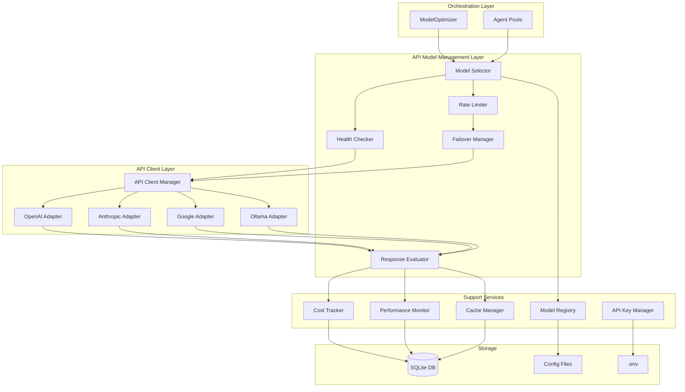

# Design Document: API-Based Model Selection & Rate Limit Management

## Overview

This design document specifies the architecture and implementation details for an API-Based Model Selection & Rate Limit Management system that enhances the existing multi-agent orchestration system. The system provides intelligent model selection, real-time availability checking, automatic failover, response quality evaluation, and comprehensive cost tracking for API-based AI model connections.

The system integrates seamlessly with the existing `ModelOptimizer` in `agentic_sdlc/orchestration/engine/` and extends its capabilities with:

- **API-based model connections** to OpenAI, Anthropic, Google, and Ollama
- **Intelligent model selection** based on task requirements, cost, and real-time availability
- **Automatic failover** when rate limits are hit or models are unavailable
- **Response quality evaluation** to ensure high-quality outputs
- **Comprehensive caching** to reduce API costs
- **Cost tracking and performance monitoring** for optimization

### Design Principles

1. **Extensibility**: Provider-specific adapters allow easy addition of new AI providers
2. **Reliability**: Automatic failover and retry logic ensure robust operation
3. **Efficiency**: Caching and intelligent model selection minimize costs
4. **Observability**: Comprehensive metrics and logging enable monitoring and debugging
5. **Integration**: Seamless integration with existing ModelOptimizer and agent infrastructure

## Architecture

### High-Level Architecture



### Component Interaction Flow

1. **Task Submission**: Agent pool requests model selection from ModelOptimizer
2. **Model Selection**: Model Selector evaluates available models using Health Checker and Rate Limiter
3. **API Request**: API Client Manager routes request to appropriate provider adapter
4. **Response Handling**: Response Evaluator assesses quality and updates metrics
5. **Caching**: Cache Manager stores responses for future reuse
6. **Monitoring**: Cost Tracker and Performance Monitor record metrics to SQLite

### Integration with Existing System

The API Model Management system integrates with the existing `ModelOptimizer` through:

- **Model Assignment Extension**: Extends `ModelAssignment` with API connection details
- **Performance Feedback**: Reports API performance data to ModelOptimizer for optimization
- **Failover Coordination**: Coordinates with ModelOptimizer's fallback model logic
- **Cost Integration**: Feeds cost data into ModelOptimizer's cost tracking

## Components and Interfaces

### 1. Model Registry

**Purpose**: Centralized repository for model metadata and configuration.

**Responsibilities**:
- Load model configurations from JSON file
- Validate model metadata
- Provide query interface for model lookup
- Persist configuration changes

**Interface**:
```python
class ModelRegistry:
    def __init__(self, config_path: Path):
        """Initialize registry from configuration file"""
        
    def load_config(self) -> None:
        """Load model configurations from file"""
        
    def get_model(self, model_id: str) -> Optional[ModelMetadata]:
        """Retrieve model metadata by ID"""
        
    def get_models_by_provider(self, provider: str) -> List[ModelMetadata]:
        """Get all models for a specific provider"""
        
    def get_models_by_capability(self, capability: str) -> List[ModelMetadata]:
        """Get models that support a specific capability"""
        
    def get_models_by_cost_range(self, min_cost: float, max_cost: float) -> List[ModelMetadata]:
        """Get models within a cost range"""
        
    def update_model(self, model_id: str, metadata: ModelMetadata) -> bool:
        """Update model metadata"""
        
    def add_model(self, metadata: ModelMetadata) -> bool:
        """Add new model to registry"""
```

**Configuration Format**:
```json
{
  "models": [
    {
      "id": "gpt-4-turbo",
      "provider": "openai",
      "name": "GPT-4 Turbo",
      "capabilities": ["text-generation", "code-generation", "analysis"],
      "cost_per_1k_input_tokens": 0.01,
      "cost_per_1k_output_tokens": 0.03,
      "rate_limits": {
        "requests_per_minute": 500,
        "tokens_per_minute": 150000
      },
      "context_window": 128000,
      "average_response_time_ms": 2000,
      "enabled": true
    }
  ]
}
```

### 2. Model Selector

**Purpose**: Intelligent model selection based on task requirements, cost, and availability.

**Responsibilities**:
- Evaluate task requirements
- Query available models from registry
- Check model availability via Health Checker
- Check rate limit status via Rate Limiter
- Rank models by suitability score
- Select optimal model

**Interface**:
```python
class ModelSelector:
    def __init__(
        self,
        registry: ModelRegistry,
        health_checker: HealthChecker,
        rate_limiter: RateLimiter,
        performance_monitor: PerformanceMonitor
    ):
        """Initialize model selector with dependencies"""
        
    async def select_model(
        self,
        task: AgentTask,
        agent_type: AgentType,
        constraints: Optional[SelectionConstraints] = None
    ) -> ModelSelection:
        """Select optimal model for task"""
        
    def calculate_suitability_score(
        self,
        model: ModelMetadata,
        task: AgentTask,
        performance_data: Optional[PerformanceData] = None
    ) -> float:
        """Calculate suitability score for model"""
        
    def rank_models(
        self,
        models: List[ModelMetadata],
        task: AgentTask
    ) -> List[Tuple[ModelMetadata, float]]:
        """Rank models by suitability score"""
```

**Selection Algorithm**:
1. Filter models by required capabilities
2. Filter out unavailable or rate-limited models
3. Calculate suitability score for each model:
   - Capability match: 30%
   - Cost efficiency: 25%
   - Historical performance: 25%
   - Availability: 20%
4. Apply task priority adjustments (CRITICAL/HIGH prioritize quality)
5. Return highest-scoring model

### 3. Health Checker

**Purpose**: Real-time availability monitoring for all registered models.

**Responsibilities**:
- Perform periodic health checks
- Track response times
- Maintain availability status
- Detect consecutive failures
- Trigger recovery checks

**Interface**:
```python
class HealthChecker:
    def __init__(
        self,
        registry: ModelRegistry,
        check_interval_seconds: int = 60
    ):
        """Initialize health checker"""
        
    async def start(self) -> None:
        """Start periodic health checking"""
        
    async def stop(self) -> None:
        """Stop health checking"""
        
    async def check_model_health(self, model_id: str) -> HealthStatus:
        """Perform health check on specific model"""
        
    def get_model_status(self, model_id: str) -> ModelAvailability:
        """Get current availability status"""
        
    def is_model_available(self, model_id: str) -> bool:
        """Check if model is currently available"""
```

**Health Check Logic**:
- Send lightweight test request to model API
- Record response time and success/failure
- Mark unavailable after 3 consecutive failures
- Mark available after 1 successful check
- Exponential backoff for failed checks (60s, 120s, 300s)

### 4. Rate Limiter

**Purpose**: Track and enforce rate limits to prevent quota exhaustion.

**Responsibilities**:
- Track request counts per time window
- Track token usage per time window
- Detect rate limit responses from APIs
- Mark models as rate-limited
- Reset rate limit status when window expires

**Interface**:
```python
class RateLimiter:
    def __init__(self, registry: ModelRegistry):
        """Initialize rate limiter"""
        
    async def check_rate_limit(self, model_id: str, estimated_tokens: int) -> RateLimitStatus:
        """Check if request would exceed rate limit"""
        
    async def record_request(
        self,
        model_id: str,
        tokens_used: int,
        was_rate_limited: bool = False
    ) -> None:
        """Record request for rate limit tracking"""
        
    def is_rate_limited(self, model_id: str) -> bool:
        """Check if model is currently rate-limited"""
        
    def get_time_until_reset(self, model_id: str) -> Optional[int]:
        """Get seconds until rate limit resets"""
```

**Rate Limit Tracking**:
- Sliding window algorithm for request counting
- Separate tracking for requests/minute and tokens/minute
- 90% threshold triggers rate-limited status
- Automatic reset when window expires
- Parse rate limit headers from API responses

### 5. Failover Manager

**Purpose**: Automatic failover to alternative models when primary is unavailable.

**Responsibilities**:
- Detect failover conditions
- Select alternative models
- Implement retry logic with exponential backoff
- Log failover events
- Trigger alerts for excessive failover

**Interface**:
```python
class FailoverManager:
    def __init__(
        self,
        model_selector: ModelSelector,
        max_retries: int = 3,
        base_backoff_seconds: int = 2
    ):
        """Initialize failover manager"""
        
    async def execute_with_failover(
        self,
        primary_model: str,
        task: AgentTask,
        request_func: Callable
    ) -> ModelResponse:
        """Execute request with automatic failover"""
        
    async def select_alternative(
        self,
        failed_model: str,
        task: AgentTask,
        reason: FailoverReason
    ) -> Optional[str]:
        """Select alternative model for failover"""
        
    def record_failover(
        self,
        original_model: str,
        alternative_model: str,
        reason: FailoverReason
    ) -> None:
        """Record failover event"""
```

**Failover Logic**:
1. Detect failure (unavailable, rate-limited, error)
2. Select alternative using Model Selector
3. Retry with exponential backoff (2s, 4s, 8s)
4. Log failover event with reason
5. Alert if >3 failovers in 1 hour for same model

### 6. API Client Manager

**Purpose**: Manage API connections and route requests to provider-specific adapters.

**Responsibilities**:
- Maintain connection pools
- Route requests to appropriate adapter
- Handle authentication
- Implement retry logic
- Parse responses

**Interface**:
```python
class APIClientManager:
    def __init__(
        self,
        api_key_manager: APIKeyManager,
        adapters: Dict[str, ProviderAdapter]
    ):
        """Initialize API client manager"""
        
    async def send_request(
        self,
        model_id: str,
        request: ModelRequest
    ) -> ModelResponse:
        """Send request to model API"""
        
    async def send_request_with_retry(
        self,
        model_id: str,
        request: ModelRequest,
        max_retries: int = 3
    ) -> ModelResponse:
        """Send request with retry logic"""
```

### 7. Provider Adapters

**Purpose**: Provider-specific API integration.

**Responsibilities**:
- Format requests for provider API
- Parse provider-specific responses
- Extract token usage and cost
- Handle provider-specific errors
- Normalize responses to common format

**Base Interface**:
```python
class ProviderAdapter(ABC):
    @abstractmethod
    async def send_request(
        self,
        model_id: str,
        request: ModelRequest,
        api_key: str
    ) -> ModelResponse:
        """Send request to provider API"""
        
    @abstractmethod
    def parse_response(self, raw_response: Any) -> ModelResponse:
        """Parse provider-specific response"""
        
    @abstractmethod
    def extract_token_usage(self, raw_response: Any) -> TokenUsage:
        """Extract token usage from response"""
        
    @abstractmethod
    def is_rate_limit_error(self, error: Exception) -> bool:
        """Check if error indicates rate limiting"""
```

**Implementations**:
- `OpenAIAdapter`: OpenAI API integration
- `AnthropicAdapter`: Anthropic API integration
- `GoogleAdapter`: Google AI API integration
- `OllamaAdapter`: Ollama local model integration

### 8. Response Evaluator

**Purpose**: Assess response quality and trigger model switching for low-quality outputs.

**Responsibilities**:
- Evaluate response completeness
- Evaluate response relevance
- Evaluate response coherence
- Calculate quality score
- Track quality trends
- Trigger model switch recommendations

**Interface**:
```python
class ResponseEvaluator:
    def __init__(
        self,
        quality_threshold: float = 0.7,
        evaluation_window: int = 10
    ):
        """Initialize response evaluator"""
        
    async def evaluate_response(
        self,
        response: ModelResponse,
        task: AgentTask
    ) -> QualityScore:
        """Evaluate response quality"""
        
    def should_switch_model(
        self,
        model_id: str,
        recent_scores: List[float]
    ) -> bool:
        """Determine if model switch is recommended"""
        
    def calculate_completeness(self, response: ModelResponse, task: AgentTask) -> float:
        """Calculate completeness score"""
        
    def calculate_relevance(self, response: ModelResponse, task: AgentTask) -> float:
        """Calculate relevance score"""
        
    def calculate_coherence(self, response: ModelResponse) -> float:
        """Calculate coherence score"""
```

**Quality Metrics**:
- **Completeness**: Response addresses all task requirements (0-1)
- **Relevance**: Response content is relevant to task (0-1)
- **Coherence**: Response is well-structured and logical (0-1)
- **Overall Score**: Weighted average (completeness: 40%, relevance: 35%, coherence: 25%)

### 9. Cache Manager

**Purpose**: Cache responses to reduce API calls and costs.

**Responsibilities**:
- Generate cache keys from requests
- Check cache for existing responses
- Store responses with TTL
- Implement LRU eviction
- Track cache hit rate

**Interface**:
```python
class CacheManager:
    def __init__(
        self,
        db_path: Path,
        max_size_mb: int = 1000,
        default_ttl_seconds: int = 3600
    ):
        """Initialize cache manager"""
        
    async def get(self, cache_key: str) -> Optional[CachedResponse]:
        """Retrieve cached response"""
        
    async def set(
        self,
        cache_key: str,
        response: ModelResponse,
        ttl_seconds: Optional[int] = None
    ) -> None:
        """Store response in cache"""
        
    def generate_cache_key(self, request: ModelRequest) -> str:
        """Generate cache key from request"""
        
    async def evict_expired(self) -> int:
        """Evict expired cache entries"""
        
    async def evict_lru(self, target_size_mb: int) -> int:
        """Evict least recently used entries"""
```

**Caching Strategy**:
- Cache key: SHA256 hash of (model_id + request_content + parameters)
- Default TTL: 1 hour
- LRU eviction when cache exceeds max size
- Periodic cleanup of expired entries (every 5 minutes)

### 10. API Key Manager

**Purpose**: Secure management and rotation of API keys.

**Responsibilities**:
- Load API keys from environment variables
- Validate key presence for enabled providers
- Support multiple keys per provider
- Implement round-robin key rotation
- Handle key validation errors

**Interface**:
```python
class APIKeyManager:
    def __init__(self, env_file: Optional[Path] = None):
        """Initialize API key manager"""
        
    def load_keys(self) -> None:
        """Load API keys from environment"""
        
    def get_key(self, provider: str) -> Optional[str]:
        """Get API key for provider with rotation"""
        
    def validate_keys(self, required_providers: List[str]) -> Dict[str, bool]:
        """Validate that required keys are present"""
        
    def add_key(self, provider: str, key: str) -> None:
        """Add API key for provider"""
```

**Environment Variable Convention**:
- OpenAI: `OPENAI_API_KEY`, `OPENAI_API_KEY_2`, `OPENAI_API_KEY_3`
- Anthropic: `ANTHROPIC_API_KEY`, `ANTHROPIC_API_KEY_2`
- Google: `GOOGLE_API_KEY`, `GOOGLE_API_KEY_2`
- Ollama: `OLLAMA_BASE_URL` (no key required for local)

### 11. Cost Tracker

**Purpose**: Track and report API usage costs.

**Responsibilities**:
- Record costs per request
- Aggregate costs by dimensions
- Check budget thresholds
- Persist cost data to SQLite
- Provide cost query interface

**Interface**:
```python
class CostTracker:
    def __init__(
        self,
        db_path: Path,
        daily_budget: float = 100.0
    ):
        """Initialize cost tracker"""
        
    async def record_cost(
        self,
        model_id: str,
        agent_type: AgentType,
        input_tokens: int,
        output_tokens: int,
        cost: float,
        task_id: str
    ) -> None:
        """Record cost for request"""
        
    async def get_daily_cost(self, date: Optional[datetime] = None) -> float:
        """Get total cost for specific day"""
        
    async def get_cost_by_model(
        self,
        start_date: datetime,
        end_date: datetime
    ) -> Dict[str, float]:
        """Get costs aggregated by model"""
        
    async def check_budget(self) -> BudgetStatus:
        """Check current budget utilization"""
```

**Database Schema**:
```sql
CREATE TABLE cost_records (
    id INTEGER PRIMARY KEY AUTOINCREMENT,
    timestamp DATETIME NOT NULL,
    model_id TEXT NOT NULL,
    agent_type TEXT NOT NULL,
    task_id TEXT NOT NULL,
    input_tokens INTEGER NOT NULL,
    output_tokens INTEGER NOT NULL,
    cost REAL NOT NULL,
    INDEX idx_timestamp (timestamp),
    INDEX idx_model_id (model_id),
    INDEX idx_agent_type (agent_type)
);
```

### 12. Performance Monitor

**Purpose**: Track and analyze model performance metrics.

**Responsibilities**:
- Record latency per request
- Track success/failure rates
- Record quality scores
- Calculate rolling averages
- Detect performance degradation
- Persist metrics to SQLite

**Interface**:
```python
class PerformanceMonitor:
    def __init__(self, db_path: Path):
        """Initialize performance monitor"""
        
    async def record_performance(
        self,
        model_id: str,
        agent_type: AgentType,
        latency_ms: float,
        success: bool,
        quality_score: float,
        task_id: str
    ) -> None:
        """Record performance metrics"""
        
    async def get_model_performance(
        self,
        model_id: str,
        window_hours: int = 24
    ) -> PerformanceMetrics:
        """Get performance metrics for model"""
        
    async def detect_degradation(
        self,
        model_id: str,
        threshold: float = 0.8
    ) -> Optional[PerformanceDegradation]:
        """Detect performance degradation"""
```

**Database Schema**:
```sql
CREATE TABLE performance_records (
    id INTEGER PRIMARY KEY AUTOINCREMENT,
    timestamp DATETIME NOT NULL,
    model_id TEXT NOT NULL,
    agent_type TEXT NOT NULL,
    task_id TEXT NOT NULL,
    latency_ms REAL NOT NULL,
    success BOOLEAN NOT NULL,
    quality_score REAL,
    INDEX idx_timestamp (timestamp),
    INDEX idx_model_id (model_id)
);
```

## Data Models

### Core Data Structures

```python
@dataclass
class ModelMetadata:
    """Metadata for an AI model"""
    id: str
    provider: str
    name: str
    capabilities: List[str]
    cost_per_1k_input_tokens: float
    cost_per_1k_output_tokens: float
    rate_limits: RateLimits
    context_window: int
    average_response_time_ms: float
    enabled: bool = True

@dataclass
class RateLimits:
    """Rate limit configuration"""
    requests_per_minute: int
    tokens_per_minute: int

@dataclass
class ModelSelection:
    """Result of model selection"""
    model_id: str
    model_metadata: ModelMetadata
    suitability_score: float
    alternatives: List[str]
    selection_reason: str

@dataclass
class SelectionConstraints:
    """Constraints for model selection"""
    max_cost_per_request: Optional[float] = None
    required_capabilities: List[str] = field(default_factory=list)
    excluded_providers: List[str] = field(default_factory=list)
    max_latency_ms: Optional[float] = None

@dataclass
class HealthStatus:
    """Health check result"""
    model_id: str
    is_available: bool
    response_time_ms: float
    last_check: datetime
    consecutive_failures: int
    error_message: Optional[str] = None

@dataclass
class ModelAvailability:
    """Model availability status"""
    model_id: str
    is_available: bool
    is_rate_limited: bool
    last_successful_request: Optional[datetime]
    next_retry_time: Optional[datetime]

@dataclass
class RateLimitStatus:
    """Rate limit status"""
    model_id: str
    is_limited: bool
    requests_remaining: int
    tokens_remaining: int
    reset_time: Optional[datetime]

@dataclass
class FailoverReason(Enum):
    """Reasons for failover"""
    UNAVAILABLE = "unavailable"
    RATE_LIMITED = "rate_limited"
    ERROR = "error"
    LOW_QUALITY = "low_quality"
    TIMEOUT = "timeout"

@dataclass
class ModelRequest:
    """Request to AI model"""
    prompt: str
    parameters: Dict[str, Any]
    task_id: str
    agent_type: AgentType
    max_tokens: Optional[int] = None
    temperature: float = 0.7

@dataclass
class TokenUsage:
    """Token usage information"""
    input_tokens: int
    output_tokens: int
    total_tokens: int

@dataclass
class ModelResponse:
    """Response from AI model"""
    content: str
    model_id: str
    token_usage: TokenUsage
    latency_ms: float
    cost: float
    metadata: Dict[str, Any] = field(default_factory=dict)

@dataclass
class QualityScore:
    """Response quality evaluation"""
    overall_score: float
    completeness: float
    relevance: float
    coherence: float
    timestamp: datetime = field(default_factory=datetime.now)

@dataclass
class CachedResponse:
    """Cached model response"""
    cache_key: str
    response: ModelResponse
    cached_at: datetime
    expires_at: datetime
    hit_count: int = 0

@dataclass
class BudgetStatus:
    """Budget utilization status"""
    daily_budget: float
    current_spend: float
    utilization_percent: float
    is_over_budget: bool
    remaining_budget: float

@dataclass
class PerformanceMetrics:
    """Performance metrics for a model"""
    model_id: str
    window_hours: int
    total_requests: int
    successful_requests: int
    failed_requests: int
    success_rate: float
    average_latency_ms: float
    p50_latency_ms: float
    p95_latency_ms: float
    p99_latency_ms: float
    average_quality_score: float

@dataclass
class PerformanceDegradation:
    """Performance degradation alert"""
    model_id: str
    metric: str
    current_value: float
    threshold: float
    detected_at: datetime
```

## Correctness Properties

*A property is a characteristic or behavior that should hold true across all valid executions of a system—essentially, a formal statement about what the system should do. Properties serve as the bridge between human-readable specifications and machine-verifiable correctness guarantees.*


### Property Reflection

After analyzing all acceptance criteria, I've identified the following consolidation opportunities:

**Redundancy Analysis**:
1. Properties 1.1 and 1.5 both test data persistence - can be combined into a single round-trip property
2. Properties 3.2, 8.4, 10.4, and 11.5 all test data persistence to storage - these are similar patterns but test different data types, so they should remain separate
3. Properties 4.1 and 4.3 both test rate limit tracking - 4.3 is a specific threshold case of 4.1, so they can be combined
4. Properties 7.1, 7.4, and 7.5 all test request/response handling - these test different aspects and should remain separate
5. Properties 9.1 and 9.2 test cache lookup and serving - these are sequential steps of the same operation and can be combined
6. Properties 10.1 and 10.2 test cost recording and aggregation - these are different operations and should remain separate
7. Properties 13.1 and 13.2 test ModelOptimizer integration - these are sequential and can be combined
8. Properties 15.1, 15.3, and 15.4 all test logging - these test different types of logging and should remain separate
9. Properties 16.2, 16.3, and 16.4 test adapter usage - these are sequential steps and can be combined into one comprehensive property

**Consolidated Properties**:
- Combine 1.1 + 1.5 → Model metadata round-trip property
- Combine 4.1 + 4.3 → Rate limit tracking with threshold detection
- Combine 9.1 + 9.2 → Cache hit serves cached response without API call
- Combine 13.1 + 13.2 → ModelOptimizer integration uses selected models
- Combine 16.2 + 16.3 + 16.4 → Provider adapter handles request/response normalization

This reduces the total number of properties while maintaining complete coverage of all testable requirements.

### Correctness Properties

Property 1: Model metadata persistence round-trip
*For any* valid model metadata, storing it in the registry and then retrieving it should return equivalent metadata with all fields preserved
**Validates: Requirements 1.1, 1.5**

Property 2: Invalid model configuration rejection
*For any* model configuration with missing required fields or invalid values, the registry should reject it and exclude it from available models
**Validates: Requirements 1.3**

Property 3: Model query filtering
*For any* query criteria (provider, capability, or cost range), all returned models should match the criteria and no matching models should be excluded
**Validates: Requirements 1.4**

Property 4: Model selection considers all factors
*For any* task with requirements and constraints, the selected model should satisfy all requirements and be available (not rate-limited or unavailable)
**Validates: Requirements 2.1**

Property 5: Cost-efficiency prioritization
*For any* set of models that meet task requirements, the model with the highest cost-efficiency score should be selected when task priority is MEDIUM or lower
**Validates: Requirements 2.2**

Property 6: Fallback selection on unavailability
*For any* task where the highest-ranked model is unavailable, the next highest-ranked available model should be selected
**Validates: Requirements 2.3**

Property 7: Performance data influences ranking
*For any* two models with identical capabilities and cost, the model with better historical performance (higher success rate and quality score) should rank higher
**Validates: Requirements 2.4**

Property 8: High-priority tasks prioritize quality
*For any* task with CRITICAL or HIGH priority, the selected model should prioritize quality score over cost when multiple models meet requirements
**Validates: Requirements 2.5**

Property 9: Periodic health checks
*For any* configured check interval, health checks should occur for all registered models within the interval tolerance (±10%)
**Validates: Requirements 3.1**

Property 10: Health check data recording
*For any* health check response, the recorded response time and success status should match the actual response
**Validates: Requirements 3.2**

Property 11: Consecutive failure marking
*For any* model that fails health checks N consecutive times (where N is configurable), the model should be marked as unavailable
**Validates: Requirements 3.3**

Property 12: Recovery from unavailability
*For any* model marked as unavailable, a single successful health check should mark it as available again
**Validates: Requirements 3.4**

Property 13: Availability status visibility
*For any* model, the Model_Selector should be able to query and receive the current availability status from the Health_Checker
**Validates: Requirements 3.5**

Property 14: Rate limit tracking with threshold detection
*For any* model, after N requests consuming M tokens, the tracked counts should equal N and M, and when usage reaches 90% of limits, the model should be marked as rate-limited
**Validates: Requirements 4.1, 4.3**

Property 15: Rate limit event recording
*For any* API response with HTTP 429 or rate limit error codes, a rate limit event should be recorded with timestamp and model ID
**Validates: Requirements 4.2**

Property 16: Rate limit window reset
*For any* rate-limited model, after the rate limit window expires, the model's rate limit status should be reset to not rate-limited
**Validates: Requirements 4.4**

Property 17: Rate-limited model request blocking
*For any* model marked as rate-limited, new requests should be blocked until the rate limit window resets
**Validates: Requirements 4.5**

Property 18: Automatic failover on unavailability
*For any* request to an unavailable or rate-limited model, an alternative model should be automatically selected and used
**Validates: Requirements 5.1**

Property 19: Failover event logging completeness
*For any* failover event, the log should contain the original model ID, failover reason, selected alternative model ID, and timestamp
**Validates: Requirements 5.2**

Property 20: Exponential backoff retry
*For any* request that fails when no alternatives are available, retries should occur with exponentially increasing delays (2^n * base_delay)
**Validates: Requirements 5.3**

Property 21: Original model retry after recovery
*For any* model that was rate-limited, after the rate limit window expires, the next request should attempt to use the original model
**Validates: Requirements 5.4**

Property 22: Excessive failover alerting
*For any* model that experiences more than 3 failover events within a 1-hour window, an alert should be triggered
**Validates: Requirements 5.5**

Property 23: API key loading from environment
*For any* provider with API keys in environment variables following the naming convention, all keys should be loaded and accessible
**Validates: Requirements 6.1**

Property 24: Missing key handling
*For any* enabled provider with missing API keys, a warning should be logged and the provider should be disabled
**Validates: Requirements 6.3**

Property 25: Multiple key support
*For any* provider with N API keys configured, all N keys should be stored and retrievable
**Validates: Requirements 6.4**

Property 26: Round-robin key rotation
*For any* provider with multiple API keys, consecutive requests should use keys in round-robin order (key1, key2, key3, key1, ...)
**Validates: Requirements 6.5**

Property 27: Request authentication and formatting
*For any* request to a model, the generated HTTP request should include authentication headers and be formatted according to the provider's API specification
**Validates: Requirements 7.1**

Property 28: Transient error retry with backoff
*For any* request that fails with a transient error (timeout, 5xx), retries should occur with exponentially increasing delays up to max retries
**Validates: Requirements 7.2**

Property 29: Final failure error details
*For any* request that fails after all retry attempts, the returned error should include the error type, all attempted models, and failure reasons
**Validates: Requirements 7.3**

Property 30: Provider adapter request/response normalization
*For any* request to a provider, the provider-specific adapter should format the request, parse the response, and normalize it to the common ModelResponse format
**Validates: Requirements 16.2, 16.3, 16.4**

Property 31: Token usage and cost extraction
*For any* successful API response, the extracted token usage (input and output tokens) and calculated cost should match the provider's response data
**Validates: Requirements 7.5**

Property 32: Quality assessment calculation
*For any* response, the quality score should be calculated as a weighted average of completeness (40%), relevance (35%), and coherence (25%)
**Validates: Requirements 8.1**

Property 33: Low-quality response flagging
*For any* response with a quality score below the configured threshold, the response should be flagged as low-quality
**Validates: Requirements 8.2**

Property 34: Consistent low-quality model switch
*For any* model that produces 3 or more low-quality responses in a sliding window of 10 requests, a model switch recommendation should be triggered
**Validates: Requirements 8.3**

Property 35: Quality score persistence
*For any* evaluated response, the quality score should be recorded in the Performance_Monitor and be retrievable for historical analysis
**Validates: Requirements 8.4**

Property 36: Quality evaluation skip when disabled
*For any* task with quality evaluation disabled, the evaluation should be skipped and a default quality score of 1.0 should be returned
**Validates: Requirements 8.5**

Property 37: Cache hit serves without API call
*For any* request with an identical cache key to a cached response, the cached response should be returned without making an API call
**Validates: Requirements 9.1, 9.2**

Property 38: Response caching with TTL
*For any* API response, it should be stored in the cache with the configured TTL, and should be evicted after the TTL expires
**Validates: Requirements 9.3**

Property 39: Cache key uniqueness
*For any* two requests with identical model ID, prompt, and parameters, they should generate identical cache keys
**Validates: Requirements 9.4**

Property 40: LRU cache eviction
*For any* cache that exceeds the size limit, the least recently used entries should be evicted first until the cache is below the limit
**Validates: Requirements 9.5**

Property 41: Cost calculation accuracy
*For any* completed request, the recorded cost should equal (input_tokens / 1000 * input_cost_per_1k) + (output_tokens / 1000 * output_cost_per_1k)
**Validates: Requirements 10.1**

Property 42: Cost aggregation correctness
*For any* time period and aggregation dimension (model, provider, agent type), the aggregated cost should equal the sum of all individual request costs matching the criteria
**Validates: Requirements 10.2**

Property 43: Budget threshold alerting
*For any* day where total costs exceed the configured daily budget, a budget alert should be triggered
**Validates: Requirements 10.3**

Property 44: Cost data persistence
*For any* cost record, it should be persisted to SQLite and be retrievable with all fields intact
**Validates: Requirements 10.4**

Property 45: Cost query filtering
*For any* cost query with filters (time range, model, provider, agent type), all returned records should match the filters
**Validates: Requirements 10.5**

Property 46: Performance metric tracking
*For any* completed request, latency, success status, and quality score should be recorded in the Performance_Monitor
**Validates: Requirements 11.1**

Property 47: Performance metric updates
*For any* completed request, the model's performance metrics (average latency, success rate, average quality) should be updated to reflect the new data
**Validates: Requirements 11.2**

Property 48: Rolling average calculation
*For any* time window (1 hour, 24 hours, 7 days), the calculated rolling average should include only requests within that window
**Validates: Requirements 11.3**

Property 49: Performance degradation alerting
*For any* model with a success rate below 80% over the monitoring window, a performance alert should be triggered
**Validates: Requirements 11.4**

Property 50: Performance data persistence
*For any* performance record, it should be persisted to SQLite and be retrievable with all fields intact
**Validates: Requirements 11.5**

Property 51: Invalid configuration error handling
*For any* configuration with schema violations or invalid values, detailed validation errors should be logged and default values should be used
**Validates: Requirements 12.2**

Property 52: Configuration hot reload
*For any* configuration file update, the system should reload the configuration and apply changes without requiring a restart
**Validates: Requirements 12.4**

Property 53: Configuration schema validation
*For any* configuration that doesn't match the required schema, it should be rejected with specific validation errors
**Validates: Requirements 12.5**

Property 54: ModelOptimizer integration
*For any* model assignment from ModelOptimizer, the API_Client should use that model for subsequent API requests
**Validates: Requirements 13.1, 13.2**

Property 55: Failover event reporting
*For any* API-based failover event, the event details should be reported to ModelOptimizer for performance tracking
**Validates: Requirements 13.3**

Property 56: Performance data sharing
*For any* completed request, performance data (latency, success, quality, cost) should be provided to ModelOptimizer
**Validates: Requirements 13.4**

Property 57: ModelOptimizer interface compatibility
*For any* existing ModelOptimizer method call, the API Model Management system should support it without requiring code changes
**Validates: Requirements 13.5**

Property 58: Concurrent request processing
*For any* N concurrent requests where N is less than the concurrency limit, all N requests should be processed in parallel
**Validates: Requirements 14.2**

Property 59: Non-blocking request handling
*For any* slow request, other pending requests should continue processing without being blocked
**Validates: Requirements 14.4**

Property 60: Concurrency limit enforcement
*For any* provider with a configured concurrency limit of N, no more than N requests should be in-flight simultaneously
**Validates: Requirements 14.5**

Property 61: Error logging completeness
*For any* error, the log entry should contain the model ID, request details, error type, and timestamp
**Validates: Requirements 15.1**

Property 62: Error categorization
*For any* error, it should be correctly categorized as either transient (retryable) or permanent (non-retryable) based on error type
**Validates: Requirements 15.2**

Property 63: Permanent error detail reporting
*For any* permanent error, the returned error response should include the error message, error type, and context information
**Validates: Requirements 15.3**

Property 64: Event logging coverage
*For any* rate limit event, failover event, or performance alert, it should be logged with complete details
**Validates: Requirements 15.4**

Property 65: Metrics export format
*For any* metrics query, the returned data should be in valid JSON format and include all requested metric types
**Validates: Requirements 17.1**

Property 66: Metrics completeness
*For any* metrics query, the response should include request counts, error rates, latency percentiles (p50, p95, p99), and cost totals
**Validates: Requirements 17.2**

Property 67: Metrics filtering
*For any* metrics query with filters (time range, model, provider, agent type), all returned metrics should match the filter criteria
**Validates: Requirements 17.3**

Property 68: Derived metrics calculation
*For any* metrics query, derived metrics (e.g., cost per successful request) should be correctly calculated from base metrics
**Validates: Requirements 17.4**

Property 69: Real-time metrics updates
*For any* completed request, the metrics should be updated immediately and reflect in subsequent queries
**Validates: Requirements 17.5**

Property 70: Provider failure isolation
*For any* provider that becomes completely unavailable, requests should continue to be processed using other available providers
**Validates: Requirements 18.1**

Property 71: Request queuing on total unavailability
*For any* capability where all providers are unavailable, requests should be queued and retried periodically until a provider becomes available
**Validates: Requirements 18.2**

Property 72: Cache failure fallback
*For any* cache operation failure, API requests should continue to be processed without caching
**Validates: Requirements 18.3**

Property 73: Monitoring failure fallback
*For any* performance monitoring failure, request processing should continue without recording metrics
**Validates: Requirements 18.4**

Property 74: Degraded mode logging
*For any* degraded operation mode (cache unavailable, monitoring unavailable, provider unavailable), the degradation should be logged
**Validates: Requirements 18.5**

## Error Handling

### Error Categories

**Transient Errors** (Retryable):
- Network timeouts
- HTTP 5xx errors (server errors)
- Temporary rate limits (429 with short retry-after)
- Connection failures

**Permanent Errors** (Non-retryable):
- HTTP 4xx errors (except 429)
- Authentication failures (401, 403)
- Invalid request format (400)
- Model not found (404)
- Quota exceeded (permanent)

### Error Handling Strategy

1. **Transient Error Handling**:
   - Retry with exponential backoff (2s, 4s, 8s)
   - Maximum 3 retry attempts
   - Log each retry attempt
   - Trigger failover after max retries

2. **Permanent Error Handling**:
   - No retries
   - Log detailed error information
   - Return error to caller immediately
   - Update error metrics

3. **Rate Limit Handling**:
   - Parse retry-after header if present
   - Mark model as rate-limited
   - Trigger automatic failover
   - Reset status after window expires

4. **Failover Handling**:
   - Select alternative model
   - Retry request with alternative
   - Log failover event
   - Alert if excessive failover

### Error Response Format

```python
@dataclass
class ErrorResponse:
    """Standardized error response"""
    error_type: str
    error_message: str
    model_id: str
    task_id: str
    is_retryable: bool
    attempted_models: List[str]
    failure_reasons: Dict[str, str]
    timestamp: datetime
```

## Testing Strategy

### Dual Testing Approach

The system requires both **unit tests** and **property-based tests** for comprehensive coverage:

**Unit Tests**:
- Specific examples demonstrating correct behavior
- Edge cases (empty inputs, boundary values, null handling)
- Error conditions (invalid configurations, API failures)
- Integration points between components
- Provider-specific adapter behavior

**Property-Based Tests**:
- Universal properties that hold for all inputs
- Comprehensive input coverage through randomization
- Minimum 100 iterations per property test
- Each property test references its design document property

### Property-Based Testing Configuration

**Library Selection**: Use `hypothesis` for Python property-based testing

**Test Configuration**:
```python
from hypothesis import given, settings
import hypothesis.strategies as st

@settings(max_examples=100)
@given(
    model_metadata=st.builds(ModelMetadata, ...),
    task=st.builds(AgentTask, ...)
)
def test_property_1_model_metadata_round_trip(model_metadata, task):
    """
    Feature: api-model-management
    Property 1: Model metadata persistence round-trip
    
    For any valid model metadata, storing it in the registry and then
    retrieving it should return equivalent metadata with all fields preserved
    """
    # Test implementation
    pass
```

**Test Tagging**:
Each property test must include a docstring with:
- Feature name: `api-model-management`
- Property number and title from design document
- Property statement

### Test Coverage Requirements

**Unit Test Coverage**:
- Configuration loading and validation (Requirements 1.2, 12.1, 12.3)
- Startup validation (Requirements 6.2)
- Provider adapter implementations (Requirements 16.1)
- Log level configuration (Requirements 15.5)
- Specific error scenarios
- Integration with ModelOptimizer

**Property Test Coverage**:
- All 74 correctness properties listed above
- Each property maps to specific requirements
- Comprehensive input generation using hypothesis strategies

### Integration Testing

**Integration Test Scenarios**:
1. End-to-end request flow: Task → Model Selection → API Request → Response Evaluation → Caching
2. Failover scenario: Primary model unavailable → Alternative selection → Successful request
3. Rate limit scenario: Approach limit → Mark rate-limited → Failover → Window reset → Recovery
4. Cost tracking: Multiple requests → Cost aggregation → Budget threshold → Alert
5. Performance monitoring: Multiple requests → Metric updates → Rolling averages → Degradation detection

### Mock and Stub Strategy

**External Dependencies to Mock**:
- Provider APIs (OpenAI, Anthropic, Google, Ollama)
- SQLite database (use in-memory database for tests)
- File system (configuration files)
- Environment variables
- System time (for TTL and window testing)

**Test Fixtures**:
- Sample model configurations
- Sample task definitions
- Sample API responses from each provider
- Sample error responses
- Sample performance data

### Performance Testing

**Performance Test Scenarios**:
1. Concurrent request handling (100 concurrent requests)
2. Cache performance (hit rate, lookup time)
3. Database query performance (cost aggregation, metrics queries)
4. Health check overhead
5. Memory usage under load

**Performance Targets**:
- Model selection: < 10ms
- Cache lookup: < 1ms
- Database write: < 5ms
- Health check: < 100ms
- Concurrent request throughput: > 50 requests/second

## Implementation Notes

### Technology Stack

- **Language**: Python 3.10+
- **Async Framework**: asyncio, aiohttp
- **Database**: SQLite with aiosqlite
- **HTTP Client**: httpx (async)
- **Configuration**: JSON with jsonschema validation
- **Environment**: python-dotenv
- **Testing**: pytest, hypothesis
- **Logging**: Python logging module

### File Structure

```
agentic_sdlc/orchestration/api_model_management/
├── __init__.py
├── registry.py              # Model Registry
├── selector.py              # Model Selector
├── health_checker.py        # Health Checker
├── rate_limiter.py          # Rate Limiter
├── failover_manager.py      # Failover Manager
├── api_client.py            # API Client Manager
├── adapters/
│   ├── __init__.py
│   ├── base.py              # Base ProviderAdapter
│   ├── openai_adapter.py    # OpenAI Adapter
│   ├── anthropic_adapter.py # Anthropic Adapter
│   ├── google_adapter.py    # Google Adapter
│   └── ollama_adapter.py    # Ollama Adapter
├── evaluator.py             # Response Evaluator
├── cache_manager.py         # Cache Manager
├── api_key_manager.py       # API Key Manager
├── cost_tracker.py          # Cost Tracker
├── performance_monitor.py   # Performance Monitor
├── models.py                # Data Models
├── exceptions.py            # Custom Exceptions
└── config/
    ├── model_registry.json  # Model Registry Config
    └── schema.json          # Configuration Schema
```

### Database Schema

```sql
-- Cost tracking
CREATE TABLE cost_records (
    id INTEGER PRIMARY KEY AUTOINCREMENT,
    timestamp DATETIME NOT NULL,
    model_id TEXT NOT NULL,
    agent_type TEXT NOT NULL,
    task_id TEXT NOT NULL,
    input_tokens INTEGER NOT NULL,
    output_tokens INTEGER NOT NULL,
    cost REAL NOT NULL,
    INDEX idx_timestamp (timestamp),
    INDEX idx_model_id (model_id),
    INDEX idx_agent_type (agent_type)
);

-- Performance monitoring
CREATE TABLE performance_records (
    id INTEGER PRIMARY KEY AUTOINCREMENT,
    timestamp DATETIME NOT NULL,
    model_id TEXT NOT NULL,
    agent_type TEXT NOT NULL,
    task_id TEXT NOT NULL,
    latency_ms REAL NOT NULL,
    success BOOLEAN NOT NULL,
    quality_score REAL,
    INDEX idx_timestamp (timestamp),
    INDEX idx_model_id (model_id)
);

-- Response caching
CREATE TABLE cached_responses (
    cache_key TEXT PRIMARY KEY,
    model_id TEXT NOT NULL,
    request_hash TEXT NOT NULL,
    response_data TEXT NOT NULL,
    cached_at DATETIME NOT NULL,
    expires_at DATETIME NOT NULL,
    hit_count INTEGER DEFAULT 0,
    last_accessed DATETIME NOT NULL,
    INDEX idx_expires_at (expires_at),
    INDEX idx_last_accessed (last_accessed)
);

-- Health check history
CREATE TABLE health_checks (
    id INTEGER PRIMARY KEY AUTOINCREMENT,
    timestamp DATETIME NOT NULL,
    model_id TEXT NOT NULL,
    is_available BOOLEAN NOT NULL,
    response_time_ms REAL,
    error_message TEXT,
    INDEX idx_timestamp (timestamp),
    INDEX idx_model_id (model_id)
);

-- Rate limit events
CREATE TABLE rate_limit_events (
    id INTEGER PRIMARY KEY AUTOINCREMENT,
    timestamp DATETIME NOT NULL,
    model_id TEXT NOT NULL,
    event_type TEXT NOT NULL,
    reset_time DATETIME,
    INDEX idx_timestamp (timestamp),
    INDEX idx_model_id (model_id)
);

-- Failover events
CREATE TABLE failover_events (
    id INTEGER PRIMARY KEY AUTOINCREMENT,
    timestamp DATETIME NOT NULL,
    original_model TEXT NOT NULL,
    alternative_model TEXT NOT NULL,
    reason TEXT NOT NULL,
    task_id TEXT NOT NULL,
    INDEX idx_timestamp (timestamp),
    INDEX idx_original_model (original_model)
);
```

### Configuration Example

```json
{
  "models": [
    {
      "id": "gpt-4-turbo",
      "provider": "openai",
      "name": "GPT-4 Turbo",
      "capabilities": ["text-generation", "code-generation", "analysis"],
      "cost_per_1k_input_tokens": 0.01,
      "cost_per_1k_output_tokens": 0.03,
      "rate_limits": {
        "requests_per_minute": 500,
        "tokens_per_minute": 150000
      },
      "context_window": 128000,
      "average_response_time_ms": 2000,
      "enabled": true
    },
    {
      "id": "claude-3.5-sonnet",
      "provider": "anthropic",
      "name": "Claude 3.5 Sonnet",
      "capabilities": ["text-generation", "code-generation", "analysis"],
      "cost_per_1k_input_tokens": 0.003,
      "cost_per_1k_output_tokens": 0.015,
      "rate_limits": {
        "requests_per_minute": 1000,
        "tokens_per_minute": 200000
      },
      "context_window": 200000,
      "average_response_time_ms": 1500,
      "enabled": true
    }
  ],
  "health_check": {
    "interval_seconds": 60,
    "timeout_seconds": 10,
    "consecutive_failures_threshold": 3
  },
  "rate_limiting": {
    "threshold_percent": 90,
    "window_seconds": 60
  },
  "caching": {
    "enabled": true,
    "max_size_mb": 1000,
    "default_ttl_seconds": 3600
  },
  "budget": {
    "daily_limit": 100.0,
    "alert_threshold_percent": 80
  },
  "quality_evaluation": {
    "enabled": true,
    "threshold": 0.7,
    "evaluation_window": 10
  },
  "failover": {
    "max_retries": 3,
    "base_backoff_seconds": 2,
    "alert_threshold": 3,
    "alert_window_hours": 1
  },
  "concurrency": {
    "max_concurrent_requests_per_provider": 10
  }
}
```

### Integration with ModelOptimizer

The API Model Management system extends ModelOptimizer through:

1. **Model Assignment Extension**:
```python
# Extend ModelAssignment with API details
@dataclass
class APIModelAssignment(ModelAssignment):
    api_model_id: str
    provider: str
    api_enabled: bool = True
```

2. **Performance Feedback**:
```python
# Report performance to ModelOptimizer
def report_performance_to_optimizer(
    model_optimizer: ModelOptimizer,
    model_id: str,
    agent_type: AgentType,
    performance_data: Dict[str, Any]
):
    model_optimizer._update_performance_data(
        model_id,
        agent_type,
        performance_data
    )
```

3. **Failover Coordination**:
```python
# Coordinate with ModelOptimizer's fallback logic
async def select_model_with_optimizer(
    model_optimizer: ModelOptimizer,
    model_selector: ModelSelector,
    task: AgentTask,
    agent_type: AgentType
) -> str:
    # Get ModelOptimizer's selection
    optimizer_model, assignment = model_optimizer.select_model_for_agent(
        agent_type, task
    )
    
    # Check availability via API Model Management
    selection = await model_selector.select_model(task, agent_type)
    
    # Use API selection if different (due to availability)
    return selection.model_id
```

### Deployment Considerations

**Environment Variables**:
```bash
# OpenAI
OPENAI_API_KEY=sk-...
OPENAI_API_KEY_2=sk-...

# Anthropic
ANTHROPIC_API_KEY=sk-ant-...

# Google
GOOGLE_API_KEY=...

# Ollama (local)
OLLAMA_BASE_URL=http://localhost:11434

# Configuration
API_MODEL_CONFIG_PATH=./config/model_registry.json
API_MODEL_DB_PATH=./data/api_model_management.db
API_MODEL_LOG_LEVEL=INFO
```

**Monitoring and Alerting**:
- Budget threshold alerts
- Performance degradation alerts
- Excessive failover alerts
- Rate limit alerts
- Provider unavailability alerts

**Operational Metrics**:
- Request success rate per model
- Average latency per model
- Cost per model per day
- Cache hit rate
- Failover frequency
- Provider availability percentage
