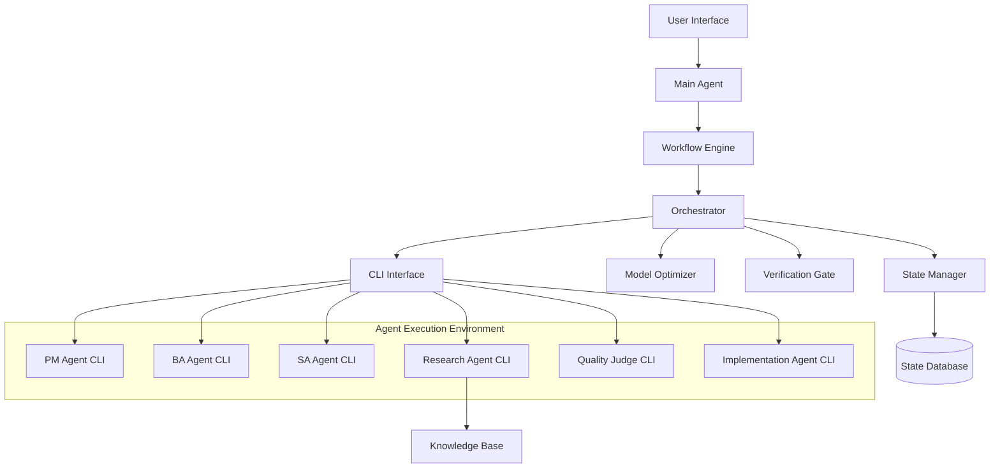
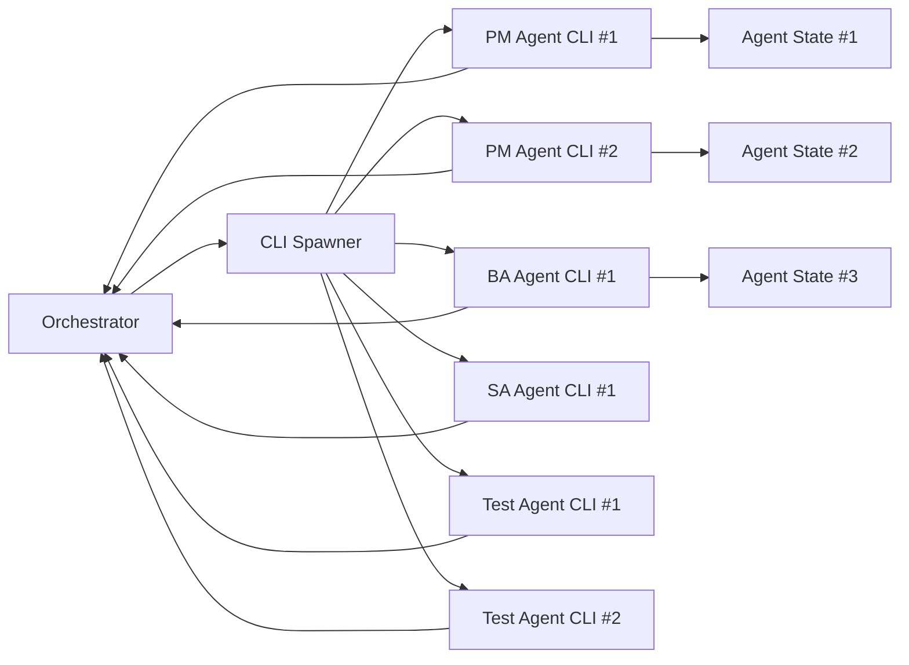

# Design Document: Multi-Agent Orchestration System

## Overview

The Multi-Agent Orchestration System implements a hierarchical orchestration architecture that coordinates specialized agents through CLI-based execution patterns. The system follows proven production patterns including sequential handoff, parallel execution, and dynamic routing to manage complex workflows while optimizing resource usage through intelligent model selection.

The architecture separates concerns between a centralized orchestrator that manages workflow state and coordination, and independent CLI-based sub-agents that execute specialized tasks in isolation. This design enables scalable, fault-tolerant execution of complex multi-step workflows while maintaining clear separation of responsibilities.

## Architecture

### High-Level Architecture



### Orchestration Patterns

The system implements three primary orchestration patterns based on research from production systems:

1. **Sequential Handoff**: Linear workflows where each agent's output becomes the next agent's input
2. **Parallel Execution**: Independent agents working simultaneously on different aspects
3. **Dynamic Routing**: Intelligent routing based on request analysis and agent capabilities

### CLI-Based Agent Architecture

Each sub-agent instance operates as an independent CLI process with standardized interfaces. Multiple agents of the same role type can run concurrently:



## Components and Interfaces

### Main Agent

**Purpose**: Primary interface for user interaction and request processing
**Key Responsibilities**:
- Parse and understand user requests using natural language processing
- Maintain conversation context across multiple interactions
- Route requests to the Workflow Engine for evaluation
- Handle clarification requests and user feedback

**Interface**:
```typescript
interface MainAgent {
  processRequest(request: UserRequest): Promise<WorkflowInitiation>
  maintainContext(conversationId: string, context: ConversationContext): void
  requestClarification(ambiguousRequest: UserRequest): Promise<ClarifiedRequest>
}

interface UserRequest {
  id: string
  userId: string
  content: string
  timestamp: Date
  context?: ConversationContext
}
```

### Workflow Engine

**Purpose**: Evaluate requests and match them to appropriate workflow patterns
**Key Responsibilities**:
- Analyze request complexity and requirements
- Match requests to available workflow templates
- Generate execution plans with agent assignments
- Validate workflow prerequisites and dependencies

**Interface**:
```typescript
interface WorkflowEngine {
  evaluateRequest(request: ClarifiedRequest): Promise<WorkflowMatch[]>
  selectOptimalWorkflow(matches: WorkflowMatch[]): Promise<WorkflowPlan>
  validatePrerequisites(plan: WorkflowPlan): Promise<ValidationResult>
}

interface WorkflowPlan {
  id: string
  pattern: OrchestrationPattern
  agents: AgentAssignment[]
  dependencies: TaskDependency[]
  estimatedDuration: number
  requiredResources: ResourceRequirement[]
}
```

### Orchestrator

**Purpose**: Central coordination hub that manages agent execution and workflow state
**Key Responsibilities**:
- Initialize and manage sub-agent lifecycles
- Coordinate task handoffs between agents
- Monitor agent progress and handle failures
- Collect and validate agent outputs

**Interface**:
```typescript
interface Orchestrator {
  executeWorkflow(plan: WorkflowPlan): Promise<WorkflowExecution>
  monitorAgentProgress(agentId: string): Promise<AgentStatus>
  handleAgentFailure(agentId: string, error: AgentError): Promise<RecoveryAction>
  collectResults(executionId: string): Promise<WorkflowResults>
}

interface WorkflowExecution {
  id: string
  status: ExecutionStatus
  currentPhase: string
  activeAgents: string[]
  completedTasks: TaskResult[]
  nextActions: string[]
}
```

### CLI Interface

**Purpose**: Manage independent CLI-based agent processes with support for multiple instances per role
**Key Responsibilities**:
- Spawn and manage multiple agent processes per role type in isolated environments
- Provide standardized communication protocols for each agent instance
- Handle process lifecycle management for concurrent agents
- Ensure proper resource cleanup and load balancing

**Multi-Instance Agent Management**:
```typescript
interface AgentPool {
  roleType: AgentType
  maxInstances: number
  activeInstances: AgentProcess[]
  queuedTasks: AgentTask[]
  loadBalancer: LoadBalancer
}

interface LoadBalancer {
  assignTask(task: AgentTask, pool: AgentPool): Promise<AgentProcess>
  monitorLoad(instances: AgentProcess[]): LoadMetrics
  scaleInstances(pool: AgentPool, targetCount: number): Promise<void>
}
```

**Interface**:
```typescript
interface CLIInterface {
  spawnAgentInstance(agentType: AgentType, instanceId: string, config: AgentConfig): Promise<AgentProcess>
  sendTask(processId: string, task: AgentTask): Promise<void>
  receiveResults(processId: string): Promise<AgentResult>
  terminateAgent(processId: string): Promise<void>
  scaleAgentPool(agentType: AgentType, targetInstances: number): Promise<void>
}

interface AgentProcess {
  id: string
  instanceId: string
  type: AgentType
  modelTier: ModelTier
  status: ProcessStatus
  pid: number
  startTime: Date
  lastActivity: Date
  currentLoad: number
}
```

### Model Optimization and Resource Management

**Purpose**: Intelligent model selection based on role hierarchy and task complexity with support for multiple agent instances
**Key Responsibilities**:
- Select advanced models (GPT-4, Claude-3.5) for high-level strategic roles (PM, BA, SA)
- Select lightweight models (GPT-3.5, Claude-3) for operational roles (Testing, Implementation)
- Select medium models (GPT-4-mini, Claude-3) for research and quality evaluation roles
- Manage resource allocation across multiple concurrent agent instances
- Monitor performance and adjust model assignments based on success rates

**Hierarchical Model Assignment**:
```typescript
enum ModelTier {
  STRATEGIC = 'strategic',    // PM, BA, SA roles - use advanced models
  OPERATIONAL = 'operational', // Implementation, Testing - use lightweight models
  RESEARCH = 'research'       // Research, Quality Judge - use medium models
}

interface ModelAssignment {
  roleType: AgentType
  modelTier: ModelTier
  recommendedModel: string
  fallbackModel: string
  maxConcurrentInstances: number
  costPerToken: number
}

const MODEL_ASSIGNMENTS: ModelAssignment[] = [
  {
    roleType: AgentType.PM,
    modelTier: ModelTier.STRATEGIC,
    recommendedModel: 'gpt-4-turbo',
    fallbackModel: 'gpt-4',
    maxConcurrentInstances: 3,
    costPerToken: 0.01
  },
  {
    roleType: AgentType.BA,
    modelTier: ModelTier.STRATEGIC,
    recommendedModel: 'claude-3.5-sonnet',
    fallbackModel: 'claude-3-sonnet',
    maxConcurrentInstances: 3,
    costPerToken: 0.015
  },
  {
    roleType: AgentType.SA,
    modelTier: ModelTier.STRATEGIC,
    recommendedModel: 'gpt-4-turbo',
    fallbackModel: 'gpt-4',
    maxConcurrentInstances: 2,
    costPerToken: 0.01
  },
  {
    roleType: AgentType.IMPLEMENTATION,
    modelTier: ModelTier.OPERATIONAL,
    recommendedModel: 'gpt-3.5-turbo',
    fallbackModel: 'claude-3-haiku',
    maxConcurrentInstances: 5,
    costPerToken: 0.002
  },
  {
    roleType: AgentType.RESEARCH,
    modelTier: ModelTier.RESEARCH,
    recommendedModel: 'gpt-4-mini',
    fallbackModel: 'claude-3-haiku',
    maxConcurrentInstances: 4,
    costPerToken: 0.0015
  },
  {
    roleType: AgentType.QUALITY_JUDGE,
    modelTier: ModelTier.RESEARCH,
    recommendedModel: 'claude-3-sonnet',
    fallbackModel: 'gpt-4-mini',
    maxConcurrentInstances: 2,
    costPerToken: 0.003
  }
]
```

### Specialized Agents

Each agent type implements a common interface while providing specialized capabilities. Multiple instances of each agent type can run concurrently:

**PM Agent**: Product management analysis and user story generation (Strategic Model Tier)
**BA Agent**: Business analysis and process modeling (Strategic Model Tier)  
**SA Agent**: Solution architecture and technical design (Strategic Model Tier)
**Research Agent**: Knowledge base queries and external research (Research Model Tier)
**Quality Judge**: Output evaluation and scoring (Research Model Tier)
**Implementation Agent**: Code generation and technical implementation (Operational Model Tier)

**Agent Instance Management**:
```typescript
interface AgentInstance {
  instanceId: string
  agentType: AgentType
  modelAssignment: ModelAssignment
  currentTask?: AgentTask
  taskQueue: AgentTask[]
  performance: PerformanceMetrics
  status: InstanceStatus
}

interface PerformanceMetrics {
  tasksCompleted: number
  averageExecutionTime: number
  successRate: number
  qualityScore: number
  resourceUtilization: number
}

enum InstanceStatus {
  IDLE = 'idle',
  BUSY = 'busy',
  FAILED = 'failed',
  SCALING_UP = 'scaling_up',
  SCALING_DOWN = 'scaling_down'
}
```

**Common Agent Interface**:
```typescript
interface SpecializedAgent {
  initialize(config: AgentConfig, instanceId: string): Promise<void>
  executeTask(task: AgentTask): Promise<AgentResult>
  getStatus(): Promise<AgentStatus>
  getPerformanceMetrics(): Promise<PerformanceMetrics>
  cleanup(): Promise<void>
}

interface AgentTask {
  id: string
  type: TaskType
  input: TaskInput
  context: TaskContext
  requirements: TaskRequirement[]
  priority: TaskPriority
  deadline?: Date
  assignedInstanceId?: string
}

interface AgentResult {
  taskId: string
  instanceId: string
  status: TaskStatus
  output: TaskOutput
  metadata: ResultMetadata
  confidence: number
  executionTime: number
  resourcesUsed: ResourceUsage
  recommendations?: string[]
}
```

## Data Models

### Core Workflow Models

```typescript
enum OrchestrationPattern {
  SEQUENTIAL_HANDOFF = 'sequential_handoff',
  PARALLEL_EXECUTION = 'parallel_execution',
  DYNAMIC_ROUTING = 'dynamic_routing',
  HIERARCHICAL_DELEGATION = 'hierarchical_delegation'
}

enum AgentType {
  PM = 'product_manager',
  BA = 'business_analyst',
  SA = 'solution_architect',
  RESEARCH = 'research',
  QUALITY_JUDGE = 'quality_judge',
  IMPLEMENTATION = 'implementation'
}

enum TaskStatus {
  PENDING = 'pending',
  IN_PROGRESS = 'in_progress',
  COMPLETED = 'completed',
  FAILED = 'failed',
  CANCELLED = 'cancelled'
}
```

### State Management Models

```typescript
interface WorkflowState {
  executionId: string
  currentPhase: string
  completedPhases: string[]
  agentStates: Map<string, AgentState>
  sharedContext: SharedContext
  checkpoints: Checkpoint[]
  lastUpdated: Date
}

interface AgentState {
  agentId: string
  status: TaskStatus
  currentTask?: AgentTask
  completedTasks: TaskResult[]
  context: AgentContext
  resources: ResourceAllocation
}

interface Checkpoint {
  id: string
  timestamp: Date
  phase: string
  state: WorkflowState
  description: string
  recoverable: boolean
}
```

### Communication Models

```typescript
interface TaskInput {
  data: any
  format: DataFormat
  source: string
  dependencies: string[]
}

interface TaskOutput {
  data: any
  format: DataFormat
  confidence: number
  metadata: OutputMetadata
  nextActions?: string[]
}

interface SharedContext {
  projectId: string
  requirements: Requirement[]
  constraints: Constraint[]
  stakeholders: Stakeholder[]
  timeline: Timeline
  resources: Resource[]
}
```

## Correctness Properties

*A property is a characteristic or behavior that should hold true across all valid executions of a system—essentially, a formal statement about what the system should do. Properties serve as the bridge between human-readable specifications and machine-verifiable correctness guarantees.*

Now I need to analyze the acceptance criteria to determine which ones can be tested as properties. Let me use the prework tool to analyze the requirements.

### Property 1: Request Processing and Context Management
*For any* user request submitted to the main agent, the system should parse the request intent, log it with proper metadata, maintain conversation context across interactions, and request clarification when parsing fails or requests are ambiguous.
**Validates: Requirements 1.1, 1.2, 1.3, 1.4, 1.5**

### Property 2: Workflow Evaluation and Selection
*For any* parsed request, the workflow engine should evaluate all available workflows, rank multiple matches by relevance score, select the highest-scoring match, validate prerequisites, and provide an execution plan for user approval.
**Validates: Requirements 2.1, 2.2, 2.3, 2.4, 2.5**

### Property 3: Agent Orchestration and Monitoring
*For any* approved workflow, the orchestrator should initialize all required sub-agents with appropriate context, monitor their progress independently, handle failures gracefully with retry logic, and collect validated results upon completion.
**Validates: Requirements 3.1, 3.2, 3.3, 3.4, 3.5**

### Property 4: CLI Process Management and Multi-Instance Support
*For any* triggered sub-agent, the CLI interface should spawn an independent process with unique instance ID, enable autonomous operation across multiple concurrent instances, provide standardized output formats, support state persistence and resumption per instance, and return structured results to the orchestrator with proper load balancing.
**Validates: Requirements 4.1, 4.2, 4.3, 4.4, 4.5**

### Property 5: Agent Specialization and Hierarchical Model Assignment
*For any* specialized agent instance (PM, BA, SA using strategic models; Research, Quality Judge using research models; Implementation using operational models), the agent should perform its domain-specific analysis with appropriate model tier, generate outputs consistent with its role level, and produce standardized reports while maintaining performance metrics per instance.
**Validates: Requirements 5.1, 5.2, 5.3, 5.4, 5.5, 5.6, 5.7**

### Property 6: Knowledge Base Integration and Research Quality
*For any* research requirement, the research agent should query the knowledge base with structured parameters, receive ranked results, access approved external sources when needed, and provide cited results with confidence scores while maintaining version control and audit trails.
**Validates: Requirements 6.1, 6.2, 6.3, 6.4, 6.5**

### Property 7: Quality Evaluation and A/B Testing
*For any* set of solution approaches, the quality judge should create A/B test scenarios, execute automated tests using predefined metrics, rank solutions with detailed evaluation reports, identify risks and quality issues, and recommend improvements when thresholds are not met.
**Validates: Requirements 7.1, 7.2, 7.3, 7.4, 7.5**

### Property 8: Document Generation and User Verification
*For any* completed analysis phase, the orchestrator should compile comprehensive reports, present them through verification gates requiring explicit approval, route feedback to appropriate agents, prevent implementation without approval, and archive approved documentation.
**Validates: Requirements 8.1, 8.2, 8.3, 8.4, 8.5**

### Property 9: Model Optimization and Multi-Instance Resource Management
*For any* task assignment, the model optimizer should evaluate role hierarchy and select appropriate model tier (strategic for PM/BA/SA, operational for implementation/testing, research for quality/research roles), spawn multiple agent instances per role type as needed, monitor performance across all instances to adjust selections, and manage task queuing and load balancing under resource constraints.
**Validates: Requirements 9.1, 9.2, 9.3, 9.4, 9.5**

### Property 10: State Management and Recovery
*For any* workflow execution, the state manager should persist state at checkpoints and agent completions, enable resumption from interruptions, maintain audit trails, validate consistency during resumption, and provide rollback capabilities when errors occur.
**Validates: Requirements 10.1, 10.2, 10.3, 10.4, 10.5**

### Property 11: Framework Integration and Compatibility
*For any* integration with existing agentic_sdlc framework, the orchestrator should utilize existing interfaces and protocols, extend capabilities without breaking backward compatibility, use standard message formats and APIs, leverage existing infrastructure, and maintain compatibility through versioned interfaces during framework updates.
**Validates: Requirements 11.1, 11.2, 11.3, 11.4, 11.5**

## Error Handling

### Agent Failure Recovery

The system implements a multi-layered approach to handle agent failures:

1. **Graceful Degradation**: When an agent fails, the orchestrator attempts to reassign the task to a backup agent of the same type
2. **Retry Logic**: Failed tasks are retried up to 3 times with exponential backoff
3. **Partial Results**: If an agent produces partial results before failure, these are preserved and used in recovery
4. **User Notification**: Critical failures that cannot be automatically recovered trigger user notifications with options to continue, retry, or abort

### State Consistency

State consistency is maintained through:

1. **Atomic Operations**: All state changes are performed atomically to prevent partial updates
2. **Checkpoint Validation**: Each checkpoint validates state consistency before persistence
3. **Rollback Mechanisms**: Failed operations trigger automatic rollback to the last consistent state
4. **Conflict Resolution**: Concurrent state modifications are resolved using timestamp-based ordering

### Communication Failures

CLI communication failures are handled through:

1. **Heartbeat Monitoring**: Regular heartbeat checks detect unresponsive agents
2. **Timeout Management**: Configurable timeouts prevent indefinite waiting
3. **Process Restart**: Failed CLI processes are automatically restarted with preserved context
4. **Message Queuing**: Failed messages are queued for retry when communication is restored

## Testing Strategy

### Dual Testing Approach

The system requires both unit testing and property-based testing for comprehensive coverage:

**Unit Tests** focus on:
- Specific workflow scenarios and edge cases
- Integration points between components
- Error conditions and failure modes
- CLI process lifecycle management
- State persistence and recovery mechanisms

**Property Tests** focus on:
- Universal properties that hold across all inputs
- Comprehensive input coverage through randomization
- Workflow invariants and consistency guarantees
- Agent behavior across different task types
- System behavior under various load conditions

### Property-Based Testing Configuration

The system will use **Hypothesis** (Python) for property-based testing with the following configuration:
- Minimum 100 iterations per property test
- Each property test references its corresponding design document property
- Tag format: **Feature: multi-agent-orchestration, Property {number}: {property_text}**

### Testing Framework Integration

Testing integrates with the existing agentic_sdlc framework through:
- Shared test utilities and fixtures
- Common assertion libraries for agent behavior
- Standardized mocking patterns for CLI processes
- Consistent reporting and metrics collection

### Performance and Load Testing

Additional testing includes:
- Load testing with multiple concurrent workflows
- Performance benchmarking of agent spawning and communication
- Memory usage monitoring during long-running workflows
- Scalability testing with increasing numbers of agents

### Integration Testing

End-to-end integration tests validate:
- Complete workflow execution from user request to final output
- Cross-agent communication and data flow
- State persistence across system restarts
- User verification gate functionality
- Knowledge base integration and external API calls