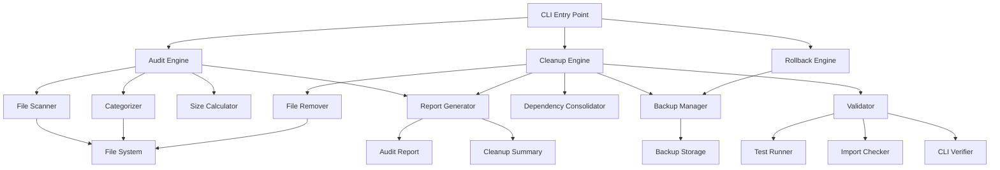

# Design Document: Project Audit and Cleanup System

## Overview

The Project Audit and Cleanup System is a comprehensive Python-based tool that systematically analyzes, categorizes, and safely removes unnecessary files from the Agentic SDLC project. The system implements a three-phase approach: (1) Audit and Analysis, (2) Safe Removal with Backup, and (3) Validation and Reporting. The design prioritizes safety through mandatory backups, rollback capabilities, and comprehensive validation testing before finalizing any changes.

The system will reduce package size from approximately 120MB to under 10MB by removing corrupt directories, bundled libraries, cache files, and consolidating dependency management. All operations are reversible through a backup and rollback mechanism.

## Architecture

### High-Level Architecture



### Component Layers

1. **CLI Layer**: Command-line interface for user interaction
2. **Engine Layer**: Core logic for audit, cleanup, and rollback operations
3. **Service Layer**: Specialized services (scanner, categorizer, backup, validator)
4. **Storage Layer**: File system operations and backup management
5. **Reporting Layer**: Report generation and documentation updates

## Components and Interfaces

### 1. CLI Entry Point (`scripts/cleanup.py`)

**Purpose**: Provide command-line interface for all cleanup operations

**Interface**:
```python
class CleanupCLI:
    def run(args: List[str]) -> int:
        """Main entry point for CLI"""
        
    def audit_only() -> AuditReport:
        """Generate audit report without cleanup"""
        
    def cleanup(dry_run: bool = False, backup: bool = True) -> CleanupResult:
        """Execute cleanup with optional dry-run"""
        
    def rollback(backup_id: str) -> RollbackResult:
        """Restore from backup"""
```

**Command-line Flags**:
- `--audit-only`: Generate audit report only
- `--dry-run`: Show what would be done without executing
- `--backup`: Create backup before cleanup (default: True)
- `--rollback <backup_id>`: Restore from specific backup
- `--verbose`: Enable detailed logging

### 2. Audit Engine

**Purpose**: Scan project and categorize all files for action

**Interface**:
```python
class AuditEngine:
    def __init__(scanner: FileScanner, categorizer: FileCategorizer):
        """Initialize with scanner and categorizer"""
        
    def scan_project(root_path: Path) -> ProjectInventory:
        """Scan entire project structure"""
        
    def categorize_files(inventory: ProjectInventory) -> CategorizedFiles:
        """Categorize files into KEEP/REMOVE/CONSOLIDATE/ARCHIVE"""
        
    def calculate_impact() -> SizeImpact:
        """Calculate size reduction impact"""
        
    def generate_report() -> AuditReport:
        """Generate comprehensive audit report"""
```

**Data Structures**:
```python
@dataclass
class ProjectInventory:
    all_files: List[FileInfo]
    all_directories: List[DirectoryInfo]
    total_size: int
    
@dataclass
class FileInfo:
    path: Path
    size: int
    modified_time: datetime
    is_critical: bool
    
@dataclass
class CategorizedFiles:
    keep: List[FileInfo]
    remove: List[FileInfo]
    consolidate: List[FileInfo]
    archive: List[FileInfo]
```

### 3. File Scanner

**Purpose**: Recursively scan project and collect file metadata

**Interface**:
```python
class FileScanner:
    def scan(root_path: Path, exclude_patterns: List[str]) -> List[FileInfo]:
        """Scan directory recursively"""
        
    def get_file_info(file_path: Path) -> FileInfo:
        """Get metadata for single file"""
        
    def calculate_directory_size(dir_path: Path) -> int:
        """Calculate total size of directory"""
```

### 4. File Categorizer

**Purpose**: Apply rules to categorize files into action categories

**Interface**:
```python
class FileCategorizer:
    def __init__(rules: CategoryRules):
        """Initialize with categorization rules"""
        
    def categorize(file_info: FileInfo) -> FileCategory:
        """Determine category for file"""
        
    def is_critical(file_path: Path) -> bool:
        """Check if file is critical component"""
        
    def is_corrupt_directory(dir_path: Path) -> bool:
        """Check if directory is corrupt"""
        
    def is_cache_file(file_path: Path) -> bool:
        """Check if file is cache"""
```

**Categorization Rules**:

**KEEP (Critical Components)**:
- `agentic_sdlc/core/**`
- `agentic_sdlc/intelligence/**`
- `agentic_sdlc/infrastructure/**`
- `agentic_sdlc/orchestration/**`
- `agentic_sdlc/defaults/**` (excluding projects/)
- `docs/**`
- `.agent/**`
- `.kiro/**`
- `tests/**`
- `bin/**`
- `scripts/**`
- Root config files: `pyproject.toml`, `package.json`, `docker-compose.yml`, `Dockerfile`, `.gitignore`, `.dockerignore`, `README.md`, `LICENSE`, `SECURITY.md`

**REMOVE (Corrupt/Bloat)**:
- `*_corrupt_*` directories
- `agentic_sdlc/lib/**`
- `__pycache__/**`
- `*.pyc`, `*.pyo`
- `.DS_Store`
- Empty directories (except logs/, states/, data/)

**CONSOLIDATE (Dependencies)**:
- `agentic_sdlc/requirements_tools.txt`
- Any other `requirements*.txt` files

**ARCHIVE (Cache)**:
- `.brain/**` (files older than 30 days)
- `.hypothesis/**`

### 5. Backup Manager

**Purpose**: Create and manage backups before any removal

**Interface**:
```python
class BackupManager:
    def __init__(backup_dir: Path):
        """Initialize with backup directory"""
        
    def create_backup(files: List[Path]) -> BackupInfo:
        """Create compressed backup of files"""
        
    def create_manifest(backup_id: str, files: List[Path]) -> None:
        """Create manifest of backed up files"""
        
    def list_backups() -> List[BackupInfo]:
        """List all available backups"""
        
    def restore_backup(backup_id: str) -> RestoreResult:
        """Restore files from backup"""
```

**Backup Structure**:
```
.cleanup_backup/
├── backup_20260131_143022/
│   ├── manifest.json
│   ├── files.tar.gz
│   └── metadata.json
└── backup_20260131_150315/
    ├── manifest.json
    ├── files.tar.gz
    └── metadata.json
```

**Manifest Format**:
```json
{
  "backup_id": "backup_20260131_143022",
  "timestamp": "2026-01-31T14:30:22Z",
  "files": [
    {
      "original_path": "agentic_sdlc/lib/some_file.py",
      "backup_path": "files.tar.gz:agentic_sdlc/lib/some_file.py",
      "size": 1024,
      "checksum": "sha256:abc123..."
    }
  ],
  "total_size": 125829120,
  "total_files": 1523
}
```

### 6. Cleanup Engine

**Purpose**: Execute safe removal of categorized files

**Interface**:
```python
class CleanupEngine:
    def __init__(backup_mgr: BackupManager, validator: Validator):
        """Initialize with backup manager and validator"""
        
    def cleanup(categorized: CategorizedFiles, dry_run: bool) -> CleanupResult:
        """Execute cleanup operations"""
        
    def remove_files(files: List[Path], backup: bool) -> RemovalResult:
        """Remove files with optional backup"""
        
    def archive_cache(cache_files: List[Path]) -> ArchiveResult:
        """Archive old cache files"""
        
    def consolidate_dependencies() -> ConsolidationResult:
        """Merge requirements into pyproject.toml"""
```

**Cleanup Sequence**:
1. Create backup of all files to be removed
2. Remove corrupt directories
3. Remove lib/ directory
4. Clean cache directories
5. Consolidate dependencies
6. Remove empty directories
7. Update package manifests
8. Run validation tests
9. Generate cleanup summary

### 7. Dependency Consolidator

**Purpose**: Merge requirements files into pyproject.toml

**Interface**:
```python
class DependencyConsolidator:
    def parse_requirements_file(file_path: Path) -> List[Dependency]:
        """Parse requirements.txt format"""
        
    def merge_into_pyproject(deps: List[Dependency], group: str) -> None:
        """Add dependencies to pyproject.toml group"""
        
    def detect_duplicates() -> List[Dependency]:
        """Find duplicate dependencies"""
        
    def validate_pyproject() -> ValidationResult:
        """Validate pyproject.toml syntax"""
```

**Dependency Groups**:
- `[project.dependencies]`: Core runtime dependencies
- `[project.optional-dependencies.dev]`: Development tools
- `[project.optional-dependencies.graph]`: Graph database support
- `[project.optional-dependencies.mcp]`: MCP connectors
- `[project.optional-dependencies.tools]`: Additional tools (from requirements_tools.txt)

### 8. Validator

**Purpose**: Verify package integrity after cleanup

**Interface**:
```python
class Validator:
    def validate_all() -> ValidationResult:
        """Run all validation checks"""
        
    def run_tests() -> TestResult:
        """Execute pytest suite"""
        
    def verify_imports() -> ImportResult:
        """Verify critical imports work"""
        
    def verify_cli_entry_points() -> CLIResult:
        """Verify CLI commands are executable"""
        
    def verify_package_build() -> BuildResult:
        """Test package build process"""
```

**Validation Checks**:
1. **Import Validation**: Verify `import agentic_sdlc` and all submodules
2. **CLI Validation**: Test `agentic --help`, `asdlc --help`, `agentic-sdlc --help`
3. **Test Suite**: Run `pytest tests/` and verify all pass
4. **Package Build**: Run `python -m build` and verify success
5. **Size Validation**: Verify package size < 10MB

### 9. Report Generator

**Purpose**: Generate audit reports and cleanup summaries

**Interface**:
```python
class ReportGenerator:
    def generate_audit_report(categorized: CategorizedFiles) -> str:
        """Generate markdown audit report"""
        
    def generate_cleanup_summary(result: CleanupResult) -> str:
        """Generate cleanup summary"""
        
    def save_report(content: str, filename: str) -> Path:
        """Save report to docs/"""
```

**Audit Report Format**:
```markdown
# Cleanup Audit Report
**Generated**: 2026-01-31 14:30:22
**Project**: Agentic SDLC v2.7.5

## Summary
- Total Files Scanned: 5,234
- Files to Keep: 3,456
- Files to Remove: 1,523
- Files to Consolidate: 3
- Files to Archive: 252

## Size Impact
- Current Size: 120.5 MB
- After Cleanup: 4.8 MB
- Reduction: 115.7 MB (96%)

## Files to Remove
### Corrupt Directories (3 items, 45.2 MB)
- agentic_sdlc.egg-info_corrupt_20260131/ (15.1 MB)
- agentic_sdlc.egg-info.trash_corrupt_20260131/ (15.1 MB)
- build_corrupt_20260131/ (15.0 MB)

### Bundled Libraries (1 item, 68.5 MB)
- agentic_sdlc/lib/ (68.5 MB)

...
```

## Data Models

### Core Data Types

```python
from enum import Enum
from dataclasses import dataclass
from pathlib import Path
from datetime import datetime
from typing import List, Optional

class FileCategory(Enum):
    KEEP = "keep"
    REMOVE = "remove"
    CONSOLIDATE = "consolidate"
    ARCHIVE = "archive"

@dataclass
class FileInfo:
    path: Path
    size: int
    modified_time: datetime
    category: Optional[FileCategory]
    is_critical: bool
    reason: str  # Why this category was assigned

@dataclass
class DirectoryInfo:
    path: Path
    size: int
    file_count: int
    is_empty: bool
    is_critical: bool

@dataclass
class Dependency:
    name: str
    version_spec: str
    source_file: Path
    target_group: str

@dataclass
class BackupInfo:
    backup_id: str
    timestamp: datetime
    file_count: int
    total_size: int
    manifest_path: Path
    archive_path: Path

@dataclass
class CleanupResult:
    success: bool
    backup_id: str
    files_removed: int
    size_freed: int
    errors: List[str]
    validation_result: ValidationResult

@dataclass
class ValidationResult:
    passed: bool
    import_check: bool
    cli_check: bool
    test_check: bool
    build_check: bool
    errors: List[str]

@dataclass
class AuditReport:
    timestamp: datetime
    total_files: int
    categorized_files: CategorizedFiles
    size_impact: SizeImpact
    recommendations: List[str]

@dataclass
class SizeImpact:
    current_size: int
    projected_size: int
    reduction: int
    reduction_percent: float
```

## Correctness Properties

*A property is a characteristic or behavior that should hold true across all valid executions of a system—essentially, a formal statement about what the system should do. Properties serve as the bridge between human-readable specifications and machine-verifiable correctness guarantees.*

### Property 1: Backup and Restore Round Trip
*For any* set of files marked for removal, creating a backup then restoring from that backup should result in all files being restored to their original locations with identical content (checksums match).
**Validates: Requirements 7.1, 7.2, 7.3, 7.4, 7.5**

### Property 2: Critical Component Preservation
*For any* file in the critical components list (core/, intelligence/, infrastructure/, orchestration/, defaults/ excluding projects/, docs/, .agent/, .kiro/, tests/, bin/, scripts/, root configs), that file should never be categorized as REMOVE.
**Validates: Requirements 6.1, 6.2, 6.3, 6.5**

### Property 3: Size Reduction Accuracy
*For any* cleanup operation, the calculated size reduction should equal the sum of all removed file sizes, and the final package size should equal initial size minus removed size.
**Validates: Requirements 5.1, 5.2, 5.3, 5.5**

### Property 4: Dependency Consolidation Idempotence
*For any* set of requirements files, consolidating them into pyproject.toml then consolidating again should produce the same result (no duplicate dependencies added).
**Validates: Requirements 4.3, 4.5**

### Property 5: Validation Triggers Rollback
*For any* cleanup operation where validation fails (imports, CLI, tests, or build), the system should automatically trigger rollback and restore all files to their pre-cleanup state.
**Validates: Requirements 9.5**

### Property 6: Corrupt Directory Pattern Matching
*For any* directory with "_corrupt_" in its name, that directory should be categorized as REMOVE unless it is explicitly in the critical components list.
**Validates: Requirements 1.1, 1.2**

### Property 7: Cache Directory Structure Preservation
*For any* cache directory (.brain/, .hypothesis/, __pycache__/), after cleanup the directory itself should still exist even if all files within it are removed.
**Validates: Requirements 3.1, 3.4**

### Property 8: Manifest and Archive Consistency
*For any* backup, every file listed in the manifest should exist in the backup archive, and every file in the backup archive should be listed in the manifest (bijection).
**Validates: Requirements 7.3**

### Property 9: Audit Categorization Completeness
*For any* project scan, every scanned file should be assigned exactly one category (KEEP, REMOVE, CONSOLIDATE, or ARCHIVE), and the sum of files in all categories should equal the total number of files scanned.
**Validates: Requirements 8.2**

### Property 10: Dry Run Makes No Changes
*For any* cleanup operation with dry_run=True, no files should be created, modified, or removed on the file system, and no backups should be created.
**Validates: Requirements 13.3**

### Property 11: Requirements File Pattern Matching
*For any* file matching the pattern "requirements*.txt", that file should be identified by the scanner and categorized as CONSOLIDATE.
**Validates: Requirements 4.1**

### Property 12: Empty Directory Identification
*For any* directory that contains zero files or only contains .DS_Store/.gitkeep files, that directory should be identified as empty unless it is in the critical empty directories list (logs/, states/, data/).
**Validates: Requirements 11.1, 11.2, 11.3**

### Property 13: File Age-Based Archival
*For any* file in .brain/ with modification time older than 30 days, that file should be moved to .brain/archive/ during cleanup.
**Validates: Requirements 3.2**

### Property 14: Import Reference Detection
*For any* Python file in the codebase, if it contains an import statement referencing a path, the system should correctly identify that path as referenced and not remove it.
**Validates: Requirements 1.2, 2.3**

### Property 15: Configuration Update Validity
*For any* pyproject.toml file, after the system updates it (adding dependencies or exclusions), the file should remain syntactically valid and parseable.
**Validates: Requirements 12.4**

## Error Handling

### Error Categories

1. **File System Errors**
   - Permission denied
   - File not found
   - Disk full
   - **Handling**: Log error, skip file, continue with others, report in summary

2. **Backup Errors**
   - Cannot create backup directory
   - Insufficient disk space for backup
   - Backup corruption
   - **Handling**: Abort cleanup, do not proceed without valid backup

3. **Validation Errors**
   - Import failures
   - CLI entry point failures
   - Test failures
   - Build failures
   - **Handling**: Trigger automatic rollback, report errors, exit with error code

4. **Dependency Errors**
   - Invalid requirements.txt syntax
   - Duplicate dependencies with conflicting versions
   - Invalid pyproject.toml syntax
   - **Handling**: Report conflicts, ask user to resolve, do not auto-merge conflicting versions

5. **Rollback Errors**
   - Backup not found
   - Backup corrupted
   - Cannot restore file (permission denied)
   - **Handling**: Report which files failed to restore, provide manual recovery instructions

### Error Recovery Strategy

```python
class ErrorRecoveryStrategy:
    def handle_error(error: Exception, context: ErrorContext) -> RecoveryAction:
        """Determine recovery action based on error type"""
        
    def can_continue(error: Exception) -> bool:
        """Determine if cleanup can continue after error"""
        
    def should_rollback(error: Exception) -> bool:
        """Determine if rollback is required"""
```

**Recovery Actions**:
- **CONTINUE**: Log error, skip item, continue with remaining items
- **ABORT**: Stop cleanup, preserve current state, do not rollback
- **ROLLBACK**: Stop cleanup, restore from backup, report failure

**Error Severity Levels**:
- **CRITICAL**: Backup failure, validation failure → ROLLBACK
- **HIGH**: File removal failure, dependency conflict → ABORT
- **MEDIUM**: Single file permission error → CONTINUE
- **LOW**: Empty directory removal failure → CONTINUE

## Testing Strategy

### Dual Testing Approach

The testing strategy employs both unit tests and property-based tests to ensure comprehensive coverage:

- **Unit tests**: Verify specific examples, edge cases, and error conditions
- **Property tests**: Verify universal properties across all inputs using Hypothesis (Python's property-based testing library)

### Unit Testing

**Focus Areas**:
- Specific file categorization examples
- Backup creation and restoration for known file sets
- Dependency parsing for specific requirements.txt formats
- Error handling for specific failure scenarios
- CLI flag combinations

**Example Unit Tests**:
```python
def test_corrupt_directory_identified():
    """Test that _corrupt_ directories are identified"""
    
def test_critical_components_preserved():
    """Test that core/ directories are never removed"""
    
def test_backup_manifest_created():
    """Test manifest creation for known file set"""
    
def test_rollback_restores_files():
    """Test rollback restores specific files"""
    
def test_dry_run_no_changes():
    """Test dry-run makes no file system changes"""
```

### Property-Based Testing

**Configuration**:
- Library: Hypothesis (https://hypothesis.readthedocs.io/)
- Minimum iterations: 100 per property test
- Each test tagged with: `# Feature: project-audit-cleanup, Property N: <property text>`

**Property Test Examples**:

```python
from hypothesis import given, strategies as st

@given(st.lists(st.text()))
# Feature: project-audit-cleanup, Property 1: Backup Completeness
def test_backup_restore_roundtrip(file_paths):
    """For any set of files, backup then restore should be identity"""
    # Create files, backup, remove, restore, verify identical
    
@given(st.lists(st.text()), st.booleans())
# Feature: project-audit-cleanup, Property 2: Critical Component Preservation
def test_critical_never_removed(file_paths, is_critical):
    """For any file marked critical, it should never be in REMOVE category"""
    
@given(st.integers(min_value=0), st.lists(st.integers(min_value=0)))
# Feature: project-audit-cleanup, Property 3: Size Reduction Guarantee
def test_size_reduction_matches_removed(initial_size, removed_sizes):
    """For any cleanup, size reduction should equal sum of removed file sizes"""
```

### Integration Testing

**Test Scenarios**:
1. **Full Cleanup Cycle**: Audit → Backup → Cleanup → Validate → Report
2. **Rollback Scenario**: Cleanup → Validation Failure → Automatic Rollback
3. **Dry Run Scenario**: Audit → Dry Run → Verify No Changes
4. **Dependency Consolidation**: Parse requirements → Merge → Validate → Remove old files

### Test Environment Setup

```python
@pytest.fixture
def mock_project_structure(tmp_path):
    """Create mock project structure for testing"""
    # Create directories
    (tmp_path / "agentic_sdlc" / "core").mkdir(parents=True)
    (tmp_path / "agentic_sdlc" / "lib").mkdir(parents=True)
    (tmp_path / "agentic_sdlc.egg-info_corrupt_20260131").mkdir(parents=True)
    
    # Create files
    (tmp_path / "pyproject.toml").write_text("[project]\nname='test'")
    (tmp_path / "agentic_sdlc" / "requirements_tools.txt").write_text("requests>=2.0.0")
    
    return tmp_path
```

### Validation Testing

**Post-Cleanup Validation**:
1. Import test: `python -c "import agentic_sdlc"`
2. CLI test: `asdlc --help`
3. Test suite: `pytest tests/ -v`
4. Build test: `python -m build --wheel`
5. Size test: `du -sh dist/*.whl` (should be < 10MB)

### Test Coverage Goals

- **Overall Coverage**: 85%+
- **Critical Paths**: 100% (backup, rollback, validation)
- **Error Handling**: 90%+
- **Edge Cases**: Property tests cover randomized inputs

