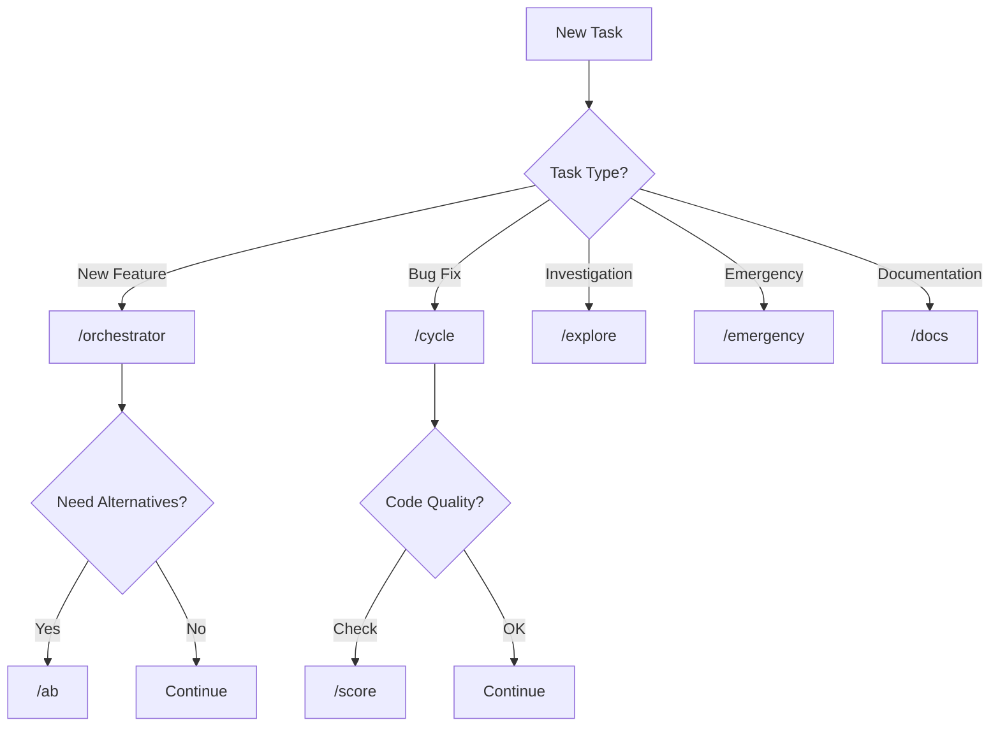
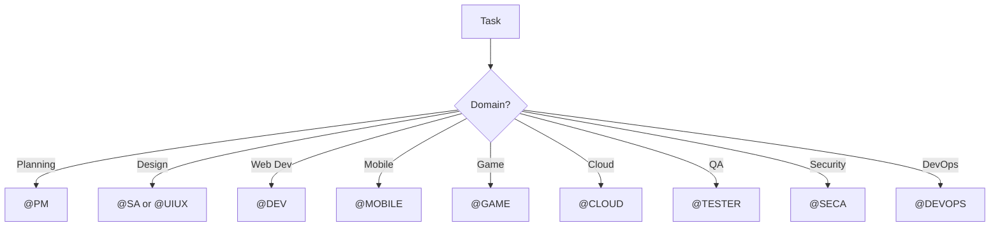

# GEMINI.md - Agentic SDLC Brain System

> **📖 Universal Guide:** This document is the **single source of truth** for the Agentic SDLC system. It works with **ANY AI-powered IDE or CLI** (Cursor, Windsurf, Claude, ChatGPT, Cline, Aider, etc.).

---

## 🎯 What is Agentic SDLC?

**Agentic SDLC** is an intelligent, self-learning software development lifecycle system powered by AI agents. It provides:

1. **3-Layer Concentric Architecture** - Core → Intelligence → Infrastructure
2. **7 Intelligence Sub-Agents** - Observer, A/B Test, Judge, Self-Learning, Proxy, Artifact Gen, Monitor
3. **17 Specialized AI Roles** - PM, BA, SA, UIUX, DEV, MOBILE, GAME, CLOUD, TESTER, SECA, DEVOPS, ORCHESTRATOR, REPORTER, RESEARCH
4. **18 Automated Workflows** - Complete task lifecycle automation
5. **Cross-IDE Compatibility** - Works everywhere through markdown files
6. **Self-Learning Knowledge Base** - Neo4j graph + LEANN vector search
7. **Compound Learning** - Every task improves the system

---

## 🏗️ 3-Layer Concentric Architecture

```
            ┌───────────────────────────────────────────────────────────┐
            │                  LAYER 3: INFRASTRUCTURE                   │
            │        External Interfaces, Tools, CLI, MCP, Docs          │
            │   ┌────────────────────────────────────────────────────┐  │
            │   │              LAYER 2: INTELLIGENCE                  │  │
            │   │     Brain System - 7 Sub-Agents (Root Layer)       │  │
            │   │   ┌────────────────────────────────────────────┐   │  │
            │   │   │           LAYER 1: CORE                     │   │  │
            │   │   │   Stable Foundation - Rarely Changes        │   │  │
            │   │   │                                             │   │  │
            │   │   │  ┌───────────────────────────────────┐     │   │  │
            │   │   │  │ GEMINI.md (This File)             │     │   │  │
            │   │   │  │ Skills (17 AI Roles)              │     │   │  │
            │   │   │  │ Templates (20+ Documents)         │     │   │  │
            │   │   │  │ Rules (8 Rule Files)              │     │   │  │
            │   │   │  │ Workflows (18 Workflows)          │     │   │  │
            │   │   │  └───────────────────────────────────┘     │   │  │
            │   │   │                                             │   │  │
            │   │   └─────────────────────────────────────────────┘   │  │
            │   │                         ↑                           │  │
            │   │   ┌─────────────────────────────────────────────┐  │  │
            │   │   │ Observer │ A/B Test │ Judge │ Self-Learning │  │  │
            │   │   │ Proxy │ Artifact Gen │ Monitor              │  │  │
            │   │   └─────────────────────────────────────────────┘  │  │
            │   │                                                     │  │
            │   └─────────────────────────────────────────────────────┘  │
            │                            ↑                               │
            │   ┌─────────────────────────────────────────────────────┐ │
            │   │ Tools │ CLI │ MCP Connectors │ Docs │ Neo4j │ KB  │ │
            │   └─────────────────────────────────────────────────────┘ │
            │                                                            │
            └────────────────────────────────────────────────────────────┘
```

### Dependency Rule

```
Layer 3 → Layer 2 → Layer 1 (dependencies flow INWARD only)
```

- **Layer 1 (Core)** has NO dependencies
- **Layer 2 (Intelligence)** depends ONLY on Layer 1
- **Layer 3 (Infrastructure)** depends on Layer 2 + Layer 1

---

## 📂 Directory Structure

```
agentic-sdlc/
│
├── .agent/                       # 🧠 LAYER 1: CORE
│   ├── GEMINI.md                # This file - Universal guide
│   ├── skills/                  # 17 AI role definitions
│   ├── templates/               # 20+ document templates
│   ├── rules/                   # 8 rule files
│   └── workflows/               # 18 workflow definitions
│
├── tools/                        # 🧠 LAYER 2 + 3
│   ├── intelligence/            # LAYER 2: Brain sub-agents
│   │   ├── observer/           # Rule compliance monitor
│   │   ├── ab_test/            # A/B result generator
│   │   ├── judge/              # Quality scorer
│   │   ├── self_learning/      # Learning engine
│   │   ├── proxy/              # AI model router
│   │   ├── artifact_gen/       # Document generator
│   │   └── monitor/            # System health monitor
│   │
│   ├── core/                    # Core utilities
│   │   └── brain/              # Brain CLI
│   │
│   └── infrastructure/          # LAYER 3: External interfaces
│       ├── workflows/          # Workflow scripts
│       ├── autogen/            # Multi-agent teams
│       ├── communication/      # Notifications
│       ├── git/                # Git operations
│       ├── github/             # GitHub integration
│       ├── release/            # Release management
│       └── validation/         # Health checks
│
├── bin/                          # CLI entry point
├── mcp/                          # MCP connectors
└── docs/                         # Generated documentation
```

---

## 🚨 MANDATORY ENFORCEMENT RULES

> [!CAUTION]
> **THESE RULES ARE NON-NEGOTIABLE.** Before executing ANY task, you MUST complete the pre-flight checklist below.

### Pre-Flight Checklist (REQUIRED for ALL Tasks)

Before starting ANY work, complete these steps IN ORDER:

1. **READ THE WORKFLOW FILE** - If user mentions `/slash`, read `.agent/workflows/[slash].md` FIRST
2. **IDENTIFY ROLES** - Determine which `@ROLE` agents should be activated
3. **INITIALIZE STATE** - Run `python tools/core/brain/brain_cli.py status` to check current state
4. **ANNOUNCE START** - Use task_boundary to log the task start

### Slash Command Interpretation

When user types a slash command, you MUST:

| User Input | REQUIRED Action |
|------------|-----------------|
| `/auto` or `/orchestrator` | Read `.agent/workflows/orchestrator.md` and follow ALL phases |
| `/cycle` | Read `.agent/workflows/cycle.md` and follow ALL steps |
| `/brain` | Read `.agent/workflows/brain.md` and execute commands |
| `/explore` | Read `.agent/workflows/explore.md` for deep investigation |
| `/sprint` | Read `.agent/workflows/sprint.md` for sprint management |
| `/emergency` | Read `.agent/workflows/emergency.md` for hotfix |
| `/commit` | Read `.agent/workflows/commit.md` for git commit |
| `/autogen` | Read `.agent/workflows/autogen.md` for multi-agent teams |
| `/observe` | Trigger Observer for rule compliance check |
| `/ab <prompt>` | Run A/B test to generate alternatives |
| `/score <file>` | Get quality score from Judge |
| `/monitor` | Check system health |
| Any `/command` | Read `.agent/workflows/[command].md` BEFORE doing anything |

### Role Activation Matrix

For ANY task, activate the appropriate roles based on task type:

| Task Type | Required Roles | Workflow |
|-----------|---------------|----------|
| New Feature/Project | @PM → @SA → @UIUX → @DEV → @TESTER | `/orchestrator` |
| Mobile App | @PM → @SA → @MOBILE → @TESTER | `/orchestrator` |
| Game Development | @PM → @GAME → @TESTER | `/orchestrator` |
| Cloud Infrastructure | @PM → @CLOUD → @DEVOPS | `/orchestrator` |
| Bug Fix | @DEV → @TESTER | `/cycle` |
| Security Audit | @SECA → @DEV | `/explore` |
| Investigation | @SA → @DEV | `/explore` |
| Hotfix/Emergency | @DEV → @DEVOPS | `/emergency` |
| Documentation | @PM → @REPORTER | `/cycle` |
| Research | @RESEARCH | `/explore` |

---

## 🚨 CRITICAL ENFORCEMENT GATES (6 MANDATORY)

> [!CAUTION]
> **ALL 6 GATES ARE NON-NEGOTIABLE.** Skipping any gate is a protocol violation.

### Gate 1: PRE-TASK (Before Starting)

```bash
# 1. Check brain state
python tools/core/brain/brain_cli.py status

# 2. Get model recommendation
python tools/intelligence/knowledge_graph/brain_parallel.py --recommend "[task description]"

# 3. Optional: Get A/B alternatives for complex decisions
python tools/intelligence/ab_test/ab_tester.py --prompt "[decision]"
```

### Gate 2: PLANNING (Before Code)

- **MUST create** `implementation_plan.md` for any feature/change
- **MUST get user approval** before writing code
- Simple tasks: At minimum, outline steps in task.md
- Observer monitors planning compliance

### Gate 3: ERROR HANDLING (On Any Failure)

If ANY script or command fails:

```bash
# 1. STOP immediately - do NOT continue
# 2. Halt the system (Observer triggers)
python tools/core/brain/brain_cli.py halt "[error description]"

# 3. Fix the issue
# 4. Resume only after fix verified
python tools/core/brain/brain_cli.py resume
```

### Gate 4: POST-TASK (After Completion)

```bash
# 1. Trigger learning
python tools/intelligence/self_learning/learner.py --learn "[task description]"

# 2. Score output (if applicable)
python tools/intelligence/judge/scorer.py --score "[artifact path]"

# 3. Sync to Neo4j
python tools/intelligence/knowledge_graph/brain_parallel.py --sync

# 4. Monitor health
python tools/intelligence/monitor/health_monitor.py --check
```

### Gate 5: REPORTING (Mandatory Artifacts)

- **MUST create** `walkthrough.md` documenting:
  - What was done
  - What was tested
  - Validation results
- **MUST save** to `docs/walkthroughs/[date]-[name].md`
- Judge scores the walkthrough quality

### Gate 6: CLEANUP (After Every Session)

```bash
# Run housekeeping
python tools/infrastructure/workflows/housekeeping.py
```

---

## 🧠 Layer 2: Intelligence Sub-Agents

The brain system consists of 7 specialized sub-agents:

### 1. Observer (Rule Compliance Monitor)

**Location:** `tools/intelligence/observer/`

**Responsibilities:**
- Monitor ALL agent actions in real-time
- Check compliance with rules (code quality, naming, templates, steps)
- Detect violations: code style, naming conventions, missing steps, template deviations
- Generate violation reports to `docs/reports/observer/`
- Track compliance metrics over time
- Auto-correct minor violations
- Escalate major violations to user

**Actions:**
- `observe_action(agent, action, context)` - Monitor an action
- `check_compliance(action, rules)` - Validate against rules
- `report_violation(violation)` - Generate report
- `get_compliance_score()` - Get system compliance %

**Usage:**
```bash
# Start observing
python tools/intelligence/observer/observer.py --start

# Get compliance report
python tools/intelligence/observer/observer.py --report

# Check specific action
python tools/intelligence/observer/observer.py --check-action "create file foo.py"
```

### 2. A/B Test (Alternative Generator)

**Location:** `tools/intelligence/ab_test/`

**Responsibilities:**
- Accept ANY user input (task, feature, decision, architecture choice)
- Generate 2 alternative approaches
- Search KB for past similar solutions
- Query Neo4j graph for related patterns
- Use MCP connectors for external research
- Score each option (time, complexity, reliability, maintainability)
- Generate structured comparison report

**Actions:**
- `generate_alternatives(prompt)` - Create A & B options
- `research_past_solutions(prompt)` - Search KB + Neo4j
- `score_alternatives(A, B)` - Compare and score
- `generate_report(A, B, scores)` - Create comparison document

**Usage:**
```bash
# Generate alternatives
python tools/intelligence/ab_test/ab_tester.py --prompt "implement user authentication"

# Output: docs/reports/ab_tests/YYYY-MM-DD-authentication-alternatives.md
```

### 3. Judge (Quality Scorer)

**Location:** `tools/intelligence/judge/`

**Responsibilities:**
- Score A/B test results
- Score code quality (complexity, readability, security, performance, maintainability)
- Score report quality (completeness, clarity, accuracy, actionability)
- Score documentation quality
- Generate improvement suggestions
- Track quality trends over time

**Scoring Dimensions:**

**Code (0-100):**
- Complexity (cyclomatic, nesting depth)
- Readability (naming, comments, structure)
- Security (vulnerabilities, best practices)
- Performance (efficiency, optimization)
- Maintainability (modularity, DRY, SOLID)

**Reports (0-100):**
- Completeness (all sections present)
- Clarity (well-written, understandable)
- Accuracy (correct information)
- Actionability (clear next steps)

**Usage:**
```bash
# Score code file
python tools/intelligence/judge/scorer.py --code src/app.py

# Score report
python tools/intelligence/judge/scorer.py--report docs/walkthroughs/2026-01-07-feature.md

# Score A/B alternatives
python tools/intelligence/judge/scorer.py --ab-test docs/reports/ab_tests/YYYY-MM-DD-auth.md
```

### 4. Self-Learning (Learning Engine)

**Location:** `tools/intelligence/self_learning/`

**Responsibilities:**
- Learn from ALL sub-agent outputs
- Extract patterns from Observer violations → New rules to add
- Learn from A/B test outcomes → Best practices
- Learn from Judge scores → Quality patterns
- Store solutions, bugs, anti-patterns
- Generate learning digests
- Update KB and Neo4j with learnings

**Learning Sources:**
- Observer violations → Rules to add/update
- A/B test results → Best solution patterns
- Judge low scores → Areas to improve
- Completed tasks → Reusable solutions
- Fixed bugs → Anti-patterns to avoid
- Security issues → Security best practices

**Usage:**
```bash
# Record successful task
python tools/intelligence/self_learning/learner.py --record-success "task-123" --approach "JWT auth"

# Record error pattern
python tools/intelligence/self_learning/learner.py --record-error "TypeError" --resolution "Added null check"

# Generate learning digest
python tools/intelligence/self_learning/learner.py --digest

# Get recommendations
python tools/intelligence/self_learning/learner.py --recommend "implement caching"
```

### 5. Proxy (AI Model Router)

**Location:** `tools/intelligence/proxy/`

**Responsibilities:**
- Analyze prompt complexity
- Route to appropriate model based on difficulty
- Track cost metrics per model
- Optimize model selection over time based on results
- Support multiple providers (OpenAI, Anthropic, Google, local models)

**Routing Logic:**

| Task Complexity | Model | Use Case |
|----------------|-------|----------|
| Simple (0-3) | GPT-3.5, Claude Haiku, Gemini Flash | Formatting, renaming, simple refactors |
| Medium (4-6) | GPT-4, Claude Sonnet, Gemini Pro | Coding, debugging, feature implementation |
| Complex (7-10) | GPT-4o, Claude Opus, Gemini Pro 1.5 | Architecture, design, complex problem-solving |

**Usage:**
```bash
# Route a prompt
python tools/intelligence/proxy/router.py --prompt "refactor this function" --analyze

# Get cost report
python tools/intelligence/proxy/router.py --cost-report

# Optimize routing
python tools/intelligence/proxy/router.py --optimize
```

### 6. Artifact Gen (Document Generator)

**Location:** `tools/intelligence/artifact_gen/`

**Responsibilities:**
- Generate documents from templates
- Support all 20+ template types
- Auto-fill from context (files, KB, Neo4j)
- Validate against rules
- Version control artifacts

**Supported Templates:**
- All planning templates (project plan, requirements, user stories)
- All design templates (architecture, backend, UI/UX, API)
- All quality templates (test reports, security reviews)
- All delivery templates (deployment plans, changelogs)
- All intelligence templates (observer reports, A/B comparisons, quality scores)

**Usage:**
```bash
# Generate from template
python tools/intelligence/artifact_gen/generator.py --template project-plan --context "Build todo app"

# Auto-fill template
python tools/intelligence/artifact_gen/generator.py --template architecture --auto-fill

# Validate artifact
python tools/intelligence/artifact_gen/generator.py --validate docs/planning/project-plan.md
```

### 7. Monitor (System Health Monitor)

**Location:** `tools/intelligence/monitor/`

**Responsibilities:**
- Check for missing documentation
- Identify incomplete features
- Detect obsolete code
- Track rule violation trends
- Measure test coverage gaps
- Detect performance bottlenecks
- Generate health reports

**Monitoring Areas:**
- **Missing Components:** Undocumented code, missing tests
- **Improvements Needed:** Low-quality code (Judge score < 70)
- **Obsolete Code:** Unused files, deprecated functions
- **Compliance Trends:** Observer violation rate over time
- **Coverage Gaps:** Missing tests, undocumented APIs
- **Performance Issues:** Slow functions, memory leaks

**Usage:**
```bash
# Full health check
python tools/intelligence/monitor/health_monitor.py --check

# Check specific area
python tools/intelligence/monitor/health_monitor.py --check-coverage

# Get improvement suggestions
python tools/intelligence/monitor/health_monitor.py --suggest
```

---

## 👥 Layer 1: Skills (17 AI Roles)

Located in `.agent/skills/`

### Planning & Requirements

#### @PM (Project Manager)
- Sprint planning and task breakdown
- Project plan creation
- Backlog management
- Progress reporting
- Stakeholder communication

#### @BA (Business Analyst)
- Requirements gathering
- User story creation
- Acceptance criteria definition
- Business process analysis

### Design & Architecture

#### @SA (System Analyst / Architect)
- System architecture design
- Technology stack selection
- Integration design
- Performance planning

#### @UIUX (UI/UX Designer)
- Interface design
- User experience flows
- Wireframes and mockups
- Design system creation

### Development

#### @DEV (Web Developer)
- General web development (React, Vue, Angular, Next.js)
- Backend development (Node.js, Python, Java)
- API development
- Database design

#### @MOBILE (Mobile Developer)
- iOS development (Swift, SwiftUI)
- Android development (Kotlin, Jetpack Compose)
- Cross-platform (React Native, Flutter)
- Mobile-specific patterns

#### @GAME (Game Developer)
- Game development (Unity, Unreal, Godot)
- Gameplay programming
- Graphics and physics
- Game design patterns

#### @CLOUD (Cloud Architect)
- Cloud infrastructure (AWS, GCP, Azure)
- Infrastructure as Code (Terraform, Pulumi)
- Container orchestration (Kubernetes, Docker)
- Serverless architectures

### Quality & Security

#### @TESTER (QA Engineer)
- Test planning and execution
- Test automation
- Quality assurance
- Bug reporting

#### @SECA (Security Analyst)
- Security audits
- Vulnerability scanning
- Penetration testing
- Compliance checks (SOC2, GDPR, HIPAA)
- Security best practices

### Operations

#### @DEVOPS (DevOps Engineer)
- CI/CD pipeline setup
- Deployment automation
- Infrastructure management
- Monitoring and logging
- Release management

### Coordination

#### @ORCHESTRATOR (Workflow Coordinator)
- Multi-agent coordination
- Workflow execution
- Task routing
- Progress tracking

#### @REPORTER (Documentation Specialist)
- Documentation creation
- Report generation
- Knowledge base maintenance
- User guide creation

#### @RESEARCH (Research Agent)
- Knowledge base search
- External research (web, APIs)
- Technology evaluation
- Best practice discovery

---

## 📋 Layer 1: Templates (20+ Types)

Located in `.agent/templates/`

### Planning Templates
- `project-plan.md` - Project overview and goals
- `requirements-spec.md` - Detailed requirements
- `user-stories.md` - User story format

### Design Templates
- `architecture-spec.md` - System architecture
- `backend-design-spec.md` - Backend design
- `uiux-design-spec.md` - UI/UX design
- `api-design.md` - API specifications
- `mobile-design-spec.md` - Mobile app design
- `game-design-document.md` - Game design
- `cloud-architecture-spec.md` - Cloud infrastructure

### Quality Templates
- `test-report.md` - Test results
- `security-review-report.md` - Security audit
- `design-verification-report.md` - Design review

### Delivery Templates
- `implementation-log.md` - Development log
- `deployment-plan.md` - Deployment steps
- `final-report.md` - Project completion
- `changelog-entry.md` - Version changes

### Intelligence Templates (NEW)
- `observer-report.md` - Rule compliance report
- `ab-comparison-report.md` - A/B test results
- `quality-score-report.md` - Judge scoring
- `self-learning-digest.md` - Learning summary
- `system-health-report.md` - Monitor health check

---

## 📏 Layer 1: Rules (7 Files)

Located in `.agent/rules/`

### 1. global.md
- Core SDLC flow
- Role dependencies
- Approval gates
- Layer 2 intelligence rules

### 2. artifacts.md
- File naming conventions
- Folder structure
- Sprint-based organization
- Artifact persistence rules

### 3. git-workflow.md
- Task tracking
- Atomic commits
- Branching strategy
- PR process

### 4. AUTO-LEARNING.md
- Automatic knowledge capture triggers
- Learning thresholds
- KB sync rules

### 5. naming-conventions.md (NEW)
- File naming (snake_case, kebab-case, PascalCase)
- Variable naming (camelCase, UPPER_CASE)
- Database naming
- API endpoint naming

### 6. code-quality.md (NEW)
- Linting rules per language
- Code style guides
- Test coverage requirements
- Documentation standards

### 7. agent-execution.md (NEW)
- Agent behavior rules
- Inter-agent communication
- Handoff procedures
- Escalation rules

---

## 🔄 Layer 1: Workflows (18 Types)

Located in `.agent/workflows/`

### Process Workflows
- `/orchestrator` - Full automation (all roles)
- `/cycle` - Complete task lifecycle
- `/explore` - Deep investigation
- `/emergency` - Hotfix response
- `/debug` - Systematic debugging
- `/refactor` - Safe refactoring
- `/review` - Code review for PRs
- `/autogen` - Multi-agent teams

### Support Workflows
- `/brain` - Brain system controller
- `/commit` - Automated commit workflow
- `/docs` - Documentation creation
- `/onboarding` - New agent onboarding
- `/housekeeping` - Cleanup and maintenance
- `/release` - Release management
- `/sprint` - Sprint management
- `/worktree` - Parallel agent worktrees

### Utility Workflows
- `/validate` - Compliance checker
- `/metrics` - Project statistics

### New Intelligence Workflows
- `/observe` - Trigger Observer check
- `/ab <prompt>` - Run A/B test
- `/score <file>` - Get quality score
- `/monitor` - System health check

---

## 🛠️ How to Use with Any IDE/CLI

### Option 1: Cursor IDE

```
@pm Build a todo app
/cycle Implement user authentication
/observe Check my last commit
```

### Option 2: Windsurf IDE

```
Read .agent/GEMINI.md and act as @DEV
Follow /cycle workflow for this task
Run /ab "implement OAuth vs JWT"
```

### Option 3: Claude Desktop / ChatGPT

```
I'm using Agentic SDLC. Read .agent/GEMINI.md.
Act as @SA and help me design system architecture.
Use /explore workflow to investigate options.
```

### Option 4: CLI

```bash
# Install CLI
npm install -g agentic-sdlc

# Run workflows
agentic-sdlc cycle --task "Add dark mode"
agentic-sdlc observe --check
agentic-sdlc ab "implement authentication"
agentic-sdlc score src/app.py
agentic-sdlc monitor --health

# Brain commands
agentic-sdlc brain status
agentic-sdlc brain sync
agentic-sdlc brain recommend "implement caching"
```

---

## 🔧 Layer 3: Tools & Infrastructure

### Brain CLI

**Location:** `tools/core/brain/brain_cli.py`

```bash
# Check system status
python tools/core/brain/brain_cli.py status

# Pause system
python tools/core/brain/brain_cli.py halt "fixing critical bug"

# Resume system
python tools/core/brain/brain_cli.py resume

# Get statistics
python tools/core/brain/brain_cli.py stats
```

### Knowledge Graph (Neo4j)

**Location:** `tools/intelligence/knowledge_graph/`

```bash
# Sync to Neo4j
python tools/intelligence/knowledge_graph/brain_parallel.py --sync

# Query skills
python tools/intelligence/knowledge_graph/query_skills_neo4j.py --all-skills

# Get learning path
python tools/intelligence/knowledge_graph/query_skills_neo4j.py --learning-path "Authentication"

# Get recommendations
python tools/intelligence/knowledge_graph/brain_parallel.py --recommend "implement OAuth"
```

### MCP Connectors

**Location:** `mcp/connectors/`

- `filesystem` - File operations
- `github` - GitHub integration
- `research` - Web search and API calls
- `transform` - Code transformations

---

## 📊 Decision Trees

### When to Use Which Workflow?



### When to Use Which Role?



---

## 🎓 Best Practices

### Daily Workflow

```bash
# Morning: Sync brain
python tools/intelligence/knowledge_graph/brain_parallel.py --sync

# Before task: Get recommendations
python tools/intelligence/knowledge_graph/brain_parallel.py --recommend "your task"

# Optional: A/B test decision
python tools/intelligence/ab_test/ab_tester.py --prompt "architectural choice"

# During work: Use appropriate workflow
/pm plan feature           # Planning
/dev implement            # Development
/score src/app.py         # Quality check
/observe                  # Compliance check

# After work: Record learning
python tools/intelligence/self_learning/learner.py --record-success "task-id"
python tools/intelligence/judge/scorer.py --score docs/walkthroughs/...
```

### Weekly Maintenance

```bash
# Full sync
python tools/intelligence/knowledge_graph/brain_parallel.py --full

# Health check
python tools/intelligence/monitor/health_monitor.py --check

# Review learning
python tools/intelligence/self_learning/learner.py --digest
```

---

## 🚧 Troubleshooting

### Common Issues

**1. Import errors**
```bash
pip install -r tools/requirements.txt
```

**2. Neo4j connection failed**
```bash
# Check .env file
cat .env | grep NEO4J_URI

# Test connection
python tools/intelligence/knowledge_graph/test_neo4j_connection.py
```

**3. Workflow not found**
```bash
# List all workflows
ls -la .agent/workflows/
```

**4. Observer not monitoring**
```bash
# Restart observer
python tools/intelligence/observer/observer.py --restart
```

---

## 📖 FAQ

**Q: Can I use this with any IDE?**
A: Yes! GEMINI.md is designed to be IDE-agnostic. Copy it into any AI chat.

**Q: Do I need to set up Neo4j?**
A: Optional. The system works without it, but you lose graph-based recommendations.

**Q: Which workflow should I start with?**
A: For new features: `/orchestrator`. For quick tasks: `/cycle`.

**Q: How does Observer work?**
A: It monitors all actions in real-time and checks compliance with rules in `.agent/rules/`.

**Q: Can I customize the templates?**
A: Yes! Edit files in `.agent/templates/` to match your needs.

**Q: How does A/B testing work?**
A: Provide a prompt, it generates 2 alternatives using KB search + Neo4j, then Judge scores them.

**Q: What if I skip the mandatory gates?**
A: Observer will detect it and generate a violation report.

---

## 🔗 Related Documentation

- **Architecture Details:** `docs/ARCHITECTURE.md`
- **CLI Guide:** `docs/CLI-GUIDE.md`
- **KB Guide:** `docs/KB-GUIDE.md`
- **Workflow Guides:** `.agent/workflows/*.md`
- **Tools README:** `tools/README.md`

---

## 📝 Version

- **Version:** 3.0.0 (3-Layer Concentric Architecture)
- **Last Updated:** 2026-01-07
- **Layer Model:** Core → Intelligence → Infrastructure

---

> [!IMPORTANT]
> **This document is the SINGLE SOURCE OF TRUTH.** If any other documentation conflicts with GEMINI.md, GEMINI.md takes precedence.

**🎯 Quick Start:** Read this file → Choose workflow (`/cycle`, `/orchestrator`) → Activate roles (`@PM`, `@DEV`) → Follow gates → Let intelligence sub-agents help you.

