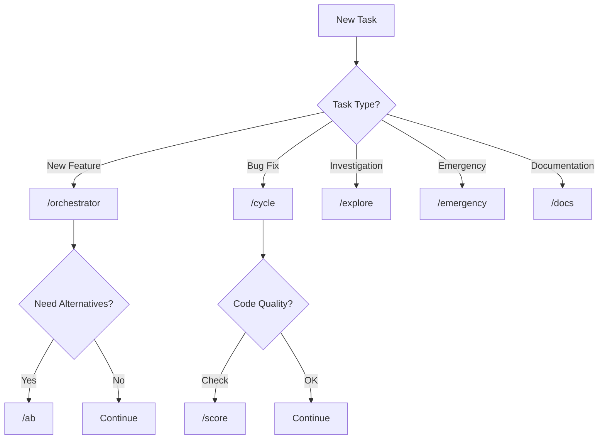
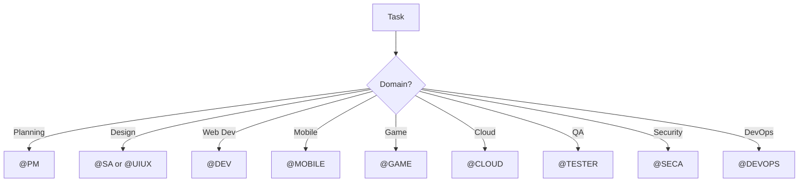

# GEMINI.md - Agentic SDLC Brain System

> **📖 Universal Guide:** This document is the **single source of truth** for the Agentic SDLC system. It works with **ANY AI-powered IDE or CLI** (Cursor, Windsurf, Claude, ChatGPT, Cline, Aider, etc.).

---

## 🎯 What is Agentic SDLC?

**Agentic SDLC** is an intelligent, self-learning software development lifecycle system powered by AI agents. It provides:

1. **3-Layer Concentric Architecture** - Core → Intelligence → Infrastructure
2. **21 Intelligence Sub-Agents** - HITL, State, Self-Healing, DSPy, Cost, Sandbox, Evaluation, Observer, and more.
3. **17 Specialized AI Roles** - PM, BA, PO, SA, UIUX, DEV, TESTER, SECA, DEVOPS, MOBILE, GAME, CLOUD, ORCHESTRATOR, REPORTER, RESEARCH, STAKEHOLDER, BRAIN
4. **23 Automated Workflows** - Complete task lifecycle automation
5. **Cross-IDE Compatibility** - Works everywhere through markdown files
6. **Self-Learning Knowledge Base** - Memgraph graph + SQLite State + LEANN vector search
7. **Compound Learning** - Every task improves the system via DSPy optimization models.

---

## 🏗️ 3-Layer Concentric Architecture

```
            ┌───────────────────────────────────────────────────────────┐
            │                  LAYER 3: INFRASTRUCTURE                   │
            │        External Interfaces, Tools, CLI, MCP, Docs          │
            │   ┌────────────────────────────────────────────────────┐  │
            │   │              LAYER 2: INTELLIGENCE                  │  │
            │   │     Brain System - 7 Sub-Agents (Root Layer)       │  │
            │   │   ┌────────────────────────────────────────────┐   │  │
            │   │   │           LAYER 1: CORE                     │   │  │
            │   │   │   Stable Foundation - Rarely Changes        │   │  │
            │   │   │                                             │   │  │
            │   │   │  ┌───────────────────────────────────┐     │   │  │
            │   │   │  │ GEMINI.md (This File)             │     │   │  │
            │   │   │  │ Skills (17 AI Roles)              │     │   │  │
            │   │   │  │ Templates (20+ Documents)         │     │   │  │
            │   │   │  │ Rules (8 Rule Files)              │     │   │  │
            │   │   │  │ Workflows (23 Workflows)          │     │   │  │
            │   │   │  └───────────────────────────────────┘     │   │  │
            │   │   │                                             │   │  │
            │   │   └─────────────────────────────────────────────┘   │  │
            │   │                         ↑                           │  │
            │   │   ┌─────────────────────────────────────────────┐  │  │
            │   │   │ Observer │ A/B Test │ Judge │ Self-Learning │  │  │
            │   │   │ Proxy │ Artifact Gen │ Monitor              │  │  │
            │   │   └─────────────────────────────────────────────┘  │  │
            │   │                                                     │  │
            │   └─────────────────────────────────────────────────────┘  │
            │                            ↑                               │
            │   ┌─────────────────────────────────────────────────────┐ │
            │   │ Tools │ CLI │ MCP Connectors │ Docs │ Memgraph │ KB  │ │
            │   └─────────────────────────────────────────────────────┘ │
            │                                                            │
            └────────────────────────────────────────────────────────────┘
```

### Dependency Rule

```
Layer 3 → Layer 2 → Layer 1 (dependencies flow INWARD only)
```

- **Layer 1 (Core)** has NO dependencies
- **Layer 2 (Intelligence)** depends ONLY on Layer 1
- **Layer 3 (Infrastructure)** depends on Layer 2 + Layer 1

---

## 📂 Directory Structure

```
agentic-sdlc/
│
├── agentic_sdlc/                 # 📦 MAIN PACKAGE
│   ├── core/                    # Layer 1: Core logic & utilities
│   ├── intelligence/            # Layer 2: 21 AI Sub-agents
│   ├── infrastructure/          # Layer 3: Bridges & connectors
│   ├── defaults/                # "Golden Master" (skills, rules, workflows)
│   └── cli.py                   # Main CLI entry point
│
├── bin/                          # Helper scripts
├── docs/                         # Documentation
├── examples/                     # Example projects (Externalized)
├── tests/                        # Unit & Integration tests
├── asdlc.py                      # Development entry point
├── pyproject.toml                # Dependencies
└── docker-compose.yml            # Container orchestration
```

---

## 🚨 MANDATORY ENFORCEMENT RULES

> [!CAUTION]
> **THESE RULES ARE NON-NEGOTIABLE.** Before executing ANY task, you MUST complete the pre-flight checklist below.

### Pre-Flight Checklist (REQUIRED for ALL Tasks)

Before starting ANY work, complete these steps IN ORDER:

1. **READ THE WORKFLOW FILE** - If user mentions `/slash`, read `.agent/workflows/[slash].md` FIRST
2. **IDENTIFY ROLES** - Determine which `@ROLE` agents should be activated
3. **INITIALIZE STATE** - Run `python asdlc.py brain status` to check current state
4. **ANNOUNCE START** - Use task_boundary to log the task start

### Slash Command Interpretation

When user types a slash command, you MUST:

| User Input | REQUIRED Action |
|------------|-----------------|
| `/auto` or `/orchestrator` | Read `.agent/workflows/orchestrator.md` and follow ALL phases |
| `/cycle` | Read `.agent/workflows/cycle.md` and follow ALL steps |
| `/brain` | Read `.agent/workflows/brain.md` and execute via `python asdlc.py brain` |
| `/explore` | Read `.agent/workflows/explore.md` for deep investigation |
| `/monitor` | Check system via `python asdlc.py dashboard` |
| Any `/command` | Read `.agent/workflows/[command].md` BEFORE doing anything |

### Role Activation Matrix

For ANY task, activate the appropriate roles based on task type:

| Task Type | Required Roles | Workflow |
|-----------|---------------|----------|
| New Feature/Project | @PM → @SA → @UIUX → @DEV → @TESTER | `/orchestrator` |
| Mobile App | @PM → @SA → @MOBILE → @TESTER | `/orchestrator` |
| Game Development | @PM → @GAME → @TESTER | `/orchestrator` |
| Cloud Infrastructure | @PM → @CLOUD → @DEVOPS | `/orchestrator` |
| Bug Fix | @DEV → @TESTER | `/cycle` |
| Security Audit | @SECA → @DEV | `/explore` |
| Investigation | @SA → @DEV | `/explore` |
| Hotfix/Emergency | @DEV → @DEVOPS | `/emergency` |
| Documentation | @PM → @REPORTER | `/cycle` |
| Research | @RESEARCH | `/explore` |

---

## 🚨 CRITICAL ENFORCEMENT GATES (6 MANDATORY)

> [!CAUTION]
> **ALL 6 GATES ARE NON-NEGOTIABLE.** Skipping any gate is a protocol violation.

### Gate 1: PRE-TASK (Before Starting)

```bash
# 1. Check brain state
python asdlc.py brain status

# 2. Get model recommendation
python asdlc.py brain recommend "[task description]"

# 3. Optional: Get A/B alternatives for complex decisions
python asdlc.py brain ab-test "[decision]"
```

### Gate 2: PLANNING (Before Code)

- **MUST create** `specification.md` for new features (use --template specification)
- **MUST create** `implementation_plan.md` for any feature/change
- **MUST get user approval** before writing code
- Simple tasks: At minimum, outline steps in task.md
- Observer monitors planning compliance

### Gate 3: ERROR HANDLING (On Any Failure)

If ANY script or command fails:

```bash
# 1. STOP immediately - do NOT continue
# 2. Halt the system (Observer triggers)
python asdlc.py brain transition halt --reason "[error description]"

# 3. Fix the issue
# 4. Resume only after fix verified
python asdlc.py brain transition active
```

### Gate 4: POST-TASK (After Completion)

```bash
# 1. Trigger learning
python asdlc.py brain learn "[task description]"

# 2. Score output (if applicable)
python asdlc.py brain score "[artifact path]"

# 3. Sync to Memgraph
python asdlc.py brain sync

# 4. Monitor health
python asdlc.py brain health
```

### Gate 5: REPORTING (Mandatory Artifacts)

- **MUST create** `walkthrough.md` documenting:
  - What was done
  - What was tested
  - Validation results
- **MUST save** to `docs/walkthroughs/[date]-[name].md`
- Judge scores the walkthrough quality

### Gate 6: CLEANUP (After Every Session)

```bash
# Run housekeeping
python asdlc.py workflow housekeeping
```

---

## 🧠 Layer 2: Intelligence Sub-Agents

The brain system consists of 7 specialized sub-agents:

### 1. HITL (Human-in-the-Loop) - Mandatory Gates
**Location:** `agentic_sdlc/intelligence/hitl/`
**Importance:** Critical for Preventing Hallucinations in Production.
- Implements mandatory approval gates: `PLANNING`, `DESIGN`, `SECURITY`, `CODE_REVIEW`, `DEPLOY`.
- CLI: `python asdlc.py brain gate request --gate code_review`

### 2. State Manager - Persistence & Recovery
**Location:** `agentic_sdlc/intelligence/state/`
**Importance:** System Stability & Crash Recovery.
- SQLite-based persistent storage for workflow sessions.
- Checkpointing for long-running multi-agent tasks (e.g., Phase-based state saving).

### 3. Self-Healing (QA → DEV Feedback Loop)
**Location:** `agentic_sdlc/intelligence/self_healing/`
**Importance:** Automated Quality Assurance.
- Iterative fix/retry loop until all tests/validations pass.
- Learns from error messages to suggest optimized fixes.

### 4. DSPy Integration (Programmatic Optimization)
**Location:** `agentic_sdlc/intelligence/dspy_integration/`
**Importance:** Self-Improving Agent Prompting.
- Replaces brittle prompting with compositional Python code.
- `AgentOptimizer` improves prompt performance based on successful task outcomes.

### 5. Cost Monitoring (Token Tracker)
**Location:** `agentic_sdlc/intelligence/cost/`
**Importance:** Operational Efficiency.
- Real-time token usage and cost tracking ($) per task and model.
- Budget alerts and model comparison tools.

### 6. Evaluation Framework (Benchmarking)
**Location:** `agentic_sdlc/intelligence/evaluation/`
**Importance:** Performance Verification.
- Benchmark agents against curated test cases (PM-01, DEV-01, etc.).
- Regression tracking to ensure updates improve (not degrade) agent quality.

### 7. Observer (Rule Compliance Monitor)
**Location:** `agentic_sdlc/intelligence/observer/`
- Real-time monitoring of agent actions against project rules (.cursorrules, etc.).

### 8. Knowledge Graph (Graph Database)
**Location:** `agentic_sdlc/intelligence/knowledge_graph/`
- Maps complex relationships between tasks, skills, and learned solutions.

### 9. A/B Test (Alternative Generator)
**Location:** `agentic_sdlc/intelligence/ab_test/`
- Generates 2 distinct approaches for any task to ensure architectural variety.

### 10. Judge (Quality Scorer)
**Location:** `agentic_sdlc/intelligence/judge/`
- Cross-validates outputs from other agents and scores them (0-100).

### 11-21. Specialized Intelligence Sub-Agents
- **Proxy:** AI Model Router based on task complexity.
- **Artifact Gen:** Intelligent document generation from 20+ templates.
- **Monitor:** Continuous health checks for missing components or coverage gaps.
- **Performance:** Execution metrics and workflow bottleneck identification.
- **Research:** Technical discovery via Web APIs and KB search.
- **Router:** Workflow & Agent routing logic.
- **Scorer:** In-depth quality metrics for inputs and outputs.
- **Task Manager:** Coordination for multi-agent autonomous tasks.
- **Workflow Validator:** Post-execution compliance checker.

---

## 🏗️ Layer 3: Infrastructure (Modern Capabilities)

### 1. Sandboxing (Secure Execution)
**Location:** `agentic_sdlc/infrastructure/sandbox/`
- Docker-based isolated execution for agent code.
- Resource limits (CPU/Memory) and network lockdown for safety.

### 2. Local LLM Hub (Ollama)
**Location:** `agentic_sdlc/infrastructure/local_llm/`
- Unified client for interacting with local LLMs (Llama3, CodeLlama).
- Provides privacy and zero-cost execution for routine tasks.

### 3. Dashboard (Visual Control Panel)
**Location:** `agentic_sdlc/intelligence/dashboard/`
- Streamlit-powered UI for real-time monitoring.
- Command: `python asdlc.py dashboard`

### 4. Self-Learning (Learning Engine)

**Location:** `agentic_sdlc/intelligence/self_learning/`

**Responsibilities:**
- Learn from ALL sub-agent outputs
- Extract patterns from Observer violations → New rules to add
- Learn from A/B test outcomes → Best practices
- Learn from Judge scores → Quality patterns
- Store solutions, bugs, anti-patterns
- Generate learning digests
- Update KB and Memgraph with learnings

**Learning Sources:**
- Observer violations → Rules to add/update
- A/B test results → Best solution patterns
- Judge low scores → Areas to improve
- Completed tasks → Reusable solutions
- Fixed bugs → Anti-patterns to avoid
- Security issues → Security best practices

**Usage:**
```bash
# Record successful task
python asdlc.py brain learn "implemented JWT auth"

# Get recommendations
python asdlc.py brain recommend "implement caching"
```

### 5. Proxy (AI Model Router)

**Location:** `agentic_sdlc/intelligence/proxy/`

**Responsibilities:**
- Analyze prompt complexity
- Route to appropriate model based on difficulty
- Track cost metrics per model
- Optimize model selection over time based on results
- Support multiple providers (OpenAI, Anthropic, Google, local models)

**Routing Logic:**

| Task Complexity | Model | Use Case |
|----------------|-------|----------|
| Simple (0-3) | GPT-3.5, Claude Haiku, Gemini Flash | Formatting, renaming, simple refactors |
| Medium (4-6) | GPT-4, Claude Sonnet, Gemini Pro | Coding, debugging, feature implementation |
| Complex (7-10) | GPT-4o, Claude Opus, Gemini Pro 1.5 | Architecture, design, complex problem-solving |

**Usage:**
```bash
# Route a prompt
python asdlc.py brain route "refactor this function"
```

### 6. Artifact Gen (Document Generator)

**Location:** `agentic_sdlc/intelligence/artifact_gen/`

**Responsibilities:**
- Generate documents from templates
- Support all 20+ template types
- Auto-fill from context (files, KB, Memgraph)
- Validate against rules
- Version control artifacts

**Supported Templates:**
- All planning templates (project plan, requirements, user stories)
- All design templates (architecture, backend, UI/UX, API)
- All quality templates (test reports, security reviews)
- All delivery templates (deployment plans, changelogs)
- All intelligence templates (observer reports, A/B comparisons, quality scores)

**Usage:**
```bash
# Generate from template
python asdlc.py brain gen project-plan '{"title": "Build todo app"}'
```

### 7. Monitor (System Health Monitor)

**Location:** `agentic_sdlc/intelligence/monitor/`

**Responsibilities:**
- Check for missing documentation
- Identify incomplete features
- Detect obsolete code
- Track rule violation trends
- Measure test coverage gaps
- Detect performance bottlenecks
- Generate health reports

**Monitoring Areas:**
- **Missing Components:** Undocumented code, missing tests
- **Improvements Needed:** Low-quality code (Judge score < 70)
- **Obsolete Code:** Unused files, deprecated functions
- **Compliance Trends:** Observer violation rate over time
- **Coverage Gaps:** Missing tests, undocumented APIs
- **Performance Issues:** Slow functions, memory leaks

**Usage:**
```bash
# Full health check
python asdlc.py brain health
```

### 8. Knowledge Graph (Memgraph-compatible)

**Location:** `tools/intelligence/knowledge_graph/`

**Responsibilities:**
- Sync project data to knowledge graph database
- Store and query skills, workflows, and relationships
- Provide learning path recommendations
- Track task patterns and dependencies
- Enable semantic search across knowledge base
- Generate context-aware suggestions

**Actions:**
- `sync_to_graph()` - Sync all data to graph
- `query_skills(skill_name)` - Query skill nodes
- `get_learning_path(topic)` - Get learning recommendations
- `find_patterns(query)` - Search for patterns

**Usage:**
```bash
# Sync to Graph
python asdlc.py brain sync
```

### 9. Performance (Execution Metrics)

**Location:** `agentic_sdlc/intelligence/performance/`

**Responsibilities:**
- Track execution time for tasks and workflows
- Measure resource utilization (CPU, memory)
- Identify performance bottlenecks
- Generate performance reports
- Optimize workflow execution

**Usage:**
```bash
# Profile a workflow
python agentic_sdlc/intelligence/performance/profiler.py --workflow cycle

# Get performance report
python agentic_sdlc/intelligence/performance/profiler.py --report
```

### 10. Research (Knowledge Discovery)

**Location:** `agentic_sdlc/intelligence/research/`

**Responsibilities:**
- Web search for best practices and solutions
- Query external APIs for documentation
- Extract knowledge from research results
- Build context for decision-making
- Integrate with MCP connectors for external data

**Usage:**
```bash
# Research a topic
python asdlc.py research --task "implement JWT authentication"

# Search knowledge base
python asdlc.py research --task "caching strategies" --type general
```

### 11. Router (Workflow & Agent Routing)

**Location:** `agentic_sdlc/intelligence/router/`

**Responsibilities:**
- Route tasks to appropriate workflows
- Route tasks to appropriate agents
- Apply routing rules based on task type
- Manage workflow transitions
- Handle complex routing logic

**Components:**
- `WorkflowRouter` - Routes to appropriate workflow
- `AgentRouter` - Routes to appropriate agent role
- `RulesEngine` - Applies routing rules

**Usage:**
```bash
# Route a task
python asdlc.py brain route "implement login feature" --workflow
```

### 12. Scorer (Input/Output Quality)

**Location:** `agentic_sdlc/intelligence/scorer/`

**Responsibilities:**
- Score input quality (clarity, completeness)
- Score output quality (correctness, relevance)
- Evaluate prompt effectiveness
- Track quality metrics over time
- Provide quality improvement suggestions

**Components:**
- `InputScorer` - Evaluates input prompts
- `OutputScorer` - Evaluates agent outputs
- `QualityMetrics` - Tracks quality trends

**Usage:**
```bash
# Score input
python asdlc.py brain score src/app.py
```

### 13. Task Manager (Task Coordination)

**Location:** `agentic_sdlc/intelligence/task_manager/`

**Responsibilities:**
- Track task status and progress
- Manage task dependencies
- Coordinate multi-agent tasks
- Handle task prioritization
- Generate task reports

**Usage:**
```bash
# Create task
python asdlc.py brain task create "implement authentication"

# Get task status
python asdlc.py brain task status task-123
```

### 14. Workflow Validator (Execution Compliance)

**Location:** `agentic_sdlc/intelligence/workflow_validator/`

**Responsibilities:**
- Parse workflow definitions from `.agent/workflows/*.md`
- Track AI agent actions during workflow execution
- Validate post-execution compliance against workflow steps
- Detect skipped steps, wrong commands, order violations
- Generate detailed compliance reports with scores
- Provide actionable recommendations for improvement

**Components:**
- `WorkflowParser` - Parse .md workflows into structured steps
- `ExecutionTracker` - Log AI actions with session management
- `ComplianceValidator` - Validate execution against definition
- `ComplianceReporter` - Generate markdown compliance reports

**Violation Types:**
- 🔴 **CRITICAL**: Missing critical enforcement steps
- 🟠 **HIGH**: Skipped required steps  
- 🟡 **MEDIUM**: Wrong order or significant deviations
- 🟢 **LOW**: Minor command variations, extra steps

**Usage:**
```bash
# Auto-validate last workflow execution
python asdlc.py brain validate-workflow --auto

# Validate specific workflow with full report
python asdlc.py brain validate-workflow --workflow commit --report

# Manual tracking
python asdlc.py brain validate-workflow --start --workflow cycle
# ... execute workflow ...
python asdlc.py brain validate-workflow --end
```

**Report Contents:**
- Compliance Score (0-100)
- Overall Status (PASS/PARTIAL/FAIL)
- Step-by-step results
- Violations with impact levels
- Metrics and completion rates
- Actionable recommendations

**Report Location:** `docs/reports/workflow_compliance/`


## 🚀 Advanced Agentic SDLC (Reinforced Intelligence)

The system has been enhanced with advanced reliability and self-improvement capabilities.

### 15. HITL (Human-in-the-Loop)
**Location:** `agentic_sdlc/intelligence/hitl/`
- Implements mandatory approval gates at critical SDLC phases.
- Supported Gates: `PLANNING`, `DESIGN_REVIEW`, `CODE_REVIEW`, `SECURITY_REVIEW`, `DEPLOYMENT`.
- CLI: `python asdlc.py brain gate request --gate code_review`

### 16. State Manager (Persistence & Recovery)
**Location:** `agentic_sdlc/intelligence/state/`
- SQLite-based workflow session persistence.
- Checkpointing for long-running multi-agent tasks.
- Crash recovery and session archival.
- CLI: `python agentic_sdlc/intelligence/state/state_manager.py transition --reason "checkpoint" --transition "CHECKPOINT"` (Use `asdlc.py brain transition` normally)

### 17. DSPy Integration (Programmatic Optimization)
**Location:** `agentic_sdlc/intelligence/dspy_integration/`
- Moves from "prompting" to "programming" language models.
- Signatures for PM, SA, DEV, QA, and SECA roles.
- `AgentOptimizer` using `BootstrapFewShot` to improve prompt effectiveness based on successes.

### 18. Self-Healing (QA → DEV Feedback Loop)
**Location:** `agentic_sdlc/intelligence/self_healing/`
- Automated iterative fix/retry loop until all tests pass.
- Learns from error patterns to suggest faster fixes in future.
- CLI: `python asdlc.py brain heal --code src/`

### 19. Cost Monitoring (Token Tracker)
**Location:** `agentic_sdlc/intelligence/cost/`
- Tracks token usage and real-time cost per task/model.
- Daily budget alerts and cost optimization suggestions.
- CLI: `python agentic_sdlc/intelligence/cost/cost_tracker.py report --period weekly`

### 20. Sandboxing (Secure Execution)
**Location:** `agentic_sdlc/infrastructure/sandbox/`
- Docker-based isolated environment for agent-generated code.
- Resource limits (CPU/Memory) and network isolation.
- CLI: `python agentic_sdlc/infrastructure/sandbox/sandbox_executor.py --lang python --code "print('hello')"`

### 21. Evaluation Framework (Benchmarking)
**Location:** `agentic_sdlc/intelligence/evaluation/`
- Automated benchmarking of agent roles against known test cases.
- Performance statistics and regression tracking.
- CLI: `python agentic_sdlc/intelligence/evaluation/benchmark.py run --role DEV`


## 👥 Layer 1: Skills (17 AI Roles)

Located in `.agent/skills/`

### Planning & Requirements

#### @PM (Project Manager)
- Sprint planning and task breakdown
- Project plan creation
- Backlog management
- Progress reporting
- Stakeholder communication

#### @BA (Business Analyst)
- Requirements gathering
- User story creation
- Acceptance criteria definition
- Business process analysis

### Design & Architecture

#### @SA (System Analyst / Architect)
- System architecture design
- Technology stack selection
- Integration design
- Performance planning

#### @UIUX (UI/UX Designer)
- Interface design
- User experience flows
- Wireframes and mockups
- Design system creation

### Development

#### @DEV (Web Developer)
- General web development (React, Vue, Angular, Next.js)
- Backend development (Node.js, Python, Java)
- API development
- Database design

#### @MOBILE (Mobile Developer)
- iOS development (Swift, SwiftUI)
- Android development (Kotlin, Jetpack Compose)
- Cross-platform (React Native, Flutter)
- Mobile-specific patterns

#### @GAME (Game Developer)
- Game development (Unity, Unreal, Godot)
- Gameplay programming
- Graphics and physics
- Game design patterns

#### @CLOUD (Cloud Architect)
- Cloud infrastructure (AWS, GCP, Azure)
- Infrastructure as Code (Terraform, Pulumi)
- Container orchestration (Kubernetes, Docker)
- Serverless architectures

### Quality & Security

#### @TESTER (QA Engineer)
- Test planning and execution
- Test automation
- Quality assurance
- Bug reporting

#### @SECA (Security Analyst)
- Security audits
- Vulnerability scanning
- Penetration testing
- Compliance checks (SOC2, GDPR, HIPAA)
- Security best practices

### Operations

#### @DEVOPS (DevOps Engineer)
- CI/CD pipeline setup
- Deployment automation
- Infrastructure management
- Monitoring and logging
- Release management

### Coordination

#### @ORCHESTRATOR (Workflow Coordinator)
- Multi-agent coordination
- Workflow execution
- Task routing
- Progress tracking

#### @REPORTER (Documentation Specialist)
- Documentation creation
- Report generation
- Knowledge base maintenance
- User guide creation

#### @RESEARCH (Research Agent)
- Knowledge base search
- External research (web, APIs)
- Technology evaluation
- Best practice discovery

---

## 📋 Layer 1: Templates (20+ Types)

Located in `.agent/templates/`

### Planning Templates
- `project-plan.md` - Project overview and goals
- `requirements-spec.md` - Detailed requirements
- `user-stories.md` - User story format

### Design Templates
- `architecture-spec.md` - System architecture
- `backend-design-spec.md` - Backend design
- `uiux-design-spec.md` - UI/UX design
- `api-design.md` - API specifications
- `mobile-design-spec.md` - Mobile app design
- `game-design-document.md` - Game design
- `cloud-architecture-spec.md` - Cloud infrastructure

### Quality Templates
- `test-report.md` - Test results
- `security-review-report.md` - Security audit
- `design-verification-report.md` - Design review

### Delivery Templates
- `implementation-log.md` - Development log
- `deployment-plan.md` - Deployment steps
- `final-report.md` - Project completion
- `changelog-entry.md` - Version changes

### Intelligence Templates (NEW)
- `observer-report.md` - Rule compliance report
- `ab-comparison-report.md` - A/B test results
- `quality-score-report.md` - Judge scoring
- `self-learning-digest.md` - Learning summary
- `system-health-report.md` - Monitor health check

---

## 📏 Layer 1: Rules (7 Files)

Located in `.agent/rules/`

### 1. global.md
- Core SDLC flow
- Role dependencies
- Approval gates
- Layer 2 intelligence rules

### 2. artifacts.md
- File naming conventions
- Folder structure
- Sprint-based organization
- Artifact persistence rules

### 3. git-workflow.md
- Task tracking
- Atomic commits
- Branching strategy
- PR process

### 4. AUTO-LEARNING.md
- Automatic knowledge capture triggers
- Learning thresholds
- KB sync rules

### 5. naming-conventions.md (NEW)
- File naming (snake_case, kebab-case, PascalCase)
- Variable naming (camelCase, UPPER_CASE)
- Database naming
- API endpoint naming

### 6. code-quality.md (NEW)
- Linting rules per language
- Code style guides
- Test coverage requirements
- Documentation standards

### 7. agent-execution.md (NEW)
- Agent behavior rules
- Inter-agent communication
- Handoff procedures
- Escalation rules

---

## 🔄 Layer 1: Workflows (23 Types)

Located in `.agent/workflows/`

### Process Workflows
- `/orchestrator` - Full automation (all roles)
- `/cycle` - Complete task lifecycle
- `/explore` - Deep investigation
- `/emergency` - Hotfix response
- `/debug` - Systematic debugging
- `/refactor` - Safe refactoring
- `/review` - Code review for PRs
- `/autogen` - Multi-agent teams
- `/planning` - Task planning phase

### Support Workflows
- `/brain` - Brain system controller
- `/commit` - Automated commit workflow
- `/docs` - Documentation creation
- `/onboarding` - New agent onboarding
- `/housekeeping` - Cleanup and maintenance
- `/release` - Release management
- `/sprint` - Sprint management
- `/worktree` - Parallel agent worktrees

### Utility Workflows
- `/validate` - Compliance checker
- `/metrics` - Project statistics

### Intelligence Workflows
- `/observe` - Trigger Observer check
- `/ab <prompt>` - Run A/B test
- `/score <file>` - Get quality score
- `/monitor` - System health check
- `/deep-search` - Technical research (DDG + GitHub + StackOverflow)

---

## 🛠️ How to Use with Any IDE/CLI

### Option 1: Cursor IDE

```
@pm Build a todo app
/cycle Implement user authentication
/observe Check my last commit
```

### Option 2: Windsurf IDE

```
Read .agent/GEMINI.md and act as @DEV
Follow /cycle workflow for this task
Run /ab "implement OAuth vs JWT"
```

### Option 3: Claude Desktop / ChatGPT

```
I'm using Agentic SDLC. Read .agent/GEMINI.md.
Act as @SA and help me design system architecture.
Use /explore workflow to investigate options.
```

### Option 4: CLI (Package Installation)

**Install from PyPI:**
```bash
pip install agentic-sdlc
```

**Initialize in your project:**
```bash
cd your-project
agentic-sdlc init
```

**Run workflows:**
```bash
agentic-sdlc cycle --task "Add dark mode"
agentic-sdlc observe --check
agentic-sdlc ab "implement authentication"
agentic-sdlc score src/app.py
agentic-sdlc monitor --health
```

**Brain commands:**
```bash
agentic-sdlc brain status
agentic-sdlc brain sync
agentic-sdlc brain recommend "implement caching"
```

---

## 🔧 Layer 3: Tools & Infrastructure

### Brain CLI

**Location:** `tools/core/brain/brain_cli.py`

```bash
# Check system status
python tools/core/brain/brain_cli.py status

# Pause system
python tools/core/brain/brain_cli.py halt "fixing critical bug"

# Resume system
python tools/core/brain/brain_cli.py resume

# Get statistics
python tools/core/brain/brain_cli.py stats
```

### Knowledge Graph (Memgraph)

**Location:** `tools/intelligence/knowledge_graph/`

```bash
# Sync to Memgraph
python tools/intelligence/knowledge_graph/brain_parallel.py --sync

# Query skills
python tools/intelligence/knowledge_graph/query_skills_memgraph.py --all-skills

# Get learning path
python tools/intelligence/knowledge_graph/query_skills_memgraph.py --learning-path "Authentication"

# Get recommendations
python tools/intelligence/knowledge_graph/brain_parallel.py --recommend "implement OAuth"
```

### MCP Connectors

**Location:** `mcp/connectors/`

| Connector | Description | API Key |
|-----------|-------------|---------|
| `filesystem` | File operations | None |
| `github` | GitHub integration | Optional |
| `api` | Generic REST API | Varies |
| `deep_search` | Technical research (DDG + GitHub + SO) | None |

**Deep Search Usage:**
```bash
# Aggregated search
python mcp/connectors/deep_search.py --search "Python async tutorial"

# DuckDuckGo only
python mcp/connectors/deep_search.py --ddg "query"

# GitHub search
python mcp/connectors/deep_search.py --github "MCP connector"

# StackOverflow search
python mcp/connectors/deep_search.py --stackoverflow "async await"
```

---

## 📊 Decision Trees

### When to Use Which Workflow?



### When to Use Which Role?



---

## 🎓 Best Practices

### Daily Workflow

```bash
# Morning: Sync brain
python tools/intelligence/knowledge_graph/brain_parallel.py --sync

# Before task: Get recommendations
python tools/intelligence/knowledge_graph/brain_parallel.py --recommend "your task"

# Optional: A/B test decision
python tools/intelligence/ab_test/ab_tester.py --prompt "architectural choice"

# During work: Use appropriate workflow
/pm plan feature           # Planning
/dev implement            # Development
/score src/app.py         # Quality check
/observe                  # Compliance check

# After work: Record learning
python tools/intelligence/self_learning/learner.py --record-success "task-id"
python tools/intelligence/judge/scorer.py --score docs/walkthroughs/...
```

### Weekly Maintenance

```bash
# Full sync
python tools/intelligence/knowledge_graph/brain_parallel.py --full

# Health check
python tools/intelligence/monitor/health_monitor.py --check

# Review learning
python tools/intelligence/self_learning/learner.py --digest
```

---

## 🚧 Troubleshooting

### Common Issues

**1. Import errors**
```bash
pip install -r tools/requirements.txt
```

**2. Memgraph connection failed**
```bash
# Check .env file
cat .env | grep MEMGRAPH_URI

# Test connection
python tools/intelligence/knowledge_graph/test_memgraph_connection.py
```

**3. Workflow not found**
```bash
# List all workflows
ls -la .agent/workflows/
```

**4. Observer not monitoring**
```bash
# Restart observer
python tools/intelligence/observer/observer.py --restart
```

---

## 📖 FAQ

**Q: Can I use this with any IDE?**
A: Yes! GEMINI.md is designed to be IDE-agnostic. Copy it into any AI chat.

**Q: Do I need to set up Memgraph?**
A: Optional. The system works without it, but you lose graph-based recommendations.

**Q: Which workflow should I start with?**
A: For new features: `/orchestrator`. For quick tasks: `/cycle`.

**Q: How does Observer work?**
A: It monitors all actions in real-time and checks compliance with rules in `.agent/rules/`.

**Q: Can I customize the templates?**
A: Yes! Edit files in `.agent/templates/` to match your needs.

**Q: How does A/B testing work?**
A: Provide a prompt, it generates 2 alternatives using KB search + Memgraph, then Judge scores them.

**Q: What if I skip the mandatory gates?**
A: Observer will detect it and generate a violation report.

---

## 🔗 Related Documentation

- **Architecture Details:** `docs/ARCHITECTURE.md`
- **CLI Guide:** `docs/CLI-GUIDE.md`
- **KB Guide:** `docs/KB-GUIDE.md`
- **Workflow Guides:** `.agent/workflows/*.md`
- **Tools README:** `tools/README.md`

---

## 📝 Version

- **Version:** 3.0.0 (3-Layer Concentric Architecture)
- **Last Updated:** 2026-01-07
- **Layer Model:** Core → Intelligence → Infrastructure

---

> [!IMPORTANT]
> **This document is the SINGLE SOURCE OF TRUTH.** If any other documentation conflicts with GEMINI.md, GEMINI.md takes precedence.

**🎯 Quick Start:** Read this file → Choose workflow (`/cycle`, `/orchestrator`) → Activate roles (`@PM`, `@DEV`) → Follow gates → Let intelligence sub-agents help you.

