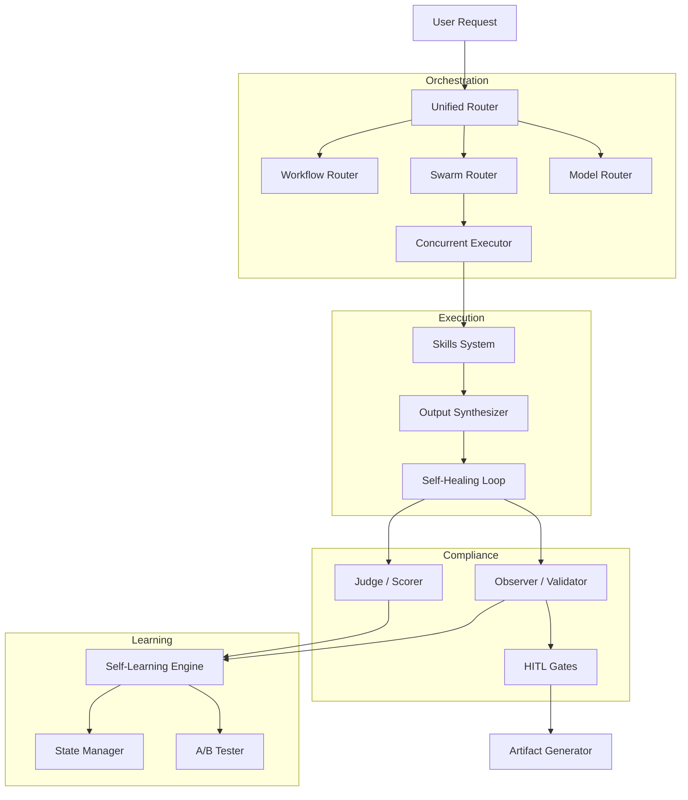

# Layer 2: Intelligence

> **The Brain System**: Self-learning, autonomous, and self-correcting intelligence layer.

## Architecture

This layer sits between Core (Layer 1) and Infrastructure (Layer 3). It provides the "cognitive" capabilities for the Agentic SDLC system.



## Components (17 Modules)

| Module | Key Classes | Purpose |
|--------|-------------|---------|
| **router** | `SwarmRouter`, `WorkflowRouter`, `ModelRouter` | Determines *how* to execute tasks (Sequential, Concurrent, MoA). |
| **judge** | `Judge`, `InputScorer`, `OutputScorer` | Evaluates quality of inputs, code, and artifacts (0-100). |
| **observer** | `Observer`, `AuditLogger` | Monitors rule compliance and logs all system actions. |
| **self_learning** | `Learner`, `PatternEngine` | Learns from success/failure to improve future recommendations. |
| **self_healing** | `SelfHealingOrchestrator`, `FeedbackLoop` | Auto-fixes code errors via QA-Dev feedback loops. |
| **concurrent** | `ConcurrentExecutor` | Runs multiple agents in parallel (Swarms pattern). |
| **synthesis** | `OutputSynthesizer` | Combines multi-agent outputs into a unified result (MoA). |
| **communication** | `FeedbackProtocol`, `GroupChat` | Handles async messaging and sync debates between agents. |
| **skills** | `AutoSkillBuilder`, `SkillManager` | Manages and dynamically generates agent capabilities. |
| **state** | `StateManager`, `WorkflowSession` | Persists workflow state and handles crash recovery (SQLite). |
| **task_manager** | `TaskBoard`, `SprintManager` | Manages Kanban tasks and agile sprints. |
| **workflow_validator** | `ComplianceValidator` | Validates executed workflows against defined protocols. |
| **hitl** | `HITLManager`, `ApprovalGate` | Enforces human approval at critical phases. |
| **ab_test** | `ABTester` | Generates and compares alternative solutions. |
| **artifact_gen** | `ArtifactGenerator` | Generates documentation and reports from templates. |
| **performance** | `MetricsCollector` | Tracks system performance and resource usage. |
| **research** | `ResearchAgent` | Deep technical research and knowledge retrieval. |

## Usage

### 1. Unified Brain CLI

The `@BRAIN` controller (`brain_cli.py`) exposes all intelligence features via a single interface:

```bash
# Check status
python agentic_sdlc/core/brain/brain_cli.py status

# Route a complex task (Swarm Intelligence)
python agentic_sdlc/core/brain/brain_cli.py swarm "Design secure login system" --mode moa

# Heal broken code
python agentic_sdlc/core/brain/brain_cli.py heal --code src/auth.py --requirements "Maximize security"

# Run parallel execution
python agentic_sdlc/core/brain/brain_cli.py concurrent --task "Review architecture" --phase review

# Generate a new skill
python agentic_sdlc/core/brain/brain_cli.py autoskill --name "KubernetesExpert" --objective "Manage localized k8s clusters"
```

### 2. Python API

```python
from agentic_sdlc.intelligence import (
    Judge, 
    SwarmRouter, 
    ConcurrentExecutor, 
    OutputSynthesizer
)

# 1. Route and Execute
router = SwarmRouter()
result = router.run("Implement JWT auth", mode="mixture_of_agents")

# 2. Parallel Execution
executor = ConcurrentExecutor()
concurrent_res = executor.run(
    roles=["SA", "SECA", "DEV"], 
    task="Review auth implementation"
)

# 3. Synthesize Results
synthesizer = OutputSynthesizer()
synthesizer.add_inputs_from_concurrent(concurrent_res.to_dict())
final_verdict = synthesizer.synthesize(strategy="consensus")

# 4. Score Quality
judge = Judge()
score = judge.score_text(final_verdict.synthesized_output)
print(f"Quality Score: {score.final_score}/10")
```

## Directory Structure

```
agentic_sdlc/intelligence/
├── concurrent/       # Parallel execution engine
├── synthesis/        # Output synthesis (MoA)
├── communication/    # Agent-to-agent talk
├── skills/           # Dynamic skill management
├── router/           # Unified routing logic
├── judge/            # Quality scoring
├── observer/         # Compliance monitoring
├── self_learning/    # Learning engine
├── self_healing/     # Auto-fix loops
├── state/            # Persistence (SQLite)
├── task_manager/     # Kanban & Sprints
├── workflow_validator/ # Execution validation
├── hitl/             # Human gates
├── ab_test/          # A/B testing
├── artifact_gen/     # Doc generation
├── performance/      # Metrics
└── research/         # Deep search
```

---
*Layer 2 Intelligence: Advanced Agentic Capabilities*
