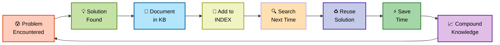
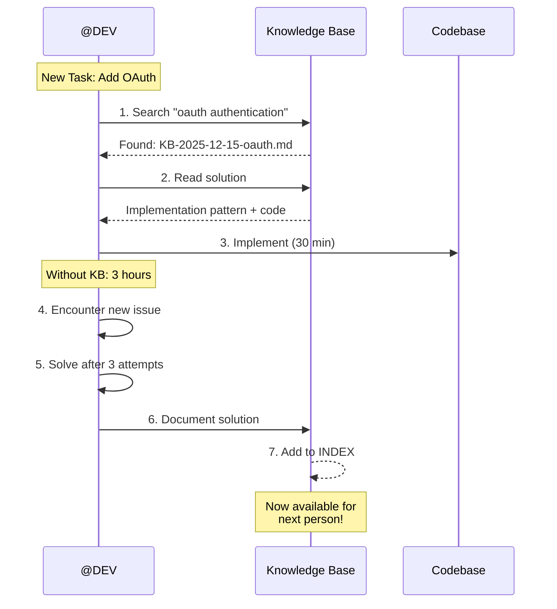
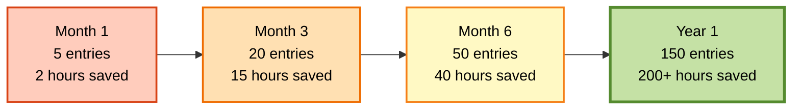
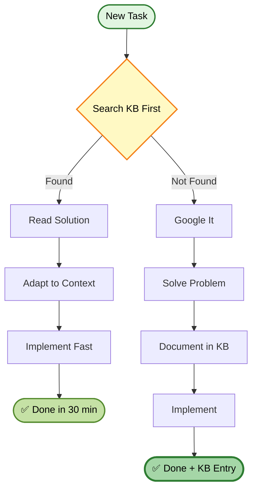
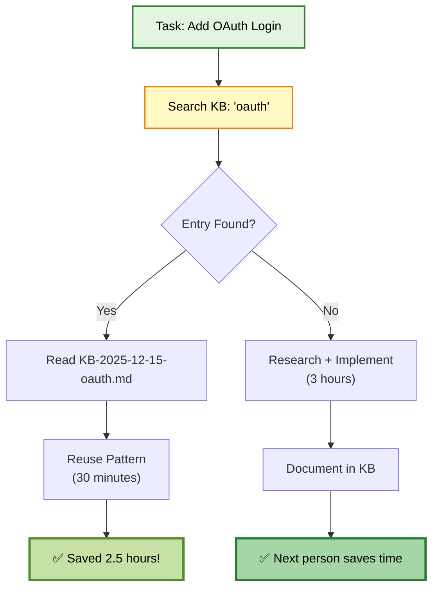
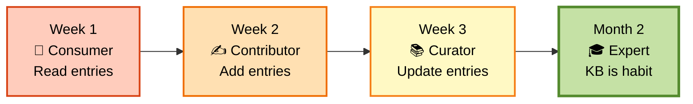

# Knowledge Base Visual Guide

## 🎯 What Is It?

The Knowledge Base is your **team's memory** - a searchable library of solutions to problems you've already solved.

## 📊 The Compound Learning Loop



## 🗂️ Knowledge Base Structure

```mermaid
graph TB
    KB[".agent/knowledge-base/"]
    
    KB --> INDEX["📇 INDEX.md<br/>(Quick Lookup)"]
    KB --> BUGS["🐛 bugs/"]
    KB --> FEATURES["✨ features/"]
    KB --> ARCH["🏗️ architecture/"]
    KB --> SEC["🔒 security/"]
    KB --> PERF["🚀 performance/"]
    KB --> PLATFORM["📱 platform-specific/"]
    
    BUGS --> CRIT["🔴 critical/"]
    BUGS --> HIGH["🟠 high/"]
    BUGS --> MED["🟡 medium/"]
    BUGS --> LOW["🟢 low/"]
    
    FEATURES --> AUTH["🔐 authentication/"]
    FEATURES --> FPERF["⚡ performance/"]
    FEATURES --> INTEG["🔌 integration/"]
    FEATURES --> UIUX["🎨 ui-ux/"]
    
    PLATFORM --> WEB["🌐 web/"]
    PLATFORM --> MOBILE["📱 mobile/"]
    PLATFORM --> DESKTOP["💻 desktop/"]
    PLATFORM --> CLI["⌨️ cli/"]
    
    style KB fill:#e1bee7,stroke:#6a1b9a,stroke-width:3px,color:#000
    style INDEX fill:#fff9c4,stroke:#f57f17,stroke-width:2px,color:#000
    style BUGS fill:#ffccbc,stroke:#d84315,stroke-width:2px,color:#000
    style FEATURES fill:#c5e1a5,stroke:#558b2f,stroke-width:2px,color:#000
    style ARCH fill:#b3e5fc,stroke:#01579b,stroke-width:2px,color:#000
    style SEC fill:#ffebee,stroke:#c62828,stroke-width:2px,color:#000
    style PERF fill:#a5d6a7,stroke:#2e7d32,stroke-width:2px,color:#000
    style PLATFORM fill:#e1f5fe,stroke:#01579b,stroke-width:2px,color:#000
```



## 🔄 Workflow Integration



## 📈 The Compound Effect Over Time



## 🎯 When to Use

### Before Starting Work



## 📝 Entry Structure

```
┌─────────────────────────────────────────┐
│ KB-2026-01-01-001-react-hydration.md   │
├─────────────────────────────────────────┤
│ YAML Frontmatter (Metadata)            │
│ ┌─────────────────────────────────────┐ │
│ │ title: "React Hydration Error"      │ │
│ │ category: bug                       │ │
│ │ priority: high                      │ │
│ │ tags: [react, ssr, hydration]       │ │
│ │ date: 2026-01-01                    │ │
│ └─────────────────────────────────────┘ │
├─────────────────────────────────────────┤
│ ## Problem                              │
│ Clear description of the issue          │
├─────────────────────────────────────────┤
│ ## What I Tried (Failed)                │
│ - Attempt 1: Didn't work                │
│ - Attempt 2: Didn't work                │
├─────────────────────────────────────────┤
│ ## Solution (What Worked)               │
│ Step-by-step solution                   │
│ ```code                                 │
│ // Working code                         │
│ ```                                     │
├─────────────────────────────────────────┤
│ ## Prevention                           │
│ How to avoid this in future             │
├─────────────────────────────────────────┤
│ ## Related                              │
│ Links to similar KB entries             │
└─────────────────────────────────────────┘
```

## 🔍 Search Methods

### Method 1: INDEX.md
```
1. Open: .agent/knowledge-base/INDEX.md
2. Ctrl+F: "oauth"
3. Find: KB-2025-12-15-003-oauth-implementation.md
4. Open and read
```

### Method 2: Browse by Category
```
Need auth help?
→ .agent/knowledge-base/features/authentication/

Found critical bug?
→ .agent/knowledge-base/bugs/critical/

Performance issue?
→ .agent/knowledge-base/performance/
```

### Method 3: IDE Search
```
Search all files: "hydration error"
→ Finds all KB entries mentioning it
```

## 💡 Real Example

### Scenario: OAuth Implementation



## 🎓 Learning Curve



## 📊 Success Metrics

Track your compound learning effectiveness:

```
┌─────────────────────────────────────┐
│ 📊 Compound System Health           │
├─────────────────────────────────────┤
│ Total Entries:        50            │
│ Entries This Week:    3             │
│ Time Saved:           40 hours      │
│ Reuse Rate:           65%           │
│ Coverage:             75%           │
└─────────────────────────────────────┘

Goal: Reuse Rate > 50% ✅
```

## 🚀 Quick Start Guide

### Step 1: Search First (Always!)
```
Before solving any problem:
1. Open .agent/knowledge-base/INDEX.md
2. Search for keywords
3. Check if solved before
```

### Step 2: Document After (If Hard)
```
After solving hard problem (3+ attempts):
1. Copy template
2. Fill in problem + solution
3. Save in correct folder
4. Add to INDEX.md
```

### Step 3: Share
```
Tell team: "Added KB-2026-01-01-005 about OAuth"
→ Everyone benefits
```

## 💪 Benefits Summary

### Individual Benefits
- ✅ Never solve same problem twice
- ✅ Build personal knowledge library
- ✅ Become faster over time
- ✅ Look like an expert

### Team Benefits
- ✅ New members onboard faster
- ✅ Consistent solutions
- ✅ Less wasted time
- ✅ Knowledge preserved

### Project Benefits
- ✅ Faster development
- ✅ Fewer bugs
- ✅ Better quality
- ✅ Lower costs

## 🎯 The Magic Formula

```
Time to Document:     10 minutes
Time Saved (1st reuse): 2 hours
Time Saved (5 reuses):  10 hours

ROI = 6000% 🚀
```

## 📚 Documentation

- **Simple Guide:** `.agent/knowledge-base/HOW-IT-WORKS.md`
- **Full README:** `.agent/knowledge-base/README.md`
- **Template:** `.agent/templates/Knowledge-Entry-Template.md`
- **Index:** `.agent/knowledge-base/INDEX.md`

---

**Remember:** Every entry makes the team smarter. Every search saves time. Every reuse compounds value.

**Philosophy:** "Each unit of engineering work should make subsequent units of work easier—not harder."

---

**Version:** 1.0.0  
**Created:** 2026-01-02  
**Status:** Active ✅

#knowledge-base #compound-learning #visual-guide
