# Agent Interaction Diagram

This diagram illustrates how agents interact with each other and with system components during workflow execution.

```mermaid
graph TB
    subgraph "User Interface"
        USER[User/CLI]
    end

    subgraph "Orchestration Layer"
        WE[Workflow Engine]
        AR[Agent Router]
        COORD[Coordinator]
        PLAN[Execution Planner]
        
        WE --> PLAN
        PLAN --> AR
        AR --> COORD
    end

    subgraph "Agent Pool"
        subgraph "Planning Agents"
            PM[PM - Project Manager]
            PO[PO - Product Owner]
        end
        
        subgraph "Design Agents"
            SA[SA - System Architect]
            UIUX[UIUX - Designer]
        end
        
        subgraph "Development Agents"
            DEV[DEV - Developer]
            FE[FRONTEND - Frontend Dev]
            BE[BACKEND - Backend Dev]
            FS[FULLSTACK - Full Stack]
        end
        
        subgraph "Quality Agents"
            TEST[TESTER - QA Engineer]
            REV[REVIEWER - Code Reviewer]
            QJ[QUALITY_JUDGE - Judge]
        end
        
        subgraph "Specialized Agents"
            RES[RESEARCH - Researcher]
            DATA[DATA - Data Engineer]
            ML[ML - ML Engineer]
            DOCS[DOCS - Tech Writer]
            SECA[SECA - Security Analyst]
            DEVOPS[DEVOPS - DevOps]
        end
    end

    subgraph "Intelligence Layer"
        BRAIN[Brain Core]
        MEMORY[Memory System]
        LEARNER[Learning Engine]
        REASONER[Reasoning Engine]
        
        BRAIN --> MEMORY
        BRAIN --> LEARNER
        BRAIN --> REASONER
    end

    subgraph "Infrastructure Services"
        LLM[LLM Provider]
        STORAGE[Storage]
        CACHE[Cache]
        QUEUE[Task Queue]
    end

    subgraph "Cross-Cutting Services"
        CONFIG[Configuration]
        SECURITY[Security]
        MONITOR[Monitoring]
    end

    USER --> WE
    
    COORD --> PM
    COORD --> PO
    COORD --> SA
    COORD --> UIUX
    COORD --> DEV
    COORD --> FE
    COORD --> BE
    COORD --> FS
    COORD --> TEST
    COORD --> REV
    COORD --> QJ
    COORD --> RES
    COORD --> DATA
    COORD --> ML
    COORD --> DOCS
    COORD --> SECA
    COORD --> DEVOPS
    
    PM -.->|collaborates| PO
    PO -.->|provides requirements| SA
    SA -.->|provides design| DEV
    SA -.->|provides design| FE
    SA -.->|provides design| BE
    DEV -.->|submits code| REV
    FE -.->|submits code| REV
    BE -.->|submits code| REV
    REV -.->|approved code| TEST
    TEST -.->|test results| QJ
    SECA -.->|security review| REV
    DEVOPS -.->|deployment support| TEST
    RES -.->|research findings| SA
    DATA -.->|data insights| ML
    DOCS -.->|documentation| PM
    
    PM --> LLM
    PO --> LLM
    SA --> LLM
    UIUX --> LLM
    DEV --> LLM
    FE --> LLM
    BE --> LLM
    FS --> LLM
    TEST --> LLM
    REV --> LLM
    QJ --> LLM
    RES --> LLM
    DATA --> LLM
    ML --> LLM
    DOCS --> LLM
    SECA --> LLM
    DEVOPS --> LLM
    
    PM --> BRAIN
    PO --> BRAIN
    SA --> BRAIN
    UIUX --> BRAIN
    DEV --> BRAIN
    FE --> BRAIN
    BE --> BRAIN
    FS --> BRAIN
    TEST --> BRAIN
    REV --> BRAIN
    QJ --> BRAIN
    RES --> BRAIN
    DATA --> BRAIN
    ML --> BRAIN
    DOCS --> BRAIN
    SECA --> BRAIN
    DEVOPS --> BRAIN
    
    BRAIN --> STORAGE
    BRAIN --> CACHE
    
    COORD --> QUEUE
    QUEUE --> STORAGE
    
    WE --> CONFIG
    WE --> SECURITY
    WE --> MONITOR
    
    COORD --> MONITOR
    
    PM --> CONFIG
    DEV --> CONFIG
    TEST --> CONFIG
    
    SECA --> SECURITY
    DEVOPS --> SECURITY

    style USER fill:#4A90E2,stroke:#2E5C8A,stroke-width:2px,color:#fff
    
    style WE fill:#50C878,stroke:#2E7D4E,stroke-width:2px,color:#fff
    style AR fill:#50C878,stroke:#2E7D4E,stroke-width:2px,color:#fff
    style COORD fill:#50C878,stroke:#2E7D4E,stroke-width:2px,color:#fff
    style PLAN fill:#50C878,stroke:#2E7D4E,stroke-width:2px,color:#fff
    
    style PM fill:#9B59B6,stroke:#6C3483,stroke-width:2px,color:#fff
    style PO fill:#9B59B6,stroke:#6C3483,stroke-width:2px,color:#fff
    style SA fill:#3498DB,stroke:#2471A3,stroke-width:2px,color:#fff
    style UIUX fill:#3498DB,stroke:#2471A3,stroke-width:2px,color:#fff
    style DEV fill:#E74C3C,stroke:#A93226,stroke-width:2px,color:#fff
    style FE fill:#E74C3C,stroke:#A93226,stroke-width:2px,color:#fff
    style BE fill:#E74C3C,stroke:#A93226,stroke-width:2px,color:#fff
    style FS fill:#E74C3C,stroke:#A93226,stroke-width:2px,color:#fff
    style TEST fill:#F39C12,stroke:#B9770E,stroke-width:2px,color:#fff
    style REV fill:#F39C12,stroke:#B9770E,stroke-width:2px,color:#fff
    style QJ fill:#F39C12,stroke:#B9770E,stroke-width:2px,color:#fff
    style RES fill:#1ABC9C,stroke:#138D75,stroke-width:2px,color:#fff
    style DATA fill:#1ABC9C,stroke:#138D75,stroke-width:2px,color:#fff
    style ML fill:#1ABC9C,stroke:#138D75,stroke-width:2px,color:#fff
    style DOCS fill:#1ABC9C,stroke:#138D75,stroke-width:2px,color:#fff
    style SECA fill:#1ABC9C,stroke:#138D75,stroke-width:2px,color:#fff
    style DEVOPS fill:#1ABC9C,stroke:#138D75,stroke-width:2px,color:#fff
    
    style BRAIN fill:#E91E63,stroke:#AD1457,stroke-width:2px,color:#fff
    style MEMORY fill:#E91E63,stroke:#AD1457,stroke-width:2px,color:#fff
    style LEARNER fill:#E91E63,stroke:#AD1457,stroke-width:2px,color:#fff
    style REASONER fill:#E91E63,stroke:#AD1457,stroke-width:2px,color:#fff
    
    style LLM fill:#607D8B,stroke:#37474F,stroke-width:2px,color:#fff
    style STORAGE fill:#607D8B,stroke:#37474F,stroke-width:2px,color:#fff
    style CACHE fill:#607D8B,stroke:#37474F,stroke-width:2px,color:#fff
    style QUEUE fill:#607D8B,stroke:#37474F,stroke-width:2px,color:#fff
    
    style CONFIG fill:#FF9800,stroke:#E65100,stroke-width:2px,color:#fff
    style SECURITY fill:#FF9800,stroke:#E65100,stroke-width:2px,color:#fff
    style MONITOR fill:#FF9800,stroke:#E65100,stroke-width:2px,color:#fff
```



## Agent Types and Responsibilities

### Planning & Management Agents (Purple)
- **PM (Project Manager)**: Planning, tracking, coordination, sprint management
- **PO (Product Owner)**: Requirements gathering, priorities, stakeholder management

### Design Agents (Blue)
- **SA (System Architect)**: System design, architecture decisions, technical leadership
- **UIUX (UI/UX Designer)**: User interface design, user experience optimization

### Development Agents (Red)
- **DEV (Developer)**: General code implementation
- **FRONTEND**: Frontend development (React, Vue, Angular)
- **BACKEND**: Backend development (APIs, databases, services)
- **FULLSTACK**: Full-stack development (frontend + backend)

### Quality Agents (Orange)
- **TESTER (QA Engineer)**: Testing, verification, self-healing test automation
- **REVIEWER (Code Reviewer)**: Code review, quality assurance, best practices
- **QUALITY_JUDGE**: Quality assessment, decision making, acceptance criteria

### Specialized Agents (Teal)
- **RESEARCH**: Technical research, proof of concepts, technology evaluation
- **DATA**: Data analysis, data engineering, ETL pipelines
- **ML**: Machine learning, AI model development and training
- **DOCS**: Documentation, technical writing, API documentation
- **SECA (Security Analyst)**: Security audits, vulnerability assessment, compliance
- **DEVOPS**: Infrastructure, deployment, CI/CD, operations

## Interaction Patterns

### 1. Hierarchical Collaboration
Agents follow a natural workflow hierarchy:
```
PM/PO → SA → DEV/FE/BE → REV → TEST → QJ
```

### 2. Peer Collaboration
Agents at the same level collaborate directly:
- PM ↔ PO: Planning and requirements
- DEV ↔ FE ↔ BE: Code integration
- TEST ↔ REV: Quality assurance

### 3. Cross-Functional Support
Specialized agents support multiple stages:
- **SECA**: Reviews code for security issues
- **DEVOPS**: Supports deployment and operations
- **RES**: Provides research for architecture decisions
- **DOCS**: Documents throughout the process

### 4. Brain Integration
All agents feed data to the Brain Core:
- **Execution patterns**: What worked and what didn't
- **Decision rationale**: Why certain choices were made
- **Performance metrics**: Speed, quality, resource usage
- **Learning feedback**: Continuous improvement data

## Communication Flows

### Solid Lines (→)
Direct dependencies and control flow:
- User → Workflow Engine
- Coordinator → Agents
- Agents → LLM Provider
- Agents → Brain Core

### Dotted Lines (-.->)
Collaboration and data sharing:
- PM ↔ PO: Requirements and planning
- SA → DEV: Design specifications
- DEV → REV: Code submissions
- REV → TEST: Approved code

## Infrastructure Integration

### LLM Provider
All agents use LLM providers for:
- Natural language understanding
- Code generation
- Decision making
- Content creation

### Brain Core
Central intelligence hub that:
- Stores execution patterns
- Learns from agent interactions
- Provides context-aware suggestions
- Optimizes future executions

### Storage & Cache
- **Storage**: Persistent data (workflows, configurations, history)
- **Cache**: Temporary data (session state, intermediate results)
- **Queue**: Task distribution and load balancing

### Cross-Cutting Services
- **Configuration**: Agent settings and parameters
- **Security**: Authentication, authorization, secrets
- **Monitoring**: Logging, metrics, health checks

## Agent Lifecycle

1. **Registration**: Agent registers with coordinator
2. **Initialization**: Load configuration and context
3. **Ready State**: Waiting for task assignment
4. **Execution**: Processing assigned task
5. **Collaboration**: Interacting with other agents
6. **Completion**: Returning results
7. **Learning**: Feeding data to brain
8. **Ready State**: Available for next task

## Key Design Principles

1. **Loose Coupling**: Agents interact through well-defined interfaces
2. **High Cohesion**: Each agent has a focused responsibility
3. **Scalability**: Agent pool can grow dynamically
4. **Resilience**: Failure of one agent doesn't affect others
5. **Learning**: Every interaction improves the system

## Related Documentation

- [Architecture Overview](../ARCHITECTURE.md)
- [Agent Guide](../AGENT_GUIDE.md)
- [Workflow Guide](../WORKFLOW_GUIDE.md)
