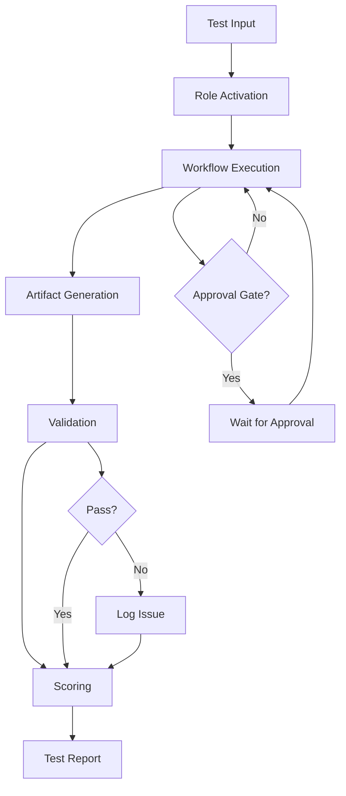

# Workflow System Test Design Specification - v1

**Project:** TeamLifecycle Workflow System Validation
**Type:** Global System Testing
**Version:** 1
**Date:** 2026-01-01
**SA:** @SA
**Status:** Ready for Review

---

## 1. Architecture Overview

### 1.1 Test System Architecture

```
┌─────────────────────────────────────────────────────────┐
│              Test Execution Controller                   │
│         (Manual execution + validation)                  │
└─────────────────────────────────────────────────────────┘
                          ↓
┌─────────────────────────────────────────────────────────┐
│                  8 Test Scenarios                        │
│  1. Role Functionality (12 roles)                       │
│  2. Execution Modes (3 modes)                           │
│  3. Approval Gates                                       │
│  4. Artifact Generation                                  │
│  5. Phase Transitions                                    │
│  6. Git Workflow                                         │
│  7. Knowledge Base                                       │
│  8. Parallel Execution                                   │
└─────────────────────────────────────────────────────────┘
                          ↓
┌─────────────────────────────────────────────────────────┐
│         TeamLifecycle Workflow System (SUT)              │
│  12 Roles | 3 Modes | Approval Gates | Artifacts        │
└─────────────────────────────────────────────────────────┘
                          ↓
┌─────────────────────────────────────────────────────────┐
│              Validation & Scoring Engine                 │
│  Artifact Checker | Path Validator | Score Calculator   │
└─────────────────────────────────────────────────────────┘
                          ↓
┌─────────────────────────────────────────────────────────┐
│                    Test Report                           │
│  Scores | Issues | Recommendations | Pass/Fail          │
└─────────────────────────────────────────────────────────┘
```

### 1.2 Data Flow Diagram



---

## 2. Test Data Models

### 2.1 Test Case Model

```typescript
interface TestCase {
  id: string;                    // TC-1.1, TC-2.1, etc.
  scenario: string;              // Scenario name
  description: string;           // Test description
  input: string;                 // Test input
  expectedOutput: ExpectedOutput;
  actualOutput?: ActualOutput;
  status: 'pass' | 'fail' | 'skip';
  score: number;
  issues: Issue[];
}
```

### 2.2 Expected Output Model

```typescript
interface ExpectedOutput {
  artifacts: ArtifactSpec[];     // Expected artifacts
  workflow: string[];            // Expected workflow sequence
  approvalGates: string[];       // Expected approval gates
  tags: string[];                // Expected tags
  handoffs: string[];            // Expected handoffs
}

interface ArtifactSpec {
  name: string;                  // File name pattern
  location: string;              // Directory path
  sections: string[];            // Required sections
  tags: string[];                // Required tags
}
```

### 2.3 Validation Result Model

```typescript
interface ValidationResult {
  testCaseId: string;
  category: string;
  passed: boolean;
  score: number;
  maxScore: number;
  issues: Issue[];
  timestamp: string;
}

interface Issue {
  severity: 'critical' | 'high' | 'medium' | 'low';
  category: string;
  description: string;
  location: string;
  recommendation: string;
}
```

### 2.4 Score Card Model

```typescript
interface ScoreCard {
  roleFunctionality: number;     // 0-30
  workflowAdherence: number;     // 0-20
  approvalGates: number;         // 0-15
  artifactQuality: number;       // 0-15
  modeExecution: number;         // 0-10
  gitIntegration: number;        // 0-5
  kbIntegration: number;         // 0-3
  errorHandling: number;         // 0-2
  total: number;                 // 0-100
  grade: 'A' | 'B' | 'C' | 'D' | 'F';
  status: 'pass' | 'fail';
}
```

---

## 3. Validation Framework

### 3.1 Artifact Validation Rules

**File Naming Patterns:**
```regex
Project-Plan-Sprint-\d+-v\d+\.md
Backend-Design-Spec-Sprint-\d+-v\d+\.md
UIUX-Design-Spec-Sprint-\d+-v\d+\.md
Product-Backlog-Sprint-\d+-v\d+\.md
Design-Verification-Report-Sprint-\d+-v\d+\.md
Security-Review-Report-Sprint-\d+-v\d+\.md
Development-Log-Sprint-\d+-v\d+\.md
DevOps-Plan-Sprint-\d+-v\d+\.md
Test-Report-Sprint-\d+-v\d+\.md
Phase-Report-Sprint-\d+-v\d+\.md
Final-Approval-Report-Sprint-\d+\.md
Orchestration-Log-Sprint-\d+\.md
```

**Path Validation:**
```
docs/sprints/sprint-N/plans/       → PM, PO artifacts
docs/sprints/sprint-N/designs/     → SA, UIUX artifacts
docs/sprints/sprint-N/reviews/     → QA, SECA artifacts
docs/sprints/sprint-N/logs/        → DEV, DEVOPS, ORCHESTRATOR
docs/sprints/sprint-N/tests/       → TESTER artifacts
docs/sprints/sprint-N/reports/     → REPORTER artifacts
docs/global/reports/               → STAKEHOLDER artifacts
```

**Content Validation:**
- Required sections present
- Handoff tags included
- Role tags present
- Version numbers correct
- Cross-references valid

### 3.2 Workflow Validation Rules

**Phase Sequence:**
```
Planning → Design → Review → Development → Testing → Reporting → Approval
```

**Approval Gates:**
1. Project Plan → User Approval Required
2. Design Phase → QA + SECA Review Required
3. Final Delivery → Stakeholder Approval Required

**No Phase Skipping:**
- Cannot go from Planning to Development
- Cannot skip Design Review
- Cannot skip Testing

### 3.3 Git Validation Rules

**Commit Message Format:**
```
[TASK-ID] <Type>: <Description>

Types: Feature, Fix, Refactor, Docs, Chore, Test
Example: [TASK-001] Feature: Add user authentication
```

**Atomic Commits:**
- One task = One commit
- Commit immediately after task completion
- Link commit hash in Development-Log

**CHANGELOG Format:**
```markdown
- [YYYY-MM-DD] [Commit-Hash] [Type]: [Description] (@Author)
```

---

## 4. Scoring Engine Design

### 4.1 Scoring Algorithm

```javascript
function calculateScore(testResults) {
  let score = {
    roleFunctionality: 0,
    workflowAdherence: 0,
    approvalGates: 0,
    artifactQuality: 0,
    modeExecution: 0,
    gitIntegration: 0,
    kbIntegration: 0,
    errorHandling: 0
  };
  
  // 1. Role Functionality (30 points)
  score.roleFunctionality = validateRoles(testResults) * 30;
  
  // 2. Workflow Adherence (20 points)
  score.workflowAdherence = validateWorkflow(testResults) * 20;
  
  // 3. Approval Gates (15 points)
  score.approvalGates = validateGates(testResults) * 15;
  
  // 4. Artifact Quality (15 points)
  score.artifactQuality = validateArtifacts(testResults) * 15;
  
  // 5. Mode Execution (10 points)
  score.modeExecution = validateModes(testResults) * 10;
  
  // 6. Git Integration (5 points)
  score.gitIntegration = validateGit(testResults) * 5;
  
  // 7. KB Integration (3 points)
  score.kbIntegration = validateKB(testResults) * 3;
  
  // 8. Error Handling (2 points)
  score.errorHandling = validateErrors(testResults) * 2;
  
  score.total = Object.values(score).reduce((a, b) => a + b, 0);
  score.grade = calculateGrade(score.total);
  score.status = score.total >= 70 ? 'pass' : 'fail';
  
  return score;
}
```

### 4.2 Validation Functions

**validateRoles(testResults):**
- Check each of 12 roles executed correctly
- Verify artifacts generated
- Validate handoffs
- Return: 0.0 to 1.0 (12 roles × 2.5 points each)

**validateWorkflow(testResults):**
- Verify phase sequence correct
- Check no phase skipping
- Validate role order
- Confirm handoffs
- Return: 0.0 to 1.0

**validateGates(testResults):**
- Check approval requests present
- Verify user approval received
- Validate gate timing
- Confirm no bypasses
- Return: 0.0 to 1.0

**validateArtifacts(testResults):**
- Check file naming convention
- Verify path correctness
- Validate content completeness
- Confirm formatting
- Return: 0.0 to 1.0

**validateModes(testResults):**
- Check Manual mode works
- Verify Semi-Auto mode works
- Validate Full-Auto mode works
- Return: 0.0 to 1.0

**validateGit(testResults):**
- Check commit messages format
- Verify atomic commits
- Validate CHANGELOG updates
- Confirm task linking
- Return: 0.0 to 1.0

**validateKB(testResults):**
- Check KB searches performed
- Verify entry creation
- Validate index updates
- Confirm categorization
- Return: 0.0 to 1.0

**validateErrors(testResults):**
- Check error messages clear
- Verify graceful failures
- Validate recovery
- Confirm user guidance
- Return: 0.0 to 1.0

---

## 5. Detailed Test Specifications

### 5.1 Role Functionality Tests

#### TC-1.1: Project Manager (@PM) Test

**Test Input:**
```
User: "@PM - Build a simple todo app with task CRUD operations"
```

**Expected Behavior:**
1. PM reads user request
2. PM creates project plan document
3. PM requests user approval
4. PM waits for approval before proceeding

**Expected Artifact:**
```yaml
File: Project-Plan-Sprint-N-v1.md
Location: docs/sprints/sprint-N/plans/
Sections:
  - Executive Summary
  - Project Scope
  - Features (Must/Should/Could)
  - Tech Stack
  - Timeline
  - Risks & Mitigation
  - Success Criteria
  - Approval Required
  - Next Steps
Tags: ["#planning", "#pm"]
Handoffs: ["@SA", "@UIUX", "@PO"]
```

**Validation Checks:**
- ✅ Artifact created with correct name
- ✅ Artifact in correct location
- ✅ All required sections present
- ✅ Proper tags included
- ✅ Handoff tags present
- ✅ Approval request clear
- ✅ Workflow blocks until approval

**Scoring:**
- Pass all checks: 2.5 points
- Missing 1-2 checks: 1.5 points
- Missing 3+ checks: 0 points

---

#### TC-1.2: System Analyst (@SA) Test

**Test Input:**
```
Context: Approved project plan exists
User: "@SA - Design the backend architecture"
```

**Expected Behavior:**
1. SA reads approved project plan
2. SA designs system architecture
3. SA creates design specification
4. SA hands off to QA, SECA, UIUX

**Expected Artifact:**
```yaml
File: Backend-Design-Spec-Sprint-N-v1.md
Location: docs/sprints/sprint-N/designs/
Sections:
  - Architecture Overview
  - Data Models & Schema
  - API Specifications
  - Integration Points
  - Error Handling
  - Security Considerations
  - Performance & Scalability
  - Next Steps
Tags: ["#designing", "#backend", "#architecture"]
Handoffs: ["@QA", "@SECA", "@UIUX"]
```

**Validation Checks:**
- ✅ Reads approved plan first
- ✅ Artifact created correctly
- ✅ Architecture diagram included
- ✅ API specs detailed
- ✅ Data models defined
- ✅ Proper handoffs

**Scoring:** 2.5 points

---

#### TC-1.3-1.12: Other Roles

Similar detailed specifications for:
- TC-1.3: UI/UX Designer (@UIUX)
- TC-1.4: Product Owner (@PO)
- TC-1.5: QA Analyst (@QA)
- TC-1.6: Security Analyst (@SECA)
- TC-1.7: Developer (@DEV)
- TC-1.8: DevOps Engineer (@DEVOPS)
- TC-1.9: Tester (@TESTER)
- TC-1.10: Reporter (@REPORTER)
- TC-1.11: Stakeholder (@STAKEHOLDER)
- TC-1.12: Orchestrator (@ORCHESTRATOR)

Each with 2.5 points, total 30 points for all roles.

---

### 5.2 Execution Mode Tests

#### TC-2.1: Manual Mode Test

**Test Input:**
```
User: "@PM - Build a simple todo app"
[Manual invocation of each role]
```

**Expected Flow:**
```
1. User → @PM
2. PM creates plan
3. User approves
4. User → @SA
5. SA creates design
6. User → @UIUX
7. UIUX creates design
8. User → @PO
9. PO creates backlog
10. User → @QA
11. QA reviews
12. User → @SECA
13. SECA reviews
14. User reviews and approves
15. User → @DEV
16. DEV implements
17. User → @DEVOPS
18. DEVOPS sets up infrastructure
19. User → @TESTER
20. TESTER tests
21. User → @REPORTER
22. REPORTER documents
23. User → @STAKEHOLDER
24. STAKEHOLDER approves
```

**Validation:**
- ✅ Each role requires manual invocation
- ✅ No automatic transitions
- ✅ All approval gates require user input
- ✅ Workflow blocks at each step

**Scoring:** 3.33 points (out of 10 for all modes)

---

#### TC-2.2: Semi-Auto Mode Test

**Test Input:**
```
User: "@PM - Build a simple todo app --mode=semi-auto"
```

**Expected Flow:**
```
1. User → @PM --mode=semi-auto
2. PM creates plan
3. User approves
4. [AUTO] Orchestrator executes: SA + UIUX + PO (parallel)
5. [AUTO] Orchestrator executes: QA + SECA (parallel)
6. Orchestrator pauses for user review
7. User reviews and approves
8. [AUTO] Orchestrator executes: DEV + DEVOPS (parallel)
9. Orchestrator pauses for testing
10. User → @TESTER (or auto if configured)
11. TESTER tests
12. [AUTO] Orchestrator executes: REPORTER
13. [AUTO] Orchestrator executes: STAKEHOLDER
14. User final approval
```

**Validation:**
- ✅ Orchestrator auto-executes within phases
- ✅ Pauses at phase boundaries
- ✅ User approval required at gates
- ✅ Parallel execution documented
- ✅ Orchestration log created

**Scoring:** 3.33 points

---

#### TC-2.3: Full-Auto Mode Test

**Test Input:**
```
User: "@PM - Build a simple todo app --mode=full-auto"
```

**Expected Flow:**
```
1. User → @PM --mode=full-auto
2. PM creates plan
3. User approves
4. [AUTO] Orchestrator executes entire workflow
5. Orchestrator only stops at:
   - Critical/high bugs
   - Final stakeholder approval
6. User receives completion notification
7. User final approval
```

**Validation:**
- ✅ Minimal user intervention
- ✅ Automatic phase transitions
- ✅ Only stops at critical gates
- ✅ Complete artifact set generated
- ✅ Orchestration log comprehensive
- ✅ Execution time tracked

**Scoring:** 3.34 points

---

### 5.3 Approval Gate Tests

#### TC-3.1: Project Plan Approval Gate

**Test Procedure:**
1. Invoke @PM to create project plan
2. Attempt to invoke @SA without approval
3. Verify workflow blocks
4. Provide approval
5. Verify workflow proceeds

**Expected Behavior:**
- ❌ @SA should not execute without approval
- ✅ Clear message: "Waiting for user approval"
- ✅ After approval, @SA can proceed

**Validation:**
- ✅ Gate enforced
- ✅ Clear messaging
- ✅ Proper unblocking after approval

**Scoring:** 5 points (out of 15 for all gates)

---

#### TC-3.2: Design Review Approval Gate

**Test Procedure:**
1. Complete design phase (SA, UIUX, PO)
2. QA and SECA review
3. Attempt to invoke @DEV without approval
4. Verify workflow blocks
5. Provide approval
6. Verify workflow proceeds

**Expected Behavior:**
- ❌ @DEV should not execute without QA+SECA approval
- ✅ Clear message: "Waiting for design review approval"
- ✅ After approval, @DEV can proceed

**Validation:**
- ✅ Gate enforced
- ✅ Both QA and SECA must complete
- ✅ Proper unblocking

**Scoring:** 5 points

---

#### TC-3.3: Final Approval Gate

**Test Procedure:**
1. Complete all phases
2. REPORTER creates final report
3. Attempt to mark complete without stakeholder
4. Verify workflow blocks
5. STAKEHOLDER approves
6. Verify workflow completes

**Expected Behavior:**
- ❌ Cannot complete without stakeholder approval
- ✅ Clear message: "Waiting for stakeholder approval"
- ✅ After approval, project marked complete

**Validation:**
- ✅ Gate enforced
- ✅ Clear messaging
- ✅ Proper completion

**Scoring:** 5 points

---

### 5.4 Artifact Generation Tests

#### TC-4.1: File Naming Convention Test

**Test Procedure:**
Execute complete workflow and verify all artifact names

**Expected Naming:**
```
✅ Project-Plan-Sprint-1-v1.md
✅ Backend-Design-Spec-Sprint-1-v1.md
✅ UIUX-Design-Spec-Sprint-1-v1.md
✅ Product-Backlog-Sprint-1-v1.md
✅ Design-Verification-Report-Sprint-1-v1.md
✅ Security-Review-Report-Sprint-1-v1.md
✅ Development-Log-Sprint-1-v1.md
✅ DevOps-Plan-Sprint-1-v1.md
✅ Test-Report-Sprint-1-v1.md
✅ Phase-Report-Sprint-1-v1.md
✅ Final-Approval-Report-Sprint-1.md
✅ Orchestration-Log-Sprint-1.md
```

**Validation:**
- ✅ All files follow naming pattern
- ✅ Sprint number correct
- ✅ Version number present
- ✅ No typos or variations

**Scoring:** 5 points (out of 15 for artifact quality)

---

#### TC-4.2: File Location Test

**Test Procedure:**
Verify all artifacts in correct directories

**Expected Structure:**
```
docs/sprints/sprint-1/
├── plans/
│   ├── Project-Plan-Sprint-1-v1.md ✅
│   └── Product-Backlog-Sprint-1-v1.md ✅
├── designs/
│   ├── Backend-Design-Spec-Sprint-1-v1.md ✅
│   └── UIUX-Design-Spec-Sprint-1-v1.md ✅
├── reviews/
│   ├── Design-Verification-Report-Sprint-1-v1.md ✅
│   └── Security-Review-Report-Sprint-1-v1.md ✅
├── logs/
│   ├── Development-Log-Sprint-1-v1.md ✅
│   ├── DevOps-Plan-Sprint-1-v1.md ✅
│   └── Orchestration-Log-Sprint-1.md ✅
├── tests/
│   └── Test-Report-Sprint-1-v1.md ✅
└── reports/
    └── Phase-Report-Sprint-1-v1.md ✅

docs/global/reports/
└── Final-Approval-Report-Sprint-1.md ✅
```

**Validation:**
- ✅ All files in correct directories
- ✅ No files in wrong locations
- ✅ No files in .agent/ directory

**Scoring:** 5 points

---

#### TC-4.3: Content Quality Test

**Test Procedure:**
Review each artifact for completeness

**Validation Criteria:**
- ✅ All required sections present
- ✅ Proper markdown formatting
- ✅ Handoff tags included
- ✅ Role tags present
- ✅ Cross-references valid
- ✅ Version numbers correct
- ✅ No placeholder text
- ✅ Content makes sense

**Scoring:** 5 points

---

### 5.5 Phase Transition Tests

#### TC-5.1: No Phase Skipping Test

**Test Procedure:**
Attempt invalid phase transitions

**Invalid Transitions to Test:**
```
❌ Planning → Development (skip Design)
❌ Planning → Testing (skip Design & Development)
❌ Design → Testing (skip Development)
❌ Development → Final Approval (skip Testing & Reporting)
```

**Expected Behavior:**
- System blocks invalid transition
- Error message displayed
- Workflow enforces correct sequence

**Validation:**
- ✅ All invalid transitions blocked
- ✅ Clear error messages
- ✅ Workflow integrity maintained

**Scoring:** 10 points (out of 20 for workflow adherence)

---

#### TC-5.2: Correct Phase Sequence Test

**Test Procedure:**
Execute complete workflow in correct order

**Valid Flow:**
```
✅ Planning (PM)
✅ Design (SA + UIUX + PO)
✅ Review (QA + SECA)
✅ Development (DEV + DEVOPS)
✅ Testing (TESTER)
✅ Reporting (REPORTER)
✅ Approval (STAKEHOLDER)
```

**Validation:**
- ✅ Each phase completes before next
- ✅ Proper handoffs between phases
- ✅ All artifacts generated in order
- ✅ No phase skipped

**Scoring:** 10 points

---

### 5.6 Git Workflow Tests

#### TC-6.1: Atomic Commits Test

**Test Procedure:**
Monitor commits during development phase

**Expected Behavior:**
- Each task has corresponding commit
- Commit immediately after task completion
- Commit hash linked in Development-Log

**Validation:**
```
Development-Log:
- [x] Task 1: Setup project structure
  Commit: abc123 - [TASK-001] Feature: Setup project
  
- [x] Task 2: Implement user model
  Commit: def456 - [TASK-002] Feature: Add user model
  
- [x] Task 3: Add authentication
  Commit: ghi789 - [TASK-003] Feature: Add authentication
```

**Scoring:** 2 points (out of 5 for git integration)

---

#### TC-6.2: Commit Message Format Test

**Test Procedure:**
Verify all commit messages follow format

**Expected Format:**
```
[TASK-ID] <Type>: <Description>

Valid Examples:
✅ [TASK-001] Feature: Add user authentication
✅ [BUG-001] Fix: Login form validation
✅ [TASK-002] Refactor: Optimize database queries
✅ [TASK-003] Docs: Update API documentation
✅ [TASK-004] Test: Add unit tests for auth

Invalid Examples:
❌ Add user authentication (missing task ID)
❌ [TASK-001] Add auth (missing type)
❌ Feature: Add auth (missing task ID)
```

**Validation:**
- ✅ All commits have task ID
- ✅ All commits have type
- ✅ All commits have description
- ✅ Format consistent

**Scoring:** 2 points

---

#### TC-6.3: CHANGELOG Updates Test

**Test Procedure:**
Verify CHANGELOG.md updated with each commit

**Expected Format:**
```markdown
# CHANGELOG

## Sprint 1

- [2026-01-01] [abc123] Feature: Setup project structure (@DEV)
- [2026-01-01] [def456] Feature: Add user model (@DEV)
- [2026-01-01] [ghi789] Feature: Add authentication (@DEV)
- [2026-01-01] [jkl012] Fix: Login validation bug (@DEV)
```

**Validation:**
- ✅ Every commit has CHANGELOG entry
- ✅ Chronological order
- ✅ Proper formatting
- ✅ Commit hash included
- ✅ Author tagged

**Scoring:** 1 point

---

### 5.7 Knowledge Base Integration Tests

#### TC-7.1: KB Search Test

**Test Procedure:**
Monitor KB searches during complex tasks

**Expected Behavior:**
```
Before implementing OAuth:
1. Search KB index for "OAuth", "authentication"
2. Find existing entry: KB-AUTH-001-OAuth2-Implementation.md
3. Use guidance from KB entry
4. Document search in Development-Log
```

**Validation:**
- ✅ KB searched before complex tasks
- ✅ Search results documented
- ✅ KB guidance used if available

**Scoring:** 1 point (out of 3 for KB integration)

---

#### TC-7.2: KB Entry Creation Test

**Test Procedure:**
Monitor KB entry creation for difficult tasks

**Trigger:** Task requires 3+ attempts

**Expected Behavior:**
```
After 3+ attempts on difficult feature:
1. Create KB entry using template
2. Document problem and solution
3. Update KB index
4. Proper categorization
5. Add searchable keywords
```

**Expected Entry:**
```markdown
# KB-FEAT-001-Complex-Feature-Implementation

## Problem
[Description of the challenge]

## Solution
[Step-by-step solution]

## Lessons Learned
[Key takeaways]

## Keywords
complex-feature, implementation, challenge
```

**Validation:**
- ✅ KB entry created
- ✅ Follows template
- ✅ Index updated
- ✅ Proper categorization
- ✅ Searchable keywords

**Scoring:** 1 point

---

#### TC-7.3: KB Index Maintenance Test

**Test Procedure:**
Verify KB index stays current

**Expected Index Format:**
```markdown
# Knowledge Base Index

## Authentication
- KB-AUTH-001: OAuth2 Implementation
- KB-AUTH-002: JWT Token Management

## Features
- KB-FEAT-001: Complex Feature Implementation
- KB-FEAT-002: Real-time Updates

## Bugs
- KB-BUG-001: Memory Leak Fix
```

**Validation:**
- ✅ Index updated when entries added
- ✅ Proper categorization
- ✅ Searchable format
- ✅ Cross-references valid

**Scoring:** 1 point

---

### 5.8 Parallel Execution Tests

#### TC-8.1: Design Phase Parallel Execution

**Test Procedure:**
Execute design phase with SA + UIUX + PO

**Expected Behavior:**
```
Orchestrator starts:
- @SA (Backend Design) - Start time: T0
- @UIUX (UI Design) - Start time: T0
- @PO (Backlog) - Start time: T0

All three execute simultaneously
No blocking between roles
Orchestrator waits for all three to complete
```

**Validation:**
- ✅ All three roles start simultaneously
- ✅ Each produces their artifact
- ✅ No blocking between roles
- ✅ Orchestrator coordinates completion
- ✅ Orchestration log documents parallel execution

**Scoring:** Part of workflow adherence (20 points)

---

## 6. Test Execution Procedures

### 6.1 Pre-Test Setup

**Environment Preparation:**
1. Clean workspace (no existing sprint artifacts)
2. Review all 12 role definitions
3. Review 3 execution mode configurations
4. Prepare test data and inputs
5. Set up monitoring and logging

**Test Data:**
```
Test Project: Simple Todo App
Features:
- Task CRUD operations
- User authentication
- Priority levels
- Due dates
Tech Stack: React + Node.js + MongoDB
```

### 6.2 Test Execution Steps

**For Each Test Case:**
1. Record test case ID and description
2. Prepare test input
3. Execute test
4. Capture actual output
5. Validate against expected output
6. Record pass/fail status
7. Calculate score
8. Log any issues
9. Document recommendations

### 6.3 Post-Test Analysis

**After All Tests:**
1. Calculate total score
2. Determine grade
3. Identify patterns in failures
4. Generate recommendations
5. Create comprehensive report
6. Update knowledge base if needed

---

## 7. Integration Points

### 7.1 File System Integration

**Read Operations:**
- Load role definitions from `.agent/workflows/`
- Read templates from `.agent/templates/`
- Access KB from `.agent/knowledge-base/`
- Read steering files from `.kiro/steering/`

**Write Operations:**
- Create test artifacts in `docs/sprints/sprint-N/`
- Update KB index
- Generate test reports in `docs/global/`
- Create validation logs

### 7.2 Workflow System Integration

**System Under Test:**
- 12 AI roles
- 3 execution modes
- Approval gate mechanism
- Artifact generation system
- Handoff coordination

**Test Interfaces:**
- Role invocation via @tags
- Mode selection via --mode flag
- Approval provision via user input
- Artifact validation via file system

---

## 8. Success Metrics

### 8.1 Test Coverage Metrics

**Role Coverage:**
- 12/12 roles tested (100%)
- Each role has dedicated test case
- All role responsibilities validated

**Mode Coverage:**
- 3/3 modes tested (100%)
- Manual, Semi-Auto, Full-Auto
- All mode features validated

**Workflow Coverage:**
- All phases tested
- All transitions tested
- All gates tested
- All handoffs tested

### 8.2 Quality Metrics

**Target Scores:**
- Overall: ≥ 80/100 (Grade B)
- Role Functionality: ≥ 25/30
- Workflow Adherence: ≥ 16/20
- Approval Gates: ≥ 12/15
- Artifact Quality: ≥ 12/15

**Issue Thresholds:**
- Critical issues: 0
- High issues: < 3
- Medium issues: < 10
- Low issues: < 20

---

## 9. Next Steps

### After Design Approval:

- @QA - Review test design for completeness and testability
- @SECA - Review security considerations in test scenarios
- @TESTER - Prepare test execution environment
- @ORCHESTRATOR - Coordinate test execution

#designing #testing #validation #architecture #global-system-test
