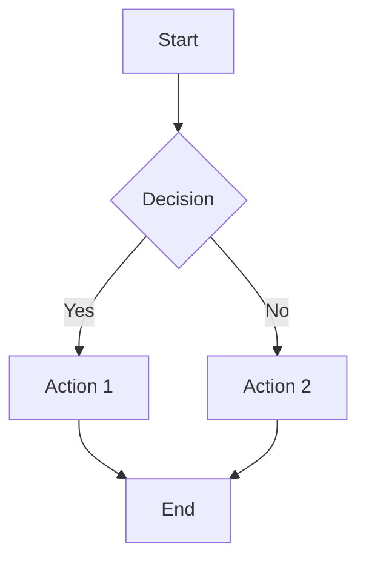
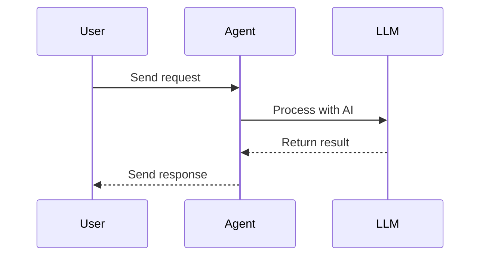

# Hướng Dẫn Đóng Góp - Contributing Guidelines

**Phiên bản**: 3.0.0  
**Cập nhật lần cuối**: 11/02/2026


Cảm ơn bạn đã quan tâm đến việc đóng góp cho tài liệu Agentic SDLC!

## Quy Trình Đóng Góp

### 1. Cập Nhật Tài Liệu Khi Code Thay Đổi

Khi có thay đổi trong source code, tài liệu cần được cập nhật tương ứng:

#### 1.1 Thay Đổi API
Khi thay đổi public API (classes, methods, functions):
1. Cập nhật API reference trong `api-reference/[module]/`
2. Chạy script tự động: `python scripts/generate_api_docs.py`
3. Review và bổ sung mô tả tiếng Việt nếu cần
4. Cập nhật code examples sử dụng API đó

#### 1.2 Thêm Features Mới
Khi thêm feature mới:
1. Tạo guide trong `guides/[category]/` sử dụng Guide Template (xem section 2.1)
2. Thêm ít nhất 1 code example trong `examples/` sử dụng Code Example Template (xem section 2.3)
3. Cập nhật `README.md` để thêm link đến guide mới
4. Thêm thuật ngữ mới vào `glossary.yaml` nếu cần
5. Xem xét thêm use case nếu feature phức tạp

#### 1.3 Breaking Changes
Khi có breaking changes:
1. Cập nhật `migration/from-v[old-version].md`
2. Document old API và new API side-by-side
3. Cung cấp migration script nếu có thể
4. Thêm warning trong API reference của deprecated features

#### 1.4 Bug Fixes
Khi fix bugs:
1. Nếu bug phổ biến, thêm vào `troubleshooting/common-errors.md`
2. Cập nhật FAQ nếu có nhiều users hỏi về bug này
3. Cập nhật code examples nếu bug ảnh hưởng đến examples

#### 1.5 Process Workflow
```
Code Change → Identify Doc Impact → Update Docs → Validate → Submit PR
     ↓              ↓                    ↓            ↓          ↓
  Commit      API/Guide/Example    Edit .md files  Run tests  Review
```

### 2. Templates cho Features Mới

Khi thêm feature mới, sử dụng các templates sau để đảm bảo consistency và completeness.

#### 2.1 Guide Template
Sử dụng template này cho tài liệu hướng dẫn features:

```markdown
# [Tên Feature]

**Phiên bản**: 3.0.0  
**Cập nhật lần cuối**: [DD/MM/YYYY]

## Giới Thiệu
[Mô tả ngắn gọn về feature - 2-3 câu]
[Giải thích tại sao feature này hữu ích]

## Yêu Cầu Tiên Quyết
- [Yêu cầu 1: ví dụ Python 3.8+]
- [Yêu cầu 2: ví dụ Agentic SDLC đã cài đặt]
- [Kiến thức cần có: ví dụ hiểu về agents]

## Mục Tiêu Học Tập
Sau khi đọc guide này, bạn sẽ có thể:
- [Mục tiêu cụ thể 1]
- [Mục tiêu cụ thể 2]
- [Mục tiêu cụ thể 3]

## Nội Dung Chính

### [Subsection 1]
[Giải thích concept]

### [Subsection 2]
[Hướng dẫn sử dụng]

## Ví Dụ

### Ví Dụ Cơ Bản
```python
# Code example với comments tiếng Việt
from agentic_sdlc import ...

# Giải thích từng bước
```

### Ví Dụ Nâng Cao
```python
# Advanced example
```

## Best Practices
- **[Practice 1]**: [Giải thích]
- **[Practice 2]**: [Giải thích]
- **[Practice 3]**: [Giải thích]

## Troubleshooting

### [Common Issue 1]
**Vấn đề**: [Mô tả]  
**Giải pháp**: [Cách khắc phục]

### [Common Issue 2]
**Vấn đề**: [Mô tả]  
**Giải pháp**: [Cách khắc phục]

## Tài Liệu Liên Quan
- [Link đến guide liên quan](../path/to/guide.md)
- [Link đến API reference](../../api-reference/module.md)
- [Link đến example](../../examples/category/example.py)
```

#### 2.2 Use Case Template
Sử dụng template này cho use case documents:

```markdown
# [Tên Use Case]

**Phiên bản**: 3.0.0  
**Cập nhật lần cuối**: [DD/MM/YYYY]

## Tổng Quan
[Mô tả tổng quan về use case - 3-4 câu]
[Giải thích giá trị business/technical]

## Kịch Bản
[Mô tả scenario cụ thể với context]
[Ai là users? Họ cần gì?]

## Vấn Đề
[Vấn đề cần giải quyết]
[Challenges và pain points]

## Giải Pháp
[Giải pháp sử dụng Agentic SDLC]
[Tại sao giải pháp này phù hợp?]

## Kiến Trúc

```mermaid
[Mermaid diagram mô tả architecture]
```

[Giải thích các components trong diagram]

## Triển Khai

### Bước 1: [Setup]
```python
# Code với comments chi tiết
```

### Bước 2: [Configuration]
```python
# Code với comments chi tiết
```

### Bước 3: [Execution]
```python
# Code với comments chi tiết
```

## Kết Quả
[Kết quả đạt được]
[Metrics hoặc improvements]

## Bài Học Kinh Nghiệm
- **[Lesson 1]**: [Chi tiết]
- **[Lesson 2]**: [Chi tiết]
- **[Lesson 3]**: [Chi tiết]

## Mở Rộng
[Suggestions cho improvements hoặc variations]

## Tài Liệu Liên Quan
- [Links đến related guides]
- [Links đến API reference]
```

#### 2.3 Code Example Template
Sử dụng template này cho code examples:

```python
"""
[Tên Example]

Mô tả: [Mô tả ngắn gọn về example - 1-2 câu]
Category: [basic/intermediate/advanced]
Feature: [Feature name mà example này demonstrate]

Setup Instructions:
1. [Bước setup 1: ví dụ Install dependencies]
2. [Bước setup 2: ví dụ Set environment variables]
3. [Bước setup 3: ví dụ Create config file]

Dependencies:
- agentic-sdlc>=3.0.0
- [dependency 2 với version]
- [dependency 3 với version]

Expected Output:
[Mô tả output mong đợi khi chạy example]
[Có thể include sample output]

Notes:
- [Note quan trọng 1]
- [Note quan trọng 2]
"""

# Import statements - group theo standard library, third-party, local
import os
import sys
from pathlib import Path

from agentic_sdlc import ...

# Constants
CONFIG_FILE = "config.yaml"
DEFAULT_TIMEOUT = 30


def main():
    """Main function demonstrating [feature]."""
    
    # Step 1: [Mô tả bước 1]
    # Comment giải thích chi tiết bằng tiếng Việt
    
    # Step 2: [Mô tả bước 2]
    # Comment giải thích chi tiết bằng tiếng Việt
    
    # Step 3: [Mô tả bước 3]
    # Comment giải thích chi tiết bằng tiếng Việt
    
    print("Example completed successfully!")


if __name__ == "__main__":
    try:
        main()
    except Exception as e:
        print(f"Error: {e}")
        sys.exit(1)
```

#### 2.4 API Reference Template
Sử dụng template này khi manually tạo API reference:

```markdown
# [Module/Class Name]

**Module**: `agentic_sdlc.[module.path]`  
**Phiên bản**: 3.0.0

## Tổng Quan
[Mô tả module/class]

## Classes

### [ClassName]
[Mô tả class]

#### Constructor
```python
def __init__(self, param1: Type1, param2: Type2 = default):
    """[Docstring]"""
```

**Parameters:**
- `param1` (Type1): [Mô tả parameter]
- `param2` (Type2, optional): [Mô tả parameter]. Default: `default`

**Raises:**
- `ExceptionType`: [Khi nào raise]

#### Methods

##### method_name
```python
def method_name(self, arg1: Type1) -> ReturnType:
    """[Docstring]"""
```

**Parameters:**
- `arg1` (Type1): [Mô tả]

**Returns:**
- `ReturnType`: [Mô tả return value]

**Raises:**
- `ExceptionType`: [Khi nào raise]

**Example:**
```python
# Usage example
```

## Functions

### function_name
[Similar structure như methods]

## Tài Liệu Liên Quan
- [Links]
```

### 3. Style Guide và Formatting Rules

#### 3.1 Ngôn Ngữ và Terminology

##### Quy Tắc Cơ Bản
- **Ngôn ngữ chính**: Viết toàn bộ nội dung bằng tiếng Việt chuẩn
- **Thuật ngữ kỹ thuật**: 
  - Giữ nguyên tiếng Anh cho technical terms
  - Thêm giải thích tiếng Việt trong ngoặc lần đầu xuất hiện
  - Ví dụ: "Agent (Tác nhân)", "Workflow (Quy trình làm việc)"
- **Consistency**: Sử dụng `glossary.yaml` để đảm bảo terminology nhất quán
- **Tone**: Professional nhưng friendly, tránh quá formal

##### Glossary Usage
Trước khi thêm thuật ngữ mới, check `docs/vi/glossary.yaml`:

```yaml
# Example entry
Agent:
  vietnamese: "Tác nhân"
  description: "Một thực thể AI chuyên biệt thực hiện các nhiệm vụ cụ thể"
  usage_examples:
    - "Developer Agent xử lý việc viết code"
    - "Tester Agent thực hiện testing tự động"
```

Nếu term chưa có, thêm vào glossary trước khi sử dụng trong docs.

#### 3.2 Markdown Formatting

##### Headings
```markdown
# Document Title (H1 - chỉ dùng 1 lần cho title)

## Main Section (H2 - cho major sections)

### Subsection (H3 - cho subsections)

#### Minor Section (H4 - cho minor sections)
```

**Rules:**
- Không skip heading levels (H1 → H3 là sai)
- Sử dụng Title Case cho H1, Sentence case cho H2-H4
- Thêm blank line trước và sau mỗi heading

##### Code Blocks
Luôn chỉ định language cho syntax highlighting:

```markdown
```python
# Python code
from agentic_sdlc import Agent
```

```bash
# Shell commands
pip install agentic-sdlc
```

```yaml
# YAML config
config:
  model: gpt-4
```

```mermaid
# Mermaid diagrams
graph TD
    A --> B
```
```

**Rules:**
- Thêm comments tiếng Việt trong code
- Sử dụng meaningful variable names
- Keep code examples concise nhưng complete

##### Lists

**Unordered Lists:**
```markdown
- Item 1
- Item 2
  - Nested item 2.1
  - Nested item 2.2
- Item 3
```

**Ordered Lists:**
```markdown
1. First step
2. Second step
3. Third step
```

**Rules:**
- Sử dụng `-` cho unordered lists (không dùng `*` hoặc `+`)
- Indent nested lists với 2 spaces
- Thêm blank line trước và sau lists

##### Links

**Internal Links (relative paths):**
```markdown
[Agent Overview](../agents/overview.md)
[API Reference](../../api-reference/core/config.md)
```

**External Links:**
```markdown
[Python Documentation](https://docs.python.org/)
```

**Anchor Links:**
```markdown
[Jump to Section](#section-name)
```

**Rules:**
- Sử dụng relative paths cho internal links
- Verify links không bị broken
- Sử dụng descriptive link text (không dùng "click here")

##### Emphasis
```markdown
**Bold text** - cho keywords quan trọng
*Italic text* - cho emphasis
`inline code` - cho code, filenames, commands
```

##### Tables
```markdown
| Column 1 | Column 2 | Column 3 |
|----------|----------|----------|
| Value 1  | Value 2  | Value 3  |
| Value 4  | Value 5  | Value 6  |
```

**Rules:**
- Align columns cho readability
- Sử dụng header row
- Keep tables simple (max 5 columns)

##### Blockquotes
```markdown
> **Lưu ý**: Đây là thông tin quan trọng cần chú ý.

> **Cảnh báo**: Hành động này có thể gây lỗi nếu không cẩn thận.
```

#### 3.3 Code Examples Style

##### Python Code Style
Follow PEP 8 với một số adjustments:

```python
"""
Module/script docstring bằng tiếng Việt.

Mô tả chi tiết về module/script.
"""

# Imports - group theo: standard library, third-party, local
import os
import sys
from pathlib import Path

from agentic_sdlc import Agent, Workflow
from agentic_sdlc.core import Config

# Constants - UPPER_CASE
DEFAULT_MODEL = "gpt-4"
MAX_RETRIES = 3

# Classes - PascalCase
class MyAgent:
    """Class docstring bằng tiếng Việt."""
    
    def __init__(self, name: str):
        """Initialize agent với name."""
        self.name = name
    
    def process(self, data: dict) -> dict:
        """
        Process data và return result.
        
        Args:
            data: Input data dictionary
            
        Returns:
            Processed result dictionary
        """
        # Comment giải thích logic bằng tiếng Việt
        result = {}
        return result

# Functions - snake_case
def create_agent(name: str, role: str) -> Agent:
    """
    Tạo agent mới với name và role.
    
    Args:
        name: Tên của agent
        role: Vai trò của agent
        
    Returns:
        Agent instance đã được tạo
    """
    # Implementation với comments tiếng Việt
    pass
```

**Rules:**
- Type hints cho tất cả function parameters và returns
- Docstrings cho classes và functions
- Comments tiếng Việt giải thích logic
- Error handling với try-except
- Meaningful variable names (tiếng Anh)

##### Shell Script Style
```bash
#!/bin/bash
# Script description bằng tiếng Việt

# Set error handling
set -e

# Constants
readonly CONFIG_FILE="config.yaml"
readonly LOG_DIR="logs"

# Functions
function setup_environment() {
    # Comment giải thích
    echo "Setting up environment..."
}

# Main execution
main() {
    setup_environment
    # More commands với comments
}

main "$@"
```

#### 3.4 Diagram Style

##### Mermaid Diagrams
Sử dụng Mermaid cho tất cả diagrams:

**Flowchart:**


**Sequence Diagram:**


**Rules:**
- Thêm caption tiếng Việt sau diagram
- Sử dụng descriptive node names
- Keep diagrams simple và focused
- Test diagram renders correctly

#### 3.5 File Organization

##### File Naming
```
kebab-case.md          # Cho markdown files
snake_case.py          # Cho Python files
01-descriptive-name.py # Cho numbered examples
```

##### Directory Structure
```
docs/vi/
├── guides/
│   ├── category/
│   │   ├── overview.md      # Always start with overview
│   │   ├── topic-1.md
│   │   └── topic-2.md
├── examples/
│   ├── basic/
│   │   ├── 01-first.py      # Numbered for ordering
│   │   └── 02-second.py
└── api-reference/
    ├── module/
    │   └── class.md
```

#### 3.6 Metadata và Versioning

Mỗi document phải có metadata header:

```markdown
# Document Title

**Phiên bản**: 3.0.0  
**Cập nhật lần cuối**: 11/02/2026  
**Tác giả**: [Tên tác giả] (optional)  
**Reviewers**: [Tên reviewers] (optional)
```

**Rules:**
- Version theo semantic versioning
- Date format: DD/MM/YYYY
- Update date mỗi khi có changes

### 4. Validation Checklist

Trước khi submit documentation changes, đảm bảo tất cả items sau được check:

#### 4.1 Content Quality
- [ ] **Ngôn ngữ**: Nội dung viết bằng tiếng Việt chuẩn, không có lỗi chính tả
- [ ] **Terminology**: Thuật ngữ kỹ thuật có trong `glossary.yaml` và được sử dụng nhất quán
- [ ] **Completeness**: Document bao gồm tất cả sections required theo template
- [ ] **Accuracy**: Technical information chính xác và up-to-date
- [ ] **Clarity**: Nội dung dễ hiểu, logic flow rõ ràng

#### 4.2 Code Quality
- [ ] **Syntax**: Code examples có syntax highlighting với language được chỉ định
- [ ] **Runnable**: Code examples có thể chạy được và tested
- [ ] **Comments**: Code có comments tiếng Việt giải thích logic
- [ ] **Error Handling**: Code examples include proper error handling
- [ ] **Dependencies**: Tất cả dependencies được list rõ ràng

#### 4.3 Formatting
- [ ] **Headings**: Heading hierarchy đúng (không skip levels)
- [ ] **Lists**: Lists formatted correctly với proper indentation
- [ ] **Links**: Cross-references đúng và không bị broken links
- [ ] **Tables**: Tables aligned và formatted properly
- [ ] **Whitespace**: Proper spacing giữa sections

#### 4.4 Diagrams
- [ ] **Syntax**: Diagrams sử dụng valid Mermaid syntax
- [ ] **Rendering**: Diagrams render correctly (test trên GitHub hoặc local viewer)
- [ ] **Captions**: Diagrams có captions tiếng Việt
- [ ] **Clarity**: Diagrams dễ hiểu và không quá phức tạp

#### 4.5 Metadata
- [ ] **Version**: Version information được update
- [ ] **Date**: Last updated date được update (format DD/MM/YYYY)
- [ ] **Author**: Author information included nếu applicable
- [ ] **Related Docs**: Links đến related documents được thêm

#### 4.6 Cross-References
- [ ] **Internal Links**: Tất cả internal links sử dụng relative paths
- [ ] **Link Validity**: Verify tất cả links point đến existing documents
- [ ] **Bidirectional**: Related documents link back to each other
- [ ] **API References**: Code examples link đến relevant API reference

#### 4.7 Examples và Use Cases
- [ ] **Setup Instructions**: Clear setup instructions provided
- [ ] **Dependencies**: All dependencies listed với versions
- [ ] **Expected Output**: Expected output documented
- [ ] **Notes**: Important notes và caveats included

#### 4.8 Automated Checks
Run các automated validation tools:

```bash
# Check markdown syntax
markdownlint docs/vi/**/*.md

# Validate Python code examples
python scripts/validate_docs.py

# Check for broken links (if tool available)
# link-checker docs/vi/
```

### 5. Testing Documentation

#### 5.1 Validate Markdown Syntax

Sử dụng markdownlint để check markdown syntax:

```bash
# Install markdownlint-cli
npm install -g markdownlint-cli

# Check all Vietnamese docs
markdownlint docs/vi/**/*.md

# Check specific file
markdownlint docs/vi/guides/agents/overview.md

# Auto-fix issues where possible
markdownlint --fix docs/vi/**/*.md
```

Common issues to watch for:
- Missing blank lines around headings
- Inconsistent list markers
- Trailing whitespace
- Missing language specifiers in code blocks

#### 5.2 Validate Code Examples

Run Python code examples để ensure they work:

```bash
# Validate all examples
python scripts/validate_docs.py

# Run specific example
python docs/vi/examples/basic/01-configuration.py

# Run with virtual environment
python -m venv test_env
source test_env/bin/activate  # On Windows: test_env\Scripts\activate
pip install agentic-sdlc
python docs/vi/examples/basic/01-configuration.py
```

Code validation checks:
- Python syntax correctness
- Import statements resolve
- Dependencies available
- Code runs without errors
- Output matches expected output

#### 5.3 Validate Cross-References

Check for broken links trong documentation:

```bash
# Using custom validation script
python scripts/validate_docs.py --check-links

# Manual check
# 1. List all markdown files
find docs/vi -name "*.md" > files.txt

# 2. Extract all links
grep -r "\[.*\](.*\.md)" docs/vi/ > links.txt

# 3. Verify each link exists
# (Script to be implemented)
```

Link validation checks:
- Internal links point to existing files
- Anchor links point to existing headings
- No broken external links
- Relative paths correct

#### 5.4 Validate Diagrams

Test Mermaid diagrams render correctly:

```bash
# Using mermaid-cli
npm install -g @mermaid-js/mermaid-cli

# Generate diagram images for testing
mmdc -i docs/vi/diagrams/architecture.md -o test-output.png

# Or use online editor for quick testing
# https://mermaid.live/
```

Diagram validation checks:
- Valid Mermaid syntax
- Renders without errors
- Readable và clear
- Appropriate size và complexity

#### 5.5 Validate Glossary Consistency

Check terminology consistency:

```bash
# Run glossary validation
python scripts/validate_docs.py --check-glossary

# This checks:
# - All technical terms in glossary
# - Consistent usage across docs
# - Vietnamese translations provided
```

#### 5.6 Integration Testing

Test documentation trong context:

1. **Local Preview**: Preview docs locally
   ```bash
   # Using mkdocs or similar
   mkdocs serve
   # Open http://localhost:8000
   ```

2. **GitHub Preview**: Push to branch và preview on GitHub

3. **User Testing**: Ask colleague to follow guide và provide feedback

#### 5.7 Automated Test Suite

Run complete test suite:

```bash
# Run all documentation tests
pytest tests/documentation/

# Run specific test categories
pytest tests/documentation/test_markdown_syntax.py
pytest tests/documentation/test_code_examples.py
pytest tests/documentation/test_cross_references.py

# Run with coverage
pytest --cov=docs tests/documentation/
```

### 6. Submission Process

#### 6.1 Preparation

Trước khi submit, đảm bảo:

1. **Read Guidelines**: Đọc kỹ contribution guidelines này
2. **Check Existing Issues**: Search existing issues/PRs để tránh duplicate work
3. **Discuss Major Changes**: Mở issue để discuss major changes trước khi implement

#### 6.2 Development Workflow

```bash
# 1. Fork repository trên GitHub
# Click "Fork" button trên repository page

# 2. Clone fork về local
git clone https://github.com/YOUR_USERNAME/agentic-sdlc.git
cd agentic-sdlc

# 3. Add upstream remote
git remote add upstream https://github.com/ORIGINAL_OWNER/agentic-sdlc.git

# 4. Create feature branch
git checkout -b docs/feature-name
# Branch naming: docs/[feature-name] hoặc docs/fix-[issue]

# 5. Make changes
# Edit documentation files
# Add new files if needed

# 6. Test changes (see section 5)
python scripts/validate_docs.py
markdownlint docs/vi/**/*.md

# 7. Commit changes
git add docs/vi/
git commit -m "docs: Add guide for [feature]"
# Commit message format: "docs: [description]"

# 8. Keep branch updated
git fetch upstream
git rebase upstream/main

# 9. Push to fork
git push origin docs/feature-name

# 10. Create Pull Request
# Go to GitHub và click "New Pull Request"
```

#### 6.3 Commit Message Guidelines

Follow conventional commits format:

```
docs: [short description]

[Optional longer description]

[Optional footer with issue references]
```

**Examples:**
```bash
# Simple change
git commit -m "docs: Add agent lifecycle guide"

# With description
git commit -m "docs: Add CI/CD integration use case

Includes complete example with GitHub Actions integration,
step-by-step setup instructions, and troubleshooting section."

# With issue reference
git commit -m "docs: Fix broken links in API reference

Fixes #123"
```

**Commit types:**
- `docs:` - Documentation changes
- `fix:` - Bug fixes in documentation
- `style:` - Formatting changes (no content change)
- `refactor:` - Restructuring documentation

#### 6.4 Pull Request Guidelines

**PR Title Format:**
```
docs: [Short description of changes]
```

**PR Description Template:**
```markdown
## Description
[Describe what this PR does]

## Type of Change
- [ ] New documentation
- [ ] Documentation update
- [ ] Bug fix (broken links, typos, etc.)
- [ ] Restructuring

## Changes Made
- [Change 1]
- [Change 2]
- [Change 3]

## Related Issues
Closes #[issue number]
Related to #[issue number]

## Checklist
- [ ] Followed style guide
- [ ] Ran validation tests
- [ ] Updated related documents
- [ ] Added/updated examples if needed
- [ ] Updated glossary if needed
- [ ] Tested code examples
- [ ] Checked for broken links

## Screenshots (if applicable)
[Add screenshots of rendered documentation]

## Additional Notes
[Any additional information]
```

#### 6.5 Review Process

Sau khi submit PR:

1. **Automated Checks**: CI/CD sẽ run automated tests
   - Markdown linting
   - Code example validation
   - Link checking
   
2. **Maintainer Review**: Maintainers sẽ review về:
   - Technical accuracy
   - Language quality (tiếng Việt)
   - Completeness
   - Formatting consistency
   - Code example correctness

3. **Address Feedback**: 
   - Respond to review comments
   - Make requested changes
   - Push updates to same branch
   
4. **Approval và Merge**:
   - PR needs approval từ ít nhất 1 maintainer
   - Sau khi approved, maintainer sẽ merge

#### 6.6 After Merge

Sau khi PR được merge:

1. **Sync Fork**: Update fork với upstream changes
   ```bash
   git checkout main
   git fetch upstream
   git merge upstream/main
   git push origin main
   ```

2. **Delete Branch**: Clean up feature branch
   ```bash
   git branch -d docs/feature-name
   git push origin --delete docs/feature-name
   ```

3. **Celebrate**: 🎉 Your contribution is now part of the project!

### 7. Review Process

Documentation changes sẽ được review về:

#### 7.1 Technical Accuracy
- **Correctness**: Information chính xác và up-to-date
- **Completeness**: Bao gồm tất cả necessary information
- **API Usage**: Code examples sử dụng APIs correctly
- **Best Practices**: Recommendations follow best practices

#### 7.2 Language Quality
- **Vietnamese**: Tiếng Việt chuẩn, không có lỗi chính tả
- **Grammar**: Ngữ pháp đúng
- **Clarity**: Nội dung rõ ràng, dễ hiểu
- **Terminology**: Thuật ngữ consistent với glossary

#### 7.3 Completeness
- **Required Sections**: Tất cả required sections có mặt
- **Examples**: Đủ examples để illustrate concepts
- **Cross-References**: Links đến related documents
- **Metadata**: Version và date information

#### 7.4 Formatting Consistency
- **Markdown**: Follows markdown style guide
- **Code Blocks**: Proper syntax highlighting
- **Headings**: Correct hierarchy
- **Lists**: Consistent formatting

#### 7.5 Code Example Correctness
- **Syntax**: Code syntactically correct
- **Runnable**: Code can be executed
- **Dependencies**: All dependencies listed
- **Output**: Expected output documented

#### 7.6 Review Timeline
- **Initial Review**: Within 2-3 business days
- **Follow-up**: Within 1-2 business days after updates
- **Merge**: After approval và passing all checks

#### 7.7 Feedback Categories

Reviewers sẽ provide feedback theo categories:

**Must Fix (Blocking):**
- Technical errors
- Broken code examples
- Broken links
- Major formatting issues

**Should Fix (Recommended):**
- Minor language improvements
- Additional examples
- Better explanations
- Formatting improvements

**Nice to Have (Optional):**
- Additional diagrams
- More use cases
- Performance tips
- Advanced examples

## Liên Hệ

Nếu có câu hỏi về contributing, vui lòng:
- Mở issue trên GitHub
- Tham gia discussion trong Pull Request
- Email: truongnat@gmail.com

## Tools và Resources

### Recommended Tools

#### Markdown Editors
- **VS Code** với extensions:
  - Markdown All in One
  - Markdown Preview Enhanced
  - markdownlint
- **Typora**: WYSIWYG markdown editor
- **MacDown**: Markdown editor cho macOS

#### Code Validation
- **Python**: `python -m py_compile file.py`
- **Linters**: `pylint`, `flake8`
- **Type Checking**: `mypy`

#### Diagram Tools
- **Mermaid Live Editor**: https://mermaid.live/
- **Draw.io**: For complex diagrams
- **PlantUML**: Alternative diagram tool

#### Link Checking
- **markdown-link-check**: Check for broken links
- **linkchecker**: Comprehensive link validation

### Useful Resources

#### Documentation Best Practices
- [Write the Docs](https://www.writethedocs.org/)
- [Google Developer Documentation Style Guide](https://developers.google.com/style)
- [Microsoft Writing Style Guide](https://docs.microsoft.com/en-us/style-guide/)

#### Markdown References
- [Markdown Guide](https://www.markdownguide.org/)
- [GitHub Flavored Markdown](https://github.github.com/gfm/)
- [CommonMark Spec](https://commonmark.org/)

#### Mermaid Documentation
- [Mermaid Official Docs](https://mermaid-js.github.io/mermaid/)
- [Mermaid Cheat Sheet](https://jojozhuang.github.io/tutorial/mermaid-cheat-sheet/)

#### Vietnamese Language Resources
- [Từ điển Tiếng Việt](https://vtudien.com/)
- [Kiểm tra chính tả](https://www.online-spellcheck.com/vietnamese)

## FAQ

### Q: Tôi nên bắt đầu từ đâu?
**A**: Bắt đầu với small changes như fix typos hoặc improve existing docs. Sau đó có thể contribute larger changes như new guides hoặc use cases.

### Q: Làm sao để test documentation locally?
**A**: Sử dụng markdown preview trong editor hoặc run `mkdocs serve` để preview toàn bộ documentation site.

### Q: Tôi có thể contribute bằng tiếng Anh không?
**A**: Documentation chính là tiếng Việt, nhưng bạn có thể submit English draft và maintainers sẽ help translate.

### Q: Làm sao để add new technical term vào glossary?
**A**: Edit `docs/vi/glossary.yaml` và add entry theo format existing entries. Include Vietnamese translation và usage examples.

### Q: Code example của tôi cần dependencies nào?
**A**: List tất cả dependencies trong docstring của example. Include version numbers nếu có specific requirements.

### Q: Tôi nên tạo issue trước khi submit PR không?
**A**: Cho major changes (new guides, restructuring), nên tạo issue để discuss trước. Cho minor changes (typos, small improvements), có thể submit PR directly.

### Q: Review process mất bao lâu?
**A**: Thường 2-3 business days cho initial review. Có thể nhanh hơn cho simple changes.

### Q: Tôi có thể contribute diagrams không?
**A**: Có! Diagrams rất valuable. Sử dụng Mermaid syntax và ensure diagrams clear và informative.

## License

Bằng việc đóng góp, bạn đồng ý rằng contributions của bạn sẽ được licensed dưới MIT License.

---

**Cảm ơn bạn đã đóng góp vào Agentic SDLC documentation!** 🙏

Mọi contribution, dù lớn hay nhỏ, đều được đánh giá cao và giúp cải thiện project cho toàn bộ community.
