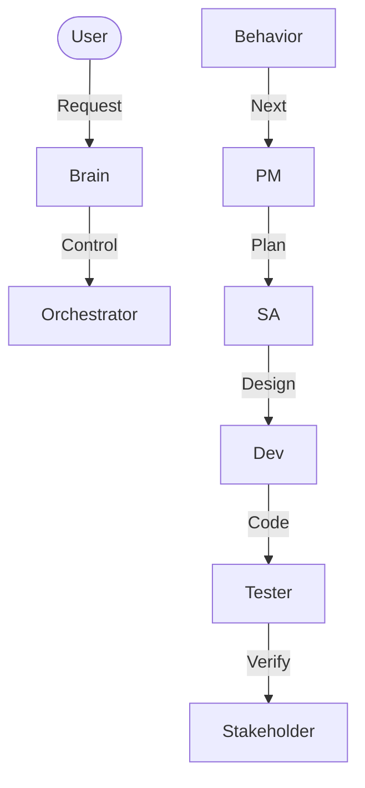

# Workflow Audit and Next Steps Implementation

## 1. Problem / Challenge
The previous workflow and skill definitions lacked explicit "Next Steps" guidance. This led to potential ambiguity for agents on what to do after completing a specific workflow or role-based task, reducing autonomy and increasing the risk of stalled processes.

## 2. Solution / Implementation
A comprehensive audit was performed on all `.agent/workflows/*.md` and `.agent/skills/*.md` files.

### 2.1 Standardized "Next Steps" Section
A standardized `## ⏭️ Next Steps` section was added to the end of **25 files** (13 skills, 12 workflows).

**Example (from cycle.md):**
```markdown
## ⏭️ Next Steps
- **If Compound Complete:** Workflow finished, ready for next task
- **If Issues Found:** Repeat `/cycle` or escalate to `/explore`
- **If Blocked:** Notify user via `notify_user`
```

### 2.2 System Flow Visualization
A new Mermaid diagram was created to visualize the transitions between these roles and workflows.

**File:** [system-flow.mermaid](file:///d:/dev/agentic-sdlc/docs/architecture/system-flow.mermaid)


*(Simplified view - see full file for details)*

## 3. Artifacts Created / Modified

### Modified Files (Workflows)
- `brain.md`
- `cycle.md`
- `orchestrator.md`
- `sprint.md`
- `emergency.md`
- `explore.md`
- `debug.md`
- `refactor.md`
- `release.md`
- `review.md`
- `docs.md`
- `validate.md`
- `housekeeping.md`
- `metrics.md`
- `onboarding.md`

### Modified Files (Skills)
- `role-pm.md`, `role-ba.md`, `role-sa.md`
- `role-uiux.md`, `role-dev.md`, `role-tester.md`
- `role-seca.md`, `role-devops.md`, `role-reporter.md`
- `role-stakeholder.md`, `role-po.md`
- `role-brain.md`
- `role-orchestrator.md`

### Created Files
- [system-flow.mermaid](file:///d:/dev/agentic-sdlc/docs/architecture/system-flow.mermaid)

## 4. Verification Results
- **Files Verified:** All modified files were successfully updated with the new section.
- **Git Commit:** Changes committed as `docs: add Next Steps section to all workflows and skills`.
- **Diagram Check:** Mermaid syntax is valid and reflects the implemented logic.

## 5. Next Steps
- **If Approved:** Merge changes to main.
- **If Refinement Needed:** Update logic based on new patterns.

## Related Files
- [Brain Workflow](../.agent/workflows/brain.md)
- [Cycle Workflow](../.agent/workflows/cycle.md)
- [System Flow Diagram](../architecture/system-flow.mermaid)

#workflow-audit #next-steps #documentation #compliance
