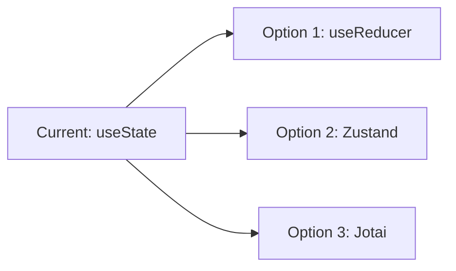
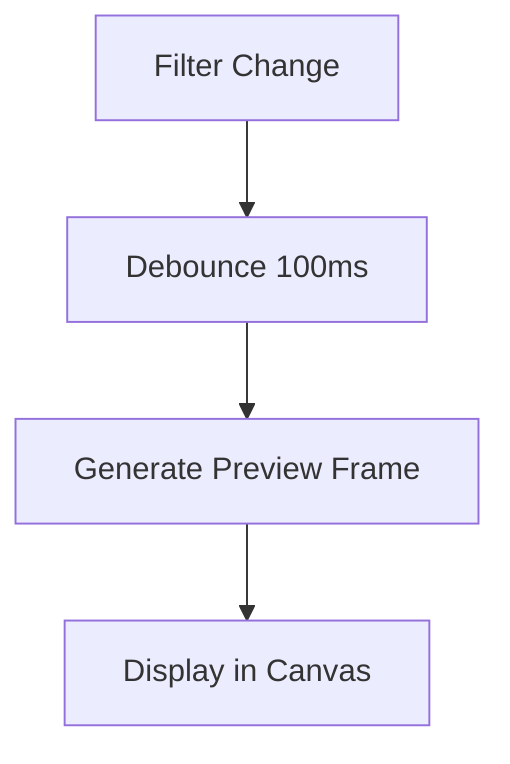

# FFmpeg Desktop Editor - Feature Gap Analysis & Improvement Plan

> **Date:** 2026-01-07  
> **Type:** Planning Only (No Implementation)  
> **Sprint Context:** Sprint 2 Complete, Phase 3 Complete

---

## 📊 Executive Summary

This document provides a comprehensive analysis of the FFmpeg Desktop Editor's current feature set, identifies gaps, and proposes detailed improvement plans for future sprints.

---

## ✅ Current Feature Matrix

### Fully Implemented Features

| Category | Feature | Component | Status |
|----------|---------|-----------|--------|
| **Core** | Format Conversion | `lib.rs`, `ExportDialog.tsx` | ✅ Complete |
| **Core** | Visual Trimming | `Timeline.tsx`, `App.tsx` | ✅ Complete |
| **Core** | Media Playback | `MediaPlayer.tsx` | ✅ Complete |
| **Filters** | Brightness/Contrast/Saturation | `FilterPanel.tsx` | ✅ Complete |
| **Filters** | Blur/Sharpen | `FilterPanel.tsx` | ✅ Complete |
| **Overlays** | Text Watermark | `OverlayPanel.tsx` | ✅ Complete |
| **Overlays** | Image Logo Overlay | `OverlayPanel.tsx` | ✅ Complete |
| **Audio** | Volume Control | `ExportDialog.tsx` | ✅ Complete |
| **Audio** | Playback Speed | `ExportDialog.tsx` | ✅ Complete |
| **Audio** | Audio Extraction | `lib.rs` | ✅ Complete |
| **Export** | Resolution Scaling | `ExportDialog.tsx` | ✅ Complete |
| **Export** | Quality Presets | `types/index.ts` | ✅ Complete |
| **Export** | GIF Export | `lib.rs` | ✅ Complete |
| **Export** | Thumbnail Extraction | `lib.rs` | ✅ Complete |
| **Batch** | Batch Processing Queue | `BatchQueue.tsx` | ✅ Complete |
| **Merge** | Multi-file Merge | `MergeDialog.tsx`, `lib.rs` | ✅ Complete |
| **Subtitles** | Burn Subtitles (.srt/.vtt/.ass) | `lib.rs` | ✅ Complete |
| **Performance** | Hardware Acceleration | `lib.rs` | ✅ Complete |
| **UX** | Error Boundary | `ErrorBoundary.tsx` | ✅ Complete |
| **UX** | Progress Tracking | `useFFmpeg.ts` | ✅ Complete |

---

## 🔍 Identified Gaps & Missing Features

### Gap 1: Real-Time Preview System
**Priority:** P1 (High)  
**Impact:** User Experience  

**Current State:**
- Filters and overlays are applied only on export
- Users cannot see the effect of their changes in real-time

**Gap Details:**
- No live preview for filter adjustments
- No preview for text/image overlay positioning
- Users must export to verify their settings

**Proposed Solution:**
| Component | Function | Complexity |
|-----------|----------|------------|
| `PreviewCanvas.tsx` | WebGL canvas for real-time filter preview | High |
| `usePreviewEngine.ts` | Hook to manage preview state and FFmpeg pipe | High |
| `lib.rs::generate_preview_frame` | Rust command to generate single preview frame | Medium |

---

### Gap 2: Visual Frame Selection for Thumbnails
**Priority:** P2 (Medium)  
**Impact:** Feature Completeness  

**Current State:**
- Thumbnail extraction uses first frame or current position
- No visual scrubber for precise frame selection

**Gap Details:**
- Cannot visually browse frames before extracting
- No filmstrip view for quick navigation
- Missing frame-by-frame navigation (arrow keys)

**Proposed Solution:**
| Component | Function | Complexity |
|-----------|----------|------------|
| `FrameStrip.tsx` | Filmstrip component showing frames at intervals | Medium |
| `lib.rs::extract_frames` | Batch frame extraction for filmstrip | Medium |
| `useFrameNavigation.ts` | Hook for keyboard frame navigation | Low |

---

### Gap 3: Undo/Redo System
**Priority:** P2 (Medium)  
**Impact:** User Experience  

**Current State:**
- No undo/redo for any operations
- Filter/trim changes are immediately applied to state

**Gap Details:**
- Cannot revert filter adjustments
- No history stack for trim regions
- Overlay changes cannot be undone

**Proposed Solution:**
| Component | Function | Complexity |
|-----------|----------|------------|
| `useHistory.ts` | Generic undo/redo hook with action stack | Medium |
| `HistoryPanel.tsx` | UI showing edit history | Low |
| State refactor | Wrap all state changes in history actions | Medium |

---

### Gap 4: Project Files (Save/Load)
**Priority:** P3 (Backlog T-014)  
**Impact:** Workflow  

**Current State:**
- Session state is lost on app close
- No project file format defined

**Gap Details:**
- Cannot save current settings and open later
- No auto-save functionality
- Missing recent projects list

**Proposed Solution:**
| Component | Function | Complexity |
|-----------|----------|------------|
| `ProjectManager.ts` | Save/load project state to JSON | Medium |
| `RecentProjects.tsx` | Landing page with recent projects | Low |
| Auto-save system | Save draft every N seconds | Low |

**Project File Schema (Proposed):**
```typescript
interface ProjectFile {
  version: string;
  inputFile: string;
  trimRegion: { start: number; end: number };
  filters: FilterSettings;
  overlays: OverlaySettings;
  exportSettings: {
    format: string;
    preset: string;
    resolution: { w: number | null; h: number | null };
  };
  audioSettings: { volume: number; speed: number };
}
```

---

### Gap 5: Multi-Track Timeline
**Priority:** P3 (Backlog T-015)  
**Impact:** Feature Expansion  

**Current State:**
- Single video track only
- Merge is only via concatenation

**Gap Details:**
- No video track stacking
- No audio track separation
- No transition effects between clips

**Proposed Solution:**
| Component | Function | Complexity |
|-----------|----------|------------|
| `MultiTrackTimeline.tsx` | Multi-track timeline UI | Very High |
| `TrackManager.ts` | Manage multiple video/audio tracks | Very High |
| `lib.rs::render_timeline` | FFmpeg complex filter graph | Very High |

> [!WARNING]
> This is a significant architectural change that would require rewriting core components. Consider this as a "v2.0" feature.

---

### Gap 6: Keyboard Shortcuts
**Priority:** P2 (Medium)  
**Impact:** Productivity  

**Current State:**
- No keyboard shortcuts defined
- All actions require mouse clicks

**Gap Details:**
| Shortcut | Action | Status |
|----------|--------|--------|
| `Space` | Play/Pause | ❌ Missing |
| `←/→` | Frame step | ❌ Missing |
| `I/O` | Set In/Out points | ❌ Missing |
| `Ctrl+S` | Export | ❌ Missing |
| `Ctrl+Z` | Undo | ❌ Missing |

**Proposed Solution:**
| Component | Function | Complexity |
|-----------|----------|------------|
| `useKeyboardShortcuts.ts` | Global keyboard event handler | Low |
| `ShortcutHelpDialog.tsx` | Help dialog showing shortcuts | Low |

---

### Gap 7: Drag-and-Drop Support
**Priority:** P2 (Medium)  
**Impact:** User Experience  

**Current State:**
- Files must be opened via dialog
- No drag-and-drop on the landing page

**Gap Details:**
- Cannot drag video files onto app
- Cannot drag subtitle files
- Cannot drag images for overlays

**Proposed Solution:**
| Component | Function | Complexity |
|-----------|----------|------------|
| `DropZone.tsx` | Enhanced drop zone component | Low |
| `useDragAndDrop.ts` | Tauri drag-and-drop integration | Low |

---

### Gap 8: Export Presets (User-Defined)
**Priority:** P3 (Low)  
**Impact:** Workflow  

**Current State:**
- Only 3 built-in presets (High, Balanced, Small)
- Cannot save custom combinations

**Gap Details:**
- Cannot save format + resolution + filters as a preset
- No export to specific platforms (YouTube, Twitter, etc.)

**Proposed Solution:**
| Component | Function | Complexity |
|-----------|----------|------------|
| `PresetManager.ts` | Save/load user presets | Low |
| `PlatformPresets.ts` | Built-in presets for social media | Low |
| `PresetBrowser.tsx` | UI to browse and apply presets | Low |

---

### Gap 9: Waveform Display
**Priority:** P3 (Low)  
**Impact:** Audio Editing  

**Current State:**
- Timeline shows video frames only
- No audio waveform visualization

**Gap Details:**
- Cannot see audio peaks on timeline
- Difficult to find audio sync points
- No separate audio track view

**Proposed Solution:**
| Component | Function | Complexity |
|-----------|----------|------------|
| `WaveformDisplay.tsx` | Audio waveform visualization | Medium |
| `lib.rs::generate_waveform` | Extract audio samples | Medium |

---

### Gap 10: Error Feedback & Recovery
**Priority:** P2 (Medium)  
**Impact:** Reliability  

**Current State:**
- Basic error boundary exists
- FFmpeg errors show generic messages

**Gap Details:**
- No detailed FFmpeg error parsing
- Missing retry mechanism
- No error log export

**Proposed Solution:**
| Component | Function | Complexity |
|-----------|----------|------------|
| `ErrorParser.ts` | Parse FFmpeg error messages | Low |
| `ErrorDialog.tsx` | Detailed error display with solutions | Low |
| `LogExporter.ts` | Export logs for support | Low |

---

## 📋 Proposed Sprint Roadmap

### Sprint 4: UX Polish
| ID | Task | Priority | Estimate |
|----|------|----------|----------|
| T-016 | Keyboard Shortcuts System | P2 | 2h |
| T-017 | Drag-and-Drop Support | P2 | 2h |
| T-018 | Visual Frame Selector | P2 | 4h |
| T-019 | Enhanced Error Feedback | P2 | 3h |

### Sprint 5: Advanced Preview
| ID | Task | Priority | Estimate |
|----|------|----------|----------|
| T-020 | Real-Time Filter Preview | P1 | 8h |
| T-021 | Undo/Redo System | P2 | 4h |
| T-022 | Waveform Display | P3 | 4h |

### Sprint 6: Workflow Features
| ID | Task | Priority | Estimate |
|----|------|----------|----------|
| T-023 | Project Files (Save/Load) | P3 | 4h |
| T-024 | User-Defined Export Presets | P3 | 3h |
| T-025 | Platform-Specific Presets | P3 | 2h |

### Future (v2.0)
| ID | Task | Priority | Estimate |
|----|------|----------|----------|
| T-026 | Multi-Track Timeline | P3 | 40h+ |
| T-027 | Transition Effects | P3 | 20h+ |

---

## 🏗️ Technical Architecture Considerations

### State Management Evolution
Current state is managed with `useState` hooks. For undo/redo and complex state:



**Recommendation:** Migrate to Zustand for:
- Simpler undo/redo implementation
- Devtools support
- Middleware for logging

### Preview Pipeline
For real-time preview, consider:



### File Format Considerations
For project files, use:
- `.ffprj` extension (custom)
- JSON internally
- Version field for migrations

---

## ✅ Verification Checklist

Before implementing any feature:
- [ ] UI mockup reviewed
- [ ] TypeScript interfaces defined
- [ ] Rust commands planned
- [ ] Edge cases documented
- [ ] Test cases identified

---

## 📝 Notes

1. **Real-time preview** is the highest-impact missing feature
2. **Multi-track timeline** should be considered v2.0 scope
3. **Keyboard shortcuts** are quick wins for power users
4. **Project files** enable professional workflows

---

*Generated by @BRAIN Meta-Level Controller*
