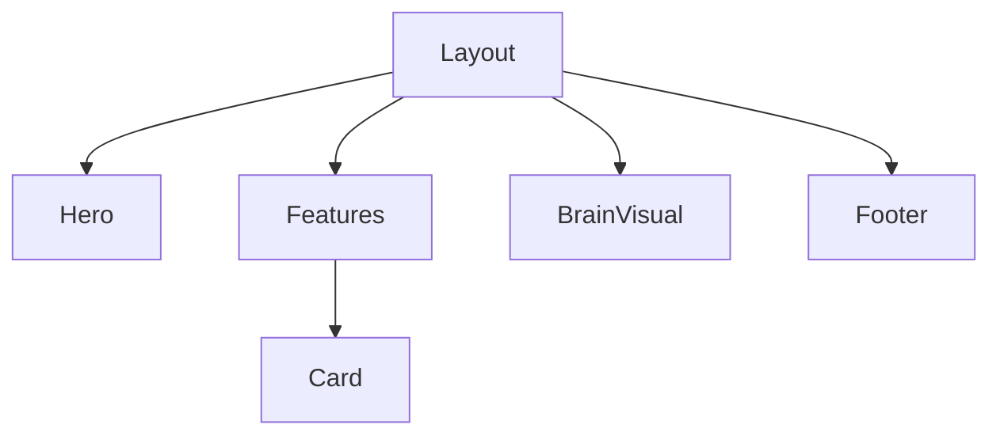

# Backend Design Spec: Landing Page
**Sprint:** sprint-1
**Author:** @SA
**Status:** DRAFT

## 1. Architecture Overview
Static Site Generation (SSG) using Astro for maximum performance and SEO.

### Tech Stack
- **Framework:** Astro 4.0
- **Styling:** TailwindCSS
- **Deployment:** Vercel/Netlify (Static)
- **Content:** Markdown / MDX

## 2. Component Architecture

## 3. Data Flow
- No backend database required.
- Content loaded at build time from `src/content/`.

## 4. Performance Strategy
- **Image Optimization:** Use Astro `<Image />` component.
- **Lazy Loading:** `loading="lazy"` for non-critical assets.
- **Minification:** HTML/CSS/JS minified at build.

## 5. Security (Static Site)
- HTTPS forced.
- CSP Headers configured in `vercel.json` or `netlify.toml`.
